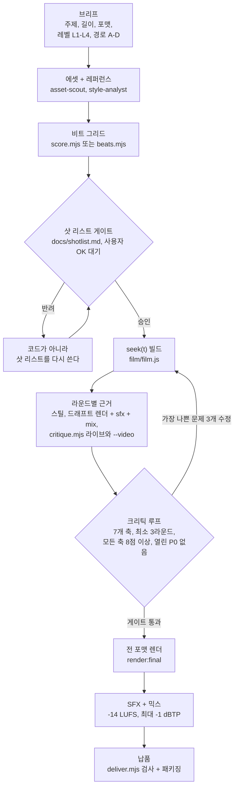

# motion-studio

<p align="center"></p>

[](https://github.com/yazzang-homelab/motion-studio/actions/workflows/ci.yml) [](LICENSE)

[English](README.md) | 한국어

motion-studio는 코드로 렌더링하는 모션 디자인용 Claude Code 플러그인이다.
Claude는 영상을 프로그램으로 쓴다. 어떤 시점의 프레임이든 요청 즉시 그려 내는, 시간의 순수 함수다. 나머지 하네스는
플러그인이 제공한다. 결정론적 `seek(t)` 캔버스 렌더러, 닫힌 형식(closed-form) 스프링, 비트 그리드, 합성 음악과
효과음, 2패스 라우드니스 믹스, Claude가 자기 프레임을 직접 보게 만드는 자동 크리틱 루프, 하나의 타임라인에서 뽑는
9:16·1:1·16:9 납품까지 담은 필름 프로젝트 스캐폴드가 그것이다. 여기에 스킬 12개(전체 파이프라인용
`/motion-studio:motion-reel` + 파이프라인 02~12단계별 스킬), 전문 서브에이전트 7개, 가드 훅 4개, eval 스위트를 함께
제공한다.

버전 0.1.0. 독립적인 비공식 구현이며 Anthropic 및 [CREDITS.md](CREDITS.md)에 밝힌 출처들과 무관하다.

<p align="center"></p>
<p align="center"><sub><code>studio-init</code>이 만들어 주는 12초 데모 필름을 플러그인으로 렌더링한 것(여기는 16:9, 같은 타임라인으로 9:16·1:1·4:5도 뽑는다).</sub></p>

## 목차

- [파이프라인](#파이프라인)
- [설치](#설치)
- [빠른 시작](#빠른-시작)
- [스킬](#스킬)
- [에이전트](#에이전트)
- [훅](#훅)
- [렌더 계약](#렌더-계약)
- [한국어 / CJK 영상](#한국어--cjk-영상)
- [CLI 레퍼런스](#cli-레퍼런스)
- [요구 사항](#요구-사항)
- [렌더 시간](#렌더-시간)
- [결정론](#결정론)
- [레벨과 경로](#레벨과-경로)
- [문제 해결](#문제-해결)
- [Eval과 CI](#eval과-ci)
- [배포 체크리스트](#배포-체크리스트)
- [크레딧](#크레딧)
- [라이선스](#라이선스)

## 파이프라인



샷 리스트 게이트는 대화 단계다. 크리틱 게이트는 강제된다. `docs/review_log.md`에 3라운드 이상이 기록되고 마지막
라운드의 모든 축이 8점 이상이며 열린 P0 문제가 없을 때까지 훅이 최종 렌더를 거부한다(문제 줄에 `P0` 토큰이 하나라도 있으면
열린 P0로 센다. P0는 `FIXES:` 줄 `<n>. fixed|resolved|wontfix`로만 닫힌다). `na` 점수는 `gate.naAllowed`에 든 축
(기본값 `["brand"]`)에서만 통과하므로 오디오가 있는 영상은 `sound=na`로 통과할 수 없다. 기본값은 마지막 라운드만 판정하고 제목의 포맷은 보지 않는다. 브리프가 여러 포맷을 납품해 `formats`의 모든 포맷이 각자 통과한 라운드를 가져야 하면 `gate.requireFormats: true`로 켠다. 크리틱은 실제 오디오로 sound를 채점하고
스스로 렌더하거나 믹스할 수 없으므로, 큐, 음악, 화면 타이밍이 바뀐 라운드마다 드래프트 렌더, `sfx`, `mix`를 먼저 만들고 근거를 두 번 뽑는다. 라이브 영상에
`critique.mjs`를 돌려 `out/review/<fmt>/`에, 믹스에 `--video`를 돌려 `out/review/<fmt>/video/`에 쓴다. 크리틱은 페이지로 나뉜 시트의
모든 페이지를 연다. 라이브 패스는 영상이 그리는 모든 글자가 해당 폰트에 글리프가 있는지도 검사한다. 빠진 글자는 P0 `font-fallback`
발견 사항이며, 그 글자를 덮는 폰트를 등록할 때까지 열린 P0로 남아 게이트를 막는다. 믹스 패스는 1초 이상의 무음 구간을 P1
`audio-gap`으로 보고하고, `deliver`는 무음 구간이 있으면 실패한다.

## 설치

이 저장소는 마켓플레이스이자 플러그인이다(`.claude-plugin/marketplace.json`에 `"source": "./"` 항목 하나).
`OWNER`는 저장소를 호스팅하는 GitHub 계정으로 바꾼다.

| 목적 | 명령 |
|---|---|
| 마켓플레이스 추가(셸) | `claude plugin marketplace add yazzang-homelab/motion-studio` |
| 플러그인 설치(셸) | `claude plugin install motion-studio@motion-studio` |
| 세션 안에서 한 번에(Claude Code 2.1.275+) | `/plugin install motion-studio --marketplace yazzang-homelab/motion-studio` |
| 업데이트 | `claude plugin update motion-studio@motion-studio` 후 재시작 또는 `/reload-plugins` |
| 스킬만 설치(훅·에이전트 제외) | `npx skills add yazzang-homelab/motion-studio` |
| 클론에서 로컬 개발 | `claude --plugin-dir .` (저장소 루트에서 실행) |

참고:

- `npx skills add`는 `skills/` 폴더만 설치한다(기본값은 하나의 정본 복사본에 대한 심볼릭 링크이고, `--copy`를 주면 독립
  복사본을 만든다). 훅, 에이전트, 플러그인 메타데이터는 설치되지 않는다. 따라서 크리틱 게이트, 편집 시 결정론 린트,
  서브에이전트 역할이 빠진다. 필름 프로젝트에서 `npm run lint`와 `npm run gate`를 직접 실행한다. `${CLAUDE_PLUGIN_ROOT}`도
  치환되지 않는다. 그 변수를 쓰는 스킬 명령마다 스킬만 설치한 환경용 `${CLAUDE_SKILL_DIR}/../<skill>/...` 경로를 함께
  적어 두었고, 각 단계는 Claude가 직접 수행한다. `skills` CLI는 Node 22.20 이상이 필요하다.
- 서드파티 마켓플레이스는 기본적으로 자동 업데이트되지 않는다. `claude plugin update`를 실행하거나 `/plugin` >
  Marketplaces에서 자동 업데이트를 켠다.
- 관리형 설정으로 마켓플레이스를 제한하는 조직(`strictKnownMarketplaces`)에서는 목록에 없는 소스의
  `marketplace add`가 거부된다. 관리자에게 저장소 허용을 요청하거나 로컬 클론과 `claude --plugin-dir`를 쓴다.
- 플러그인 자체에는 런타임 의존성이 없다. Playwright와 ffmpeg-static은 `studio-init`이 각 필름 프로젝트에
  설치하며 플러그인 캐시에는 절대 설치하지 않는다.

## 빠른 시작

```bash
# Git Bash, macOS, Linux (그리고 PowerShell 7)
mkdir my-film && cd my-film && claude
```

```powershell
# Windows PowerShell 5.1에는 && 연결이 없다: 한 줄에 명령 하나씩, 또는 ; 사용
mkdir my-film
cd my-film
claude
```

이어서 Claude Code 세션에서:

```text
/motion-studio:studio-init .
/motion-studio:motion-reel https://your-product.example 20s 9x16
```

1. `studio-init`은 필름 프로젝트 스캐폴드를 복사하고 `npm install`을 실행하고 브라우저가 있는지 확인한 뒤(Windows에서는
   Playwright의 헤드리스 셸: `npx playwright install chromium-headless-shell`, 약 115 MB) `npm run doctor`를 실행한다.
2. `motion-reel`은 빠진 입력을 묻고, 브랜드 에셋을 모으고, 비트 그리드를 만들고, 샷 리스트를 보여 준 뒤 사용자 OK를
   기다린다. 이후 영상을 빌드하고 크리틱을 3라운드 이상 돌린 다음 렌더, 믹스, 납품까지 진행한다.
3. 엔진부터 시험하려면 `/motion-studio:showreel`을 실행한다(강좌의 한 줄 쇼릴 프롬프트).

Claude 없이 같은 도구를 이 저장소 클론에서 직접 돌릴 수도 있다.

```bash
# Git Bash, macOS, Linux (그리고 PowerShell 7). --install은 npm install을 실행한다
node path/to/motion-studio/skills/studio-init/scripts/init.mjs my-film --title "My Film" --install
cd my-film
npx playwright install chromium-headless-shell   # Windows: 필수. macOS, Linux: Chrome이 설치돼 있으면 선택
npm run doctor
npm run preview
```

```powershell
# Windows PowerShell 5.1: 한 줄에 명령 하나씩. --install은 npm install을 실행한다
node path\to\motion-studio\skills\studio-init\scripts\init.mjs my-film --title "My Film" --install
cd my-film
npx playwright install chromium-headless-shell
npm run doctor
npm run preview
```

Windows에서 렌더러는 요청하지 않는 한 설치된 Chrome이나 Edge가 아니라 Playwright의 번들 헤드리스 셸을 쓴다. 새 프로필로 시작한 설치형
브라우저는 Windows 로그온 실패 1회로 집계되어 계정이 잠길 수 있다([문제 해결](#windows-계정이-렌더링이나-테스트-중-잠김) 참고). `--install`
없이 시작했다면 먼저 프로젝트에서 `npm install`을 실행한다. `npm run setup:browser`는 `npx playwright install` 줄과 같다.

## 스킬

`/motion-studio:<name>`으로 호출한다. 각 스킬은 다음 단계 안내로 끝난다.

| 스킬 | 강좌 단계 | 하는 일 |
|---|---|---|
| `motion-reel` | 전체(12단계의 패키지 스킬) | 처음부터 끝까지: 입력, init, doctor, 에셋, 레퍼런스, 음악, 샷 리스트 게이트, 빌드, 크리틱 루프(3라운드 이상, 전 축 8점 이상, P0 없음), 최종 렌더, SFX, 믹스, 납품, "다음에 개선할 점"이 담긴 보고 |
| `studio-init` | 02 Setup | 필름 프로젝트 스캐폴드, 설치, 브라우저 준비(Windows: Playwright 헤드리스 셸), doctor 실행, 구조·명령·effort 레벨·선택형 동반 도구 설명 |
| `showreel` | 03 One-liner | 출처를 밝힌 한 줄 쇼릴 프롬프트, 그 구조(길이, 주체 = 모델, 장르, effort 배수), 변형, 비슷비슷한 릴을 피하는 랜덤화 표 |
| `product-reel` | 04 Brand | 릴을 제품에 맞춘다: URL에서 가져온 실제 스크린샷·로고·색·폰트(Chrome 샌드박스 유지, 로컬·사설 주소 차단, 자격 증명은 만드는 모든 파일에서 제거), 음악과 비트 그리드 다음에 스토리 비트, 음성과 마스코트, 키 관리 |
| `reference-style` | 05 Reference | 프레임·영상·라이브러리 레퍼런스: `refs.mjs` extract/analyze, `docs/style_guide.md`와 `docs/shotlist.md`, 내용이 아니라 문법만 가져오기, OK 대기 |
| `ui-morph-spec` | 06 Spec | 6개 섹션 XML 상태 스펙(inputs, direction, structure, build, gotchas, start): 끊기지 않는 하나의 도형, 다운비트마다 상태 전환, 커서 구동, 마지막 프레임 = 첫 프레임 |
| `seek-engine` | 01 Pixels, 07 Engine | 렌더 계약, 캡처 모드, 성능 조절, 결정론 수정, HyperFrames·Remotion으로 넘기는 경로 B(라이선스 게이트) |
| `springs` | 08 Springs | 프리셋, `springFromFeel`, `track()` 중첩, `loopTrack`, `indicator`, `swapAlpha`, `stepTime`, 스프링 리팩터 프롬프트 |
| `sound-design` | 09 Sound | 트랙 측정(`beats.mjs`) 또는 합성(`score.mjs`), 영상에서 뽑은 큐, SFX 음색, 샘플, 음성, 정확한 길이로 -14 LUFS 믹스 |
| `director-brief` | 10 Overnight | 장편 브리프 골격(PLAN FIRST 또는 GO), `ANIMATION_GUIDE.md` + `STORYBOARD.md`, 챕터당 chapter-animator 하나, 청크 렌더, 선택형 generate-then-trace |
| `critique-loop` | 11 Critique | 믹스된 렌더를 먼저 만들고 `critique.mjs` 근거(라이브 영상과 `--video`), 엄격한 7축 점수, 타임스탬프가 붙은 P0/P1/P2 문제를 `docs/review_log.md`에 기록, 최악 3개 수정, 해당 구간만 재렌더, 게이트 통과 |
| `ship-formats` | 12 Ship | `layout()`으로 포맷별 재배치(크롭 금지), 전 포맷 렌더, 포맷별 검사, `deliver.mjs`, 자체 브랜드 스킬 패키징, 서비스 제안 템플릿 |

## 에이전트

플러그인 서브에이전트 이름은 `motion-studio:<name>` 형식이다. 서브에이전트는 사용자에게 직접 질문하지 못한다.
질문은 메인 세션으로 돌려보내고, 메인 세션이 사용자에게 물은 뒤 다시 지시한다. 모두 `model: inherit`. 약 2분보다 오래 걸릴
수 있는 명령은 서브에이전트가 백그라운드로 실행하고, 그 명령이 아직 돌고 있는 동안에는 반환하지 않는다.

| 에이전트 | 도구 | Effort | 사전 로드 스킬 | 역할 |
|---|---|---|---|---|
| `motion-director` | Read, Glob, Grep, Write, Edit, WebFetch | high | `director-brief` | 스타일 가이드와 비트 그리드 위의 샷 리스트, 장편용 `ANIMATION_GUIDE.md`와 `STORYBOARD.md`. 영상 코드는 쓰지 않음 |
| `motion-critic` | Read, Glob, Grep, Bash, Write, Edit | high | `critique-loop` | 라이브 영상과 믹스 렌더의 근거(`critique.mjs`, `critique.mjs --video`)를 읽고, PNG를 직접 확인하고, 7축 채점(sound는 믹스로), 타임스탬프가 붙은 P0~P2 목록, `docs/review_log.md`만 작성. 렌더나 믹스는 하지 않음 |
| `render-engineer` | Read, Glob, Grep, Bash, Write, Edit | high | `seek-engine` | 엔진, 렌더, 결정론, 성능, 인코딩 디버깅 |
| `sound-designer` | Read, Glob, Grep, Bash, Write, Edit | medium | `sound-design` | 스코어, 비트, 큐, SFX, 음성, 믹스, 싱크 지표 |
| `asset-scout` | Read, Glob, Bash, Write, WebFetch | medium | `product-reel` | URL에서 Playwright 스크린샷, 로고(없으면 텍스트 워드마크를 `manifest.brand.wordmark`로 기록), 색, 폰트와 라이선스 레지스트리(`manifest.fonts.registry`)를 `assets/brand/` + `assets/manifest.json`으로 수집. `states.mjs`로 UI 상태(클릭, 스크롤 프레임, 요소 크롭), `canvas-frames.mjs`로 캔버스 스프라이트 시트(`frames.json`, `pack/pack.json`)를 만든다. UI를 지어내지 않음 |
| `style-analyst` | Read, Glob, Grep, Bash, Write | medium | `reference-style` | `refs.mjs` 분석을 `docs/style_guide.md`와 샷 문법 노트로 정리. 내용이 아니라 문법을 가져옴 |
| `chapter-animator` | Read, Glob, Grep, Bash, Write, Edit | high | `springs`, `seek-engine` | `ANIMATION_GUIDE.md`에 따라 챕터 하나(`film/scenes/chNN_*.js`) 구현. 자기 구간의 린트와 스틸 확인. 공유 파일 버그는 고치지 않고 보고 |

## 훅

플러그인 훅은 세션 시작 시 로드되고 조건이 맞는 모든 이벤트에서 실행된다. 네 개 모두 exec 형식의 Node 스크립트이며
Node 시작 시간에 1초보다 훨씬 적은 시간만 더하고, 내부 오류가 나면 통과(허용) 처리한다.

| 이벤트(matcher) | 스크립트 | 강제하는 내용 |
|---|---|---|
| PostToolUse (`Write\|Edit\|MultiEdit`) | `hooks/post-edit-lint.mjs` | 스튜디오 프로젝트 안의 `index.html`, `film/**`, `lib/**`를 편집하면 프로젝트 린트 규칙으로 검사한다. 오류(`Math.random`, `Date.now`, 타이머, `requestAnimationFrame`, 원격 fetch 등)는 줄 번호와 수정 방법을 붙여 Claude에게 되돌리고, 경고는 컨텍스트로 추가한다 |
| PreToolUse (`Bash\|PowerShell`) | `hooks/pre-bash-gate.mjs` | 크리틱 게이트를 통과할 때까지 최종 렌더(`render.mjs ... --final`, `npm run render:final`, `npm run build`)를 어떤 방식으로 감싸도 거부한다. 패키지 스크립트 본문, `--` 앞 어디든 있는 `npm --prefix/-C/-w`, 중첩 셸, PowerShell 대입(`$out = npm run build`), `Invoke-Expression`, `eval`, `Start-Process`, `-EncodedCommand`까지 따라간다. 드래프트, 스틸, 프리뷰, 애니매틱은 막지 않는다 |
| PreToolUse (`Write\|Edit\|MultiEdit`) | `hooks/role-guard.mjs` | 플러그인 서브에이전트를 제 영역에 묶어 둔다. chapter-animator는 `film/scenes/**`와 `out/check/**`(단 `film/scenes/shared_*`는 모든 챕터가 공유하므로 챕터 서브에이전트에게 읽기 전용), motion-critic은 `docs/review_log.md`와 `out/review/**`, style-analyst는 `docs/style_guide.md`, `docs/shotlist.md`, `refs/**`, asset-scout는 `assets/**`, motion-director는 `docs/**`만 쓴다. 메인 세션은 제한하지 않는다 |
| SessionStart (`startup\|resume\|clear\|compact`) | `hooks/session-start.mjs` | 스튜디오 프로젝트 안이면 짧은 상태를 추가한다: 제목, 포맷, 길이와 BPM, 게이트 라운드와 최근 점수, 최종본 유무, 다음 추천 명령 |

제어:

- 훅 전체 끄기: 환경 변수 `MOTION_STUDIO_HOOKS=off`로 Claude Code를 시작한다(`settings.json`의 `env`에 넣어도
  된다).
- 한 프로젝트에서 크리틱 게이트만 면제: 그 프로젝트의 `studio.json`에 `"gate": { "enabled": false }`를 넣는다.
  이 결정은 사용자의 몫이며, 훅은 Claude에게 이 값을 바꾸지 말라고 알린다.
- 조직 정책: 관리형 설정에 `allowManagedHooksOnly: true`가 있으면 플러그인 훅은 아예 실행되지 않는다(관리자가
  관리형 `enabledPlugins`로 플러그인을 강제 활성화한 경우는 예외). 스킬과 에이전트는 그대로 동작하고 스킬이
  `npm run lint`와 `npm run gate`를 직접 실행하지만, 최종 렌더를 자동으로 막는 장치는 없어진다.
- `claude plugin details motion-studio`는 플러그인이 등록한 훅 이벤트를 보여 준다(`Hooks (3)  PostToolUse, PreToolUse,
  SessionStart`: 이벤트 세 개 아래 스크립트 네 개이며, 스크립트 이름과 matcher는 `hooks/hooks.json`에 있다). 스크립트 이름, matcher,
  관리형 설정이 훅을 막았는지는 보여 주지 않는다. 훅이 실제로 도는지 시험하려면 필름 프로젝트에서 Claude Code를 열고
  `const x = Math.random();`가 든 `film/hook-probe.js`를 쓰게 한다. 훅이 돌면 편집 후 린트가 `no-math-random` 오류로
  응답하고, 막혀 있으면 조용하다. 시험이 끝나면 그 파일을 지운다.

## 렌더 계약

전체 레퍼런스: [docs/ARCHITECTURE.md](docs/ARCHITECTURE.md). 모든 필름 프로젝트에는 `lib/`의 시그니처와 기본값을 담은 간결한
`docs/API.md`도 들어 있어, Claude가 플러그인 저장소 없이도 찾아볼 수 있다.

- 영상은 `film/film.js`다: `export default defineFilm((ctx) => ({ scenes, cues }))`. 모든 씬은 `t`만으로 그린다.
  영상·라이브러리 코드에서 `Math.random`, `Date`, `performance.now`, 타이머, `requestAnimationFrame`, CSS
  트랜지션을 쓰지 않는다. 난수는 `rngFor(name, i)`로 요소마다 시드를 둔 스트림 하나씩 쓴다.
- 영상 API 요약: `scene(from, to, name, draw)`(선택 항목 `layer`로 그리는 순서를 정함), 병렬 챕터 파일용 `chapter()`,
  팩토리 결과의 `overlays`(자막, 이음새 전환 같은 영상 전체 레이어. 모든 씬 위에 그려지고 샷으로 세지 않음). `ctx.grid`는
  `beat(n)`, `bar(n)`, 그리고 `audio/beats.json`에서 온 실측 강세 지점 `grid.hits` / `grid.hitsIn(a, b)`를 준다. 값이 여러
  목표를 가지면 `track()`(변경마다 스프링 하나, 키별 지정 가능)을, 끊김 없는 루프에는 `loopTrack()`을 쓴다.
- `index.html`이 영상을 `<canvas id="stage">`에 부팅한다. 도구는 프로젝트를 `http://127.0.0.1:<임의 포트>`로
  서비스한다(`file://`에서는 ES 모듈과 `fetch`가 실패한다).
- `window.seek(t)`는 프레임 `t`를 동기적으로 그린다(선택 두 번째 인자 `{ frameT, sub, subs }`는 이 그리기가 출력 프레임의
  모션 블러 서브프레임 하나임을 알린다). `window.__studio`는 `ready`, `meta`, `frame({ t, sub,
  shutter })`, `hash(t, { sub, wrap })`, `pixels(t, w)`, `cues()`, `shots()`, `grid`, `textUse()`, `coverage(family, weight,
  style, chars)`, `textTrack`을 노출한다. `wrap: false`는 루프 영상의 원래 끝 시각을 그려서, 크리틱이 `hash(0)`과
  `hash(duration)`이 같은지 시험하는 데 쓰인다. `textUse()`와 `coverage()`는 크리틱의 폰트 검사다. 페이지를 로드하기 전에
  `window.__TEXT_TRACK__ = true`를 설정하거나(또는 `?texttrack=1`) `text()`, `kinetic()`, `textWidth()`가 어떤 폰트로 어떤 문자를
  그리는지 기록하고, `textUse()`는 지금까지 그려진 프레임에 대해 `[{ family, weight, style, chars }]`를 돌려주며, `coverage()`는 그
  문자 중 해당 페이스가 그리지 못하는 것을 알려 준다. 추적은 기본으로 꺼져 있고 픽셀을 전혀 바꾸지 않는다. `g.fillText`로 직접
  그리는 영상은 `lib/draw.js`의 `recordText(str, cssFont)`를 호출할 수 있다. `text()`와 `kinetic()`은 등록되지 않은 패밀리에
  예외를 던지지 않는다(시스템 폰트와 이모지 폰트도 정당하다). 그것은 크리틱이 보고한다.
- 렌더 모드(`?render=1`, `window.__RENDER__`, `navigator.webdriver`)에서는 프리뷰 UI가 꺼진다. 프리뷰 UI는 항상
  캔버스 바깥에 있다.
- 2D 컨텍스트는 CPU 래스터라이즈(`willReadFrequently`, 글자를 회색조 안티앨리어싱으로 유지하는 `alpha: true`, `--disable-accelerated-2d-canvas`)이며 씬은
  포맷의 논리 픽셀로 그린다. 번들 폰트는 FontFace API로 로드하고 검증한다. 폰트가 없으면 렌더가 실패한다.
- 모션 블러: 캔버스 영상은 페이지 안에서 `sub`개 서브프레임(기본 4, 셔터 0.5)을 각 프레임 시각을 중심으로 누적한다.
  DOM 영상(`capture: 'page'`)은 서브프레임마다 스크린샷을 찍어 ffmpeg `tmix`로 섞는다. 씬은 `c.t`와 `lt`를 서브프레임
  시각으로 받고(그래서 움직임은 스스로 번진다), `c.frameT`, `c.frameLt`, `c.frame`(출력 프레임 인덱스), `c.sub`, `c.subs`는
  출력 프레임 자체의 값으로 받으며 모든 서브프레임에서 같다. `grain(g, W, H, c.frame)`은 스틸, 프리뷰, 최종본에서 똑같아
  보이고 `stepTime(c.frameLt, 12)`는 하드 컷이다. 첫 훅을 0에서 시작하면 안 된다. 씬 시작에서 풀린 스프링은 `lt = 0`에서
  아무것도 그리지 않으므로 씬보다 먼저 풀어 준다(`kinetic(..., lt + 0.3, ...)`).
- 비디오: H.264 `yuv420p`, CRF 16, preset `slow`, tune `animation`, BT.709 태그, `+faststart`. 출력은 `out/<fmt>/.staging/`에서
  만들어 한 묶음으로 게시하며, 실패하면 이전 파일을 되돌려 놓는다.
- 도구의 정적 서버(`127.0.0.1` 전용)는 프로젝트의 모든 점 파일과 점 디렉터리에 404를 돌려준다. 심볼릭 링크, 정션, 8.3 짧은 이름을
  거쳐도 같고, Windows에서는 `\`나 `:`가 든 요청 경로도 404다.
- 오디오: 길이는 정확히 프레임 수 / fps. 마스터는 통합 라우드니스 -14 LUFS(±0.5 LU), 트루 피크 -1 dBTP 이하. AAC
  256 kb/s, 48 kHz. `-shortest`는 쓰지 않는다.

## 한국어 / CJK 영상

번들 폰트 Instrument Serif와 Inter는 라틴 문자만 지원한다. 이 폰트로 한글, 가나, 한자를 그리면 실행한 머신의 시스템
폰트로 대체되고, 시스템 폰트가 없는 머신에서는 빈 상자(tofu)로 나온다. 그러면 렌더가 이식되지 않고 재현되지도 않는다.
영상을 쓰기 전에 필요한 문자가 있는 폰트를 등록한다.

```bash
# 전체 한글 폰트 파일 하나(경로 또는 https URL). 형식은 파일의 바이트에서 읽는다
npm run fonts -- add-file ./KoreanFont.woff2 --family "Korean Font" --license-file ./OFL.txt
# 또는 Google CJK 패밀리: 번호가 붙은 약 100개 조각. 파일 수와 크기를 먼저 출력하고 --yes를 줘야 받는다
npm run fonts -- add "Noto Sans KR:400" --subsets korean,latin --yes
# 영상 텍스트의 모든 문자에 글리프가 있는지 확인(빠진 문자가 있으면 1로 종료)
npm run fonts -- coverage --text "안녕하세요 모션 스튜디오" --family "Korean Font"
```

- `add-file`은 HTML 페이지, Git LFS 포인터, 잘린 파일을 아무것도 쓰기 전에 거부한다. 라이선스 본문을 폰트 옆에 복사하고
  (라이선스가 없으면 경고), 폰트를 `assets/fonts/fonts.json`에 기록한다.
- 조각(slice) 폰트는 프레임 0 전에 모든 조각을 미리 로드한다. 항목별 `unicodeRange`와 선택 항목 `sample` 문자열이 조각이
  로드됐음을 증명할 문자를 정한다. Google은 라틴·키릴·베트남어 조각에만 라벨을 붙이고 번호가 붙은 한글 조각에는
  라벨이 없으므로 `--subsets korean`이 필요하다.
- `studio.json`의 `brand.fonts.display` 또는 `brand.fonts.ui`를 새 패밀리로 지정한다. 그러면 `family` 없는 `text()`·`font()` 호출은
  `brand.fonts.ui`로, `kinetic()`은 `brand.fonts.display`로 그리고, `weight` 없는 호출은 패밀리가 가진 가장 가까운 두께를
  쓴다(400만 있는 서체를 가짜 볼드로 만들지 않는다). `wrapText(g, text, maxW, font)`는 공백에서 줄을 나누고 한글 음절
  한가운데에서는 절대 자르지 않는다. `fitFontSize(..., { step: 16 })`은 NeoDunggeunmo 같은 비트맵 폰트의 픽셀 격자에 맞는
  크기를 돌려준다.
- `--family` 없이 `coverage`를 실행하면 등록된 패밀리를 각각 따로 판정하므로 번들 라틴 폰트는 한글 텍스트에서 의도적으로
  실패한다.
- 결과가 `fallback`이면 이 머신의 시스템 폰트가 그 문자를 그렸다는 뜻이므로 의존하지 않는다. 상업적 사용 전에 폰트
  라이선스를 확인한다. 이 플러그인에는 번들 라틴 폰트 두 종 외의 폰트 파일이 들어 있지 않다.
- 크리틱이 이를 대신 검사한다. `npm run critique`는 텍스트 사용 기록을 켠 채로 영상을 열어, 각 폰트가 어떤 문자를 그렸는지
  (`textUse()`)와 그 폰트에 각 문자의 글리프가 있는지(`coverage()`)를 묻고, 빈틈이 있는 폰트 행마다 P0 `font-fallback`을
  낸다. 발견 사항에는 패밀리와 두께, 빠진 문자(최대 40개), 해결 방법이 적힌다. `add-file`로 그 문자를 덮는 폰트를 등록하거나
  패밀리를 바꾼 뒤 `coverage`를 다시 실행한다. 등록되지 않은 패밀리(`fonts.json`에 없는 이름)나 `sans-serif` 같은 제네릭
  패밀리는 그 자체로 P0다. 그러면 모든 문자를 시스템 폰트가 그리기 때문이다. P0는 고칠 때까지 게이트를 막으므로, 라틴 전용
  Inter로 그린 한글은 최종 렌더까지 갈 수 없다. 이 검사는 이 플러그인 버전의 `lib/runtime.js`가 필요하고(오래된 런타임이면 발견
  사항이 아니라 `preflight: unavailable` 메모가 나온다), 검토한 프레임이 실제로 그린 텍스트만 본다.

## CLI 레퍼런스

### 필름 프로젝트(`studio-init` 이후)

플래그는 `--` 뒤에 넘긴다. 예: `npm run render -- --format 1x1 --from 2 --to 4`. 모든 도구는 `--help`로 사용법을
출력한다. 종료 코드: 실패(실행 오류, 실패한 검사, 검증을 통과하지 못한 `studio.json`. `audio.lufs`가 -70~-5 밖인 경우 포함)는
1, 사용법 오류(모르거나 잘못된 플래그)는 2다. `--json`을 주면 stdout에 JSON 한 줄을 출력한다. 성공하면 결과를, 사용법·설정·실행
오류로 실패하면 `{"ok":false,"error":"..."}`를 낸다. `gate.mjs`와 `lint.mjs`도 포함이다(사람이 읽는 메시지는 stderr에 남는다).
`gate.mjs`는 통과하지 못한 게이트를 자체 판정(`pass: false`)으로 보고하고, `deliver.mjs`는 실패한 검사와 시작조차 못 한
실행을 `{ ok: false, error, failed: [...] }`로 보고한다. 몇 분 걸리는 명령(`render:final`, `build`, `mix`, `deliver`)은 로그를
남기며 백그라운드로 돌리고 그 로그를 확인한다. 예상 시간은 [렌더 시간](#렌더-시간) 표에 있다.

| 스크립트 | 실행 | 용도 | 주요 플래그 |
|---|---|---|---|
| `npm run preview` | `tools/serve.mjs --open` | 브라우저 실시간 프리뷰: 스크러버, Space 재생/정지, 방향키로 프레임·비트 이동, `[` `]` 샷 이동, F 포맷 전환, G 안전 영역 가이드 | `--port N`(기본 4178) `--json` |
| `npm run render` | `tools/render.mjs` | 기본 포맷을 `out/<fmt>/silent.mp4` + `poster.png` + `render.json`으로 렌더하고 한 묶음으로 게시한다(플레이어가 이전 파일을 열고 있으면 완성된 렌더는 `out/<fmt>/.staging/`에 남고 이전 출력은 그대로다). 프레임을 빼는 `--from`/`--to` 구간은 `clip_<from>-<to>.mp4`로 쓰고 `silent.mp4`는 건드리지 않으며, 영상 전체를 덮는 구간은 전체 렌더다 | `--format f\|all\|a,b` `--fps` `--sub` `--shutter` `--from` `--to` `--scale` `--workers` `--crf` `--preset` `--draft` `--chunk S` `--out` `--no-poster` `--hash` `--json` |
| `npm run render:all` | `render.mjs --format all` | `studio.json`의 모든 포맷 | 위와 같음 |
| `npm run render:final` | `render.mjs --format all --final` | 모든 포맷 최종 렌더, 스케일 1(훅이 게이트). `--draft`, `--scale`, `--from`/`--to`는 거부. 12초 데모에 약 4분이 걸리므로 백그라운드로 돌린다 | 위와 같음 |
| `npm run animatic` | `render.mjs --scale 0.5 --fps 30 --sub 1 --draft --out out/animatic` | 빠른 페이싱 확인 | 위와 같음 |
| `npm run stills` | `tools/stills.mjs --beats` | 비트마다 스틸 한 장씩, 라벨이 붙은 컨택트 시트. 어떤 이미지도 `--page-height`(기본 1800px)보다 높거나 1990px보다 넓지 않다. 더 긴 시트는 행 단위 페이지로 나누고, 1페이지는 `contact.png`, 이어서 `contact-2.png`, `contact-3.png` ... 다(`--cols`는 폭에 맞게 줄어든다) | `--at 0.5,2` `--every S` `--beats` `--shots` `--from S` `--to S` `--format` `--width` `--cols` `--no-label` `--out` `--page-height N` `--frames-dir` `--sub` `--max` |
| `npm run critique` | `tools/critique.mjs` | 크리틱 라운드 근거: contact, shots, phone, strip, (루프 영상) loop 시트와 `metrics.json`/`metrics.md`(결정론, 그려진 텍스트의 글리프 커버리지, 정지 구간, 팝, 프레임 0, 루프 이음새, 모서리, 테두리, 싱크, 라우드니스, 무음 구간). 시트는 `stills`와 같은 규칙으로 페이지가 나뉜다(`--page-height` 기본 1800px, 모든 페이지를 연다). 라이브 영상은 `out/review/<fmt>/`에, 믹스 렌더에 준 `--video`는 `out/review/<fmt>/video/`에 쓴다(서로 덮어쓰지 않음). `--from S --to S`는 한 챕터만 검토한다: 스틸, 시트, 모든 지표가 그 구간만 다룬다. 발견 사항에는 P0 `font-fallback`(라이브)과 P1 `audio-gap`(`--video`)이 있다. 모든 근거 폴더에는 `film-hash.json`(`film/**`, `lib/**`, `studio.json`에 대한 `filmHash`)과 `baseline.json`도 생기며 다음 실행이 새로 나온 팝·점프·정지 구간 후보를 알려 준다. `studio.json`의 `critique.stepped`와 `critique.popIgnore`는 하드 스텝 룩을 발견 사항에서 뺀다 | `--format` `--video [PATH]` `--from S` `--to S` `--strip-at S` `--page-height N` `--no-determinism` `--skip-determinism-repeat` `--check-hash` `--json` |
| `npm run score` | `tools/score.mjs` | 오리지널 합성 음악 + `audio/beats.json` + `audio/music.meta.json`(설정과 WAV 해시). `--if-missing`은 제공된 트랙과 설정이 아직 맞는 스코어를 유지하고, 스스로 만든 낡은 스코어는 다시 만든다 | `--bpm` `--dur` `--style pulse\|piano\|minimal\|cinematic` `--key` `--mode` `--seed` `--drop BAR` `--loop` `--out` `--beats` `--if-missing` |
| `npm run beats` | `tools/beats.mjs <track>` | 제공된 트랙 측정: BPM, 비트, 다운비트, 히트. JS 엔진은 `--bpm-hint`로 넓히지 않으면 70~180 BPM을 탐색한다 | `--engine auto\|librosa\|js` `--bpm-hint N` `--no-cache` `--out` |
| `npm run sfx` | `tools/sfx.mjs` | 영상에서 큐를 읽어 모든 SFX를 합성, `audio/sfx.wav` 작성 | `--cues` `--format` `--out` `--dur` `--samples DIR\|none`(`--no-samples`) `--seed` `--dump-cues` `--list` |
| `npm run voice` | `tools/voice.mjs` | `audio/voice.json`의 대사를 ElevenLabs로 `audio/voice.wav`에 생성(이후 `studio.json`의 `audio.voice` 설정). 사용자의 `ELEVENLABS_API_KEY` 필요. 똑같은 대사는 한 번만 합성하고 과금한다 | `--script` `--dry-run` `--voice-id` `--model` `--out` |
| `npm run mix` | `tools/mix.mjs --format all` | 모든 스템을 먼저 측정한 뒤 2패스 라우드니스 믹스로 `out/score.wav`, `out/<fmt>/final.mp4`에 먹싱. 영상보다 0.25초 넘게 짧거나 비어 있거나 무음인 music·voice·sfx 스템은 믹스를 멈춘다(무음 sfx 스템은 경고만 한다). `--lufs`와 `audio.lufs`는 -70~-5를 받는다. 잘못된 플래그는 종료 코드 2, `studio.json`의 잘못된 값은 1이다 | `--format` `--music P\|none` `--sfx P\|none` `--voice P\|none` `--lufs` `--tp` `--no-duck` `--allow-short-stems` |
| `npm run deliver` | `tools/deliver.mjs` | `final.mp4`를 현재 `studio.json`에 대고 납품 검사(코덱, 프레임, 정확한 길이, 크기, fps, 오디오, 라우드니스, 트루 피크, 무음 구간, 용량, 포스터, 루프 이음새, 게이트. `duration`이나 `fps`를 고치기 전에 만든 렌더는 낡은 렌더로 실패. -50 dB 아래로 1초 이상 이어지는 무음은 도입부, 페이드아웃, `critique.allowSilence` 구간을 뺀 나머지가 `silence` 검사로 실패) + `out/deliver/`(영상, 포스터, 컨택트 시트의 모든 페이지, `manifest.json`)와 `docs/production.json`으로 패키징. 검사 하나라도 실패하면 1로 종료. `--json` 실패 줄: `{ ok: false, error, failed: [...] }`. `--format`은 지정한 포맷만 다시 납품하고 나머지는 유지한다 | `--format f\|all\|a,b` |
| `npm run build` | score(없을 때), sfx, render:final, mix, deliver | 마무리 전체를 한 번에(훅이 게이트) | |
| `npm run lint` | `tools/lint.mjs` | `index.html`, `film/**`, `lib/**`의 결정론·하우스 룰 린트. 오류가 있으면 1로 종료. `--json`이면 사용법·실행 오류가 `{"ok":false,"error":"..."}`로 나온다 | `[files...]` `--json` |
| `npm run gate` | `tools/gate.mjs` | `docs/review_log.md`를 `studio.json`의 `gate`(`minRounds`, `minScore`, `axes`, `naAllowed`, `requireFormats`)와 대조한 크리틱 게이트 상태. 엄격한 열린 P0 규칙은 `--help`에 출력된다. 통과 0, 실패 1. `--json`이면 통과하지 못한 게이트는 자체 판정(`pass: false`, `reasons`)을 출력하고, 사용법·설정 오류는 `{"ok":false,"error":"..."}`를 출력한다 | `--json` |
| `npm run doctor` | `tools/doctor.mjs` | Node, Playwright, 브라우저(Windows: 번들 헤드리스 셸은 `ok`, 설치된 Chrome·Edge는 `warn`, 그리고 정보 행 `windows-logon-guard`), ffmpeg 필터, Python/librosa, 설정, 폰트, `.env` 키 유무를 점검하고 OS별 수정 명령 제시. 느린 점검은 동시에 실행하며 각자 시간 예산(브라우저 60초, ffmpeg 20초, Python 60초)을 갖고, 멈추는 대신 `timeout`으로 보고한다. 필수 항목이 실패하거나 시간 초과면 1로 종료 | `--json` |
| `npm run setup:browser` | `playwright install chromium-headless-shell` | Playwright 헤드리스 셸(약 115 MB)을 내려받는다. 기본 브라우저인 Windows에서는 필수, macOS·Linux에서는 Chrome이나 Edge가 설치돼 있으면 선택 | 없음 |
| `npm run refs` | `tools/refs.mjs` | `extract <video>` 프레임 + 컨택트 시트(`refs/contact.png`. 다른 모든 시트처럼 페이지가 나뉜다: `contact-2.png` ...), `analyze <video\|folder\|image>` 컷, 샷 길이, 팔레트, 모션 에너지(Duration이 없는 컨테이너는 패킷에서 길이를 잰다) | `--every S` `--out` `--threshold` |
| `npm run fonts` | `tools/fonts.mjs` | `add "Family:400,700"`(Google Fonts woff2, 기본 latin + latin-ext), `add-file <path\|url> --family NAME`(이미 가진 폰트. 라이선스를 옆에 복사), `coverage --text "..."`(글리프가 없는 문자 목록), `list`, `remove <family>` | `--italic` `--subsets` `--yes` `--weight` `--style` `--license` `--license-file` `--unicode-range` `--family` `--text-file` |

스캐폴드 직접 실행: `node skills/studio-init/scripts/init.mjs <dir> [--title T] [--duration S] [--fps N] [--bpm N]
[--formats a,b|all] [--loop|--no-loop] [--brand-url URL] [--force] [--install] [--json]`. 기존 폴더에는 없는 파일만
추가한다(`package.json`과 `.gitignore`는 병합한다). `--force`는 템플릿 파일을 갱신하되 `studio.json`, `film/**`, `docs/**`, `assets/fonts/fonts.json`은 건드리지 않는다.
`package.json`에서는 명령이 다른 템플릿 스크립트만 템플릿 값으로 되돌리고 의존성 버전은 절대 바꾸지 않는다. init은 유지한 값
(`kept your package.json values, which differ from the template`)과 되돌린 값을 목록으로 보여 준다. `--brand-url`은
`user:password@`와 비밀처럼 보이는 매개변수(쿼리, `;matrix` 경로 매개변수, 프래그먼트: `token`, `key`, `secret`, `password`, `auth`,
`sig`, `session`, `code` 등)를 뺀 채로 저장된다. 무엇을 뺐는지 stderr에 나오고 `--json` 결과의 `redacted`에도 들어 있다. 경로
조각 자체가 비밀인 경우는 알아볼 수 없으므로, 공개 URL을 넘기고 키는 `.env`에 둔다.

### 이 저장소(개발용)

| 스크립트 | 용도 |
|---|---|
| `npm test` | 단위 테스트: `test/*.test.mjs`에 `node --test` 실행(브라우저·ffmpeg 테스트는 없으면 건너뜀). 한 번에 최대 min(4, cpus - 1)개 파일을 돌리며 `npm test -- --test-concurrency=N`으로 바꾼다 |
| `npm run test:smoke` | `SMOKE=1` 종단 간 스모크 테스트: 임시 프로젝트 생성, 1초 렌더 2회(프레임 해시 일치 필수), 부분 클립, 스틸, score, sfx, mix, critique, deliver |
| `npm run lint` | `scripts/lint-plugin.mjs`: 프론트매터 허용 목록, 에이전트 색, 이름, 설명 길이, CRLF, JSON 파싱 |
| `npm run validate` | `claude plugin validate . --strict`(마켓플레이스)와 `claude plugin validate .claude-plugin/plugin.json --strict`(플러그인, 훅, 스킬, 에이전트) |
| `npm run eval:lint` | `scripts/eval-lint.mjs`: 모든 eval 케이스를 비용 없이 로드해 로드 오류나 통과 불가능한 grader가 있으면 실패 |
| `npm run eval:selftest` | `evals/_selftest`: 모든 regex·`tool_used` grader를 통과/실패 샘플로 채점하고 각 스캐폴드를 실행한다. 비용 없음 |

## 요구 사항

| 항목 | 버전 | 비고 |
|---|---|---|
| Node.js | 20 이상 | 20.11에서 테스트. 경로 A는 Node 22가 필요 없음 |
| 브라우저(Windows) | Playwright 번들 헤드리스 셸 | `npx playwright install chromium-headless-shell`(다운로드 약 115 MB, 디스크 270 MB). `auto`는 여기서 설치된 Chrome이나 Edge를 절대 시작하지 않는다. 새 프로필로 시작하는 설치형 브라우저는 실행마다 로그온 실패 1회로 집계되어 계정이 잠길 수 있기 때문이다. 쓰려면 `studio.json`의 `browser: "chrome"` 또는 `"msedge"`, 또는 `MOTION_BROWSER=chrome`으로 직접 선택한다. 실행마다 경고가 출력되고 한도를 넘으면 거부된다(아래) |
| 브라우저(macOS, Linux) | Chrome 또는 Edge, 또는 Playwright 브라우저 | 자동 순서: Chrome, Edge, 번들 브라우저(`npx playwright install chromium-headless-shell`). 경고도 가드도 없음 |
| 브라우저 지정 | `MOTION_CHROME_PATH`, `MOTION_BROWSER`, `studio.json`의 `browser` | 이 순서로 우선한다. `MOTION_CHROME_PATH`는 Chromium 계열 실행 파일, `MOTION_BROWSER`는 `auto`, `chrome`, `msedge`, `chromium` 중 하나(`auto`가 안전한 기본값으로 돌아가는 방법) |
| 실행 가드(Windows, 설치형 Chrome·Edge만) | 10분에 4회 | 시작하려는 실행도 센다. 그래서 3회는 통과하고 4번째는 대기 시간과 함께 거부된다. `MOTION_SYSTEM_BROWSER_MAX`(1~9)가 한도를 정하고, `MOTION_ALLOW_LOCKOUT_RISK=1`이 거부를 없애며(실행은 계속 기록·경고된다), `MOTION_LAUNCH_LOG`가 로그 위치를 바꾼다(기본값 `%LOCALAPPDATA%\motion-studio\system-browser-launches.json`) |
| Playwright | ^1.63 | `studio-init`이 필름 프로젝트에 설치 |
| ffmpeg | `loudnorm`, `ebur128`, `alimiter`, `sidechaincompress`, `amix`, `tmix`, `scale`, `apad`, `atrim`을 갖춘 최신 빌드 | 기본값은 선택 의존성 `ffmpeg-static`(GPL 빌드, `npm install` 때 다운로드). `FFMPEG_PATH`로 지정 가능하며 PATH와 `imageio-ffmpeg`가 폴백 |
| Python + librosa | Python 3.12 이상, librosa 1.0 | 선택 사항. `beats.mjs --engine librosa`용. 없으면 내장 JS 비트 트래커가 동작. `MOTION_PYTHON`으로 인터프리터를 지정하거나(고정 지정이다. 다른 Python은 시도하지 않고, 60초 안에 응답하지 않으면 `--engine auto`는 메시지를 남기고 JS 엔진으로 폴백한다) `<project>/.venv`를 쓴다 |
| ElevenLabs 키 | `.env`의 `ELEVENLABS_API_KEY` | 선택 사항이며 `voice.mjs`에만 필요. 사용자 계정과 크레딧을 쓰며 CI에서는 검증하지 않음 |

`npm run doctor`가 위 항목을 모두 점검하고 OS에 맞는 수정 명령을 정확히 출력한다.

## 렌더 시간

이 플러그인의 모든 예상치(스킬, 에이전트, 문서)가 쓰는 측정 하나:

| 항목 | 값 |
|---|---|
| 영상 | 템플릿의 12초 데모, 9x16·1x1·16x9 |
| 머신 | 12스레드 Windows 노트북(Core i7-1255U), 설치된 Chrome, ffmpeg 6.1.1 |
| 설정 | 60 fps, 서브프레임 4, 기본 워커 4, 최종 인코딩(x264 preset slow, CRF 16), 포맷당 720프레임 |
| 프레임당 | 9x16 123 ms, 1x1 75 ms, 16x9 118 ms |
| 포맷당 | 91초, 55초, 87초. 세 포맷 합쳐 약 4분(유휴 머신에서 3분 55초~3분 58초, 다른 프로그램이 부하를 주면 최대 5분) |
| 경험칙 | 60 fps로 세 포맷을 렌더할 때 영상 1초당 벽시계 약 20초. 15초 영상은 약 5분 |

합성 장면(호 200개, 텍스트, 그라디언트)의 캡처만 잰 벤치마크에서 강좌의 서브프레임별 스크린샷 루프는 출력 프레임당 1,575 ms,
여기서 쓰는 페이지 내 누적은 148 ms였다. 위 표는 실제 영상을 끝까지 돌린 값이다. 같은 12초 데모에서 다른 명령은 `doctor`
20~35초, `score` 4~11초, `sfx` 10~15초, 드래프트 렌더(`--draft --sub 1 --scale 0.5`) 포맷당 약 20초, `critique` 라이브 한 번 약 115초(20초 영상은 약 145초, `--video`는 약 85초),
`mix` 40~80초, `deliver` 약 40초다. 약 2분을 넘는 명령은 백그라운드로 돌리고 로그를 확인한다. 포어그라운드 호출은 기본 2분,
최대 10분에서 잘린다. `npm run build`는 약 6분 걸린다.

이 시간은 설치된 Chrome으로 잰 값이다. Windows 기본값은 이제 Playwright 헤드리스 셸이고, 프레임당 속도는 다시 재지 않았다. 시작 시간은
측정했다. 헤드리스 셸은 서명이 없어서 실시간 백신이 브라우저 프로세스마다 검사한다(측정한 노트북에서는 AhnLab V3). 거기서 브라우저 한 번
시작에 4~5초가 걸렸다. 실행 약 3.5초, 첫 페이지 약 11초, 도구 한 번 실행에 15~25초이며 서명된 설치형 Chrome은 2.4초였다.
`%LOCALAPPDATA%\ms-playwright`를 백신 예외로 두면 없어진다(플러그인이 설정해 주는 것이 아니라 사용자나 IT가 정할 일이다).

## 결정론

| 보장 | 범위 |
|---|---|
| 같은 머신에서 `studio.json`, 영상 소스, 폰트, 브라우저 빌드가 같으면 순서와 워커 수에 상관없이 프레임이 비트 단위로 동일(PNG 바이트의 sha256) | 보장. `render --hash`가 `out/<fmt>/frames.sha256`(프레임마다 `index t sha256` 한 줄)을 쓰고 `render.json`에 `framesDigest`를 남긴다(청크 렌더도 같은 값). `critique.mjs`는 모든 샷 경계와 큐를 걸치는 프레임의 해시를 정순, 무작위 순서, 새 페이지에서 비교한다 |
| `score.mjs`와 `sfx.mjs` 출력은 실행마다 샘플 단위로 동일 | 보장. SFX 큐마다 종류, 시각, 같은 큐들 사이의 순번으로 시드를 정하므로 다른 큐를 추가·삭제·재배열해도 그 큐의 소리는 바뀌지 않는다 |
| OS, GPU, 드라이버, 브라우저 버전이 달라도 픽셀 동일 | 보장하지 않음. 폰트 래스터화와 Skia가 다르다. 해시는 한 머신, 한 브라우저 빌드 안에서만 비교한다(`render.json`에 기록). 설치된 Chrome과 번들 헤드리스 셸을 오가면 빌드가 달라지므로 다시 렌더한 뒤 비교한다[픽셀 차이는 미측정] |
| MP4 바이트 동일 | 보장하지 않음. 인코더 비트스트림은 스레드 수에 따라 달라질 수 있다. 계약 대상은 컨테이너가 아니라 프레임이다 |
| 경로 C 생성 에셋 | 본질적으로 비결정론적. 린트는 JavaScript 레이어만 검사한다 |

## 레벨과 경로

레벨은 강좌의 프롬프트 크기 사다리에서 가져왔다(제작자들이 밝힌 수치로, 벤치마크가 아니라 사례다).

| 레벨 | 프롬프트 크기 | 보고된 실행 시간 | 인용된 사례 | 스킬 |
|---|---|---|---|---|
| L1 한 줄 | 약 150자 | 15~50분 | @stephanlivera, @himanshutwtxs, @robj3d3 | `showreel` |
| L2 브랜드 릴 | 약 350자 | 30~45분 | @tdinh_me, @achxvi | `product-reel` |
| L3 상태 스펙 | 1.5k~3k자 | 수정 포함 약 1~2시간 | @twoclipping, @verbove | `ui-morph-spec` |
| L4 디렉터 브리프 | 9.5k~19k자 | 자율 실행 6~12시간 | @donaldjewkes, @pradeepXkapoor, @pleometric | `director-brief` |

경로는 강좌의 경로 표에서 가져왔다.

| 경로 | 적합한 작업 | 강점 | 약점 | motion-studio 지원 |
|---|---|---|---|---|
| A 코드 드로잉 | 쇼릴, UI 모션, 루프, 제품 영상 | 의존성 없음, 전부 수정 가능, 지시가 없을 때 Opus가 고르는 방식 | 캐릭터와 실사 표현은 스펙이 많이 필요 | 파이프라인 전체. 기본값 |
| B 프레임워크(Remotion, HyperFrames) | 설명 영상, 제품 영상, 시리즈 | 스튜디오 프리뷰, 재사용 컴포넌트 | Remotion은 직원 3명 초과 영리 조직에 Company License 필요. HyperFrames와 `skills` CLI는 Node 22+ 필요 | 프레임워크를 지명할 때만 `seek-engine`으로 핸드오프 |
| C 혼합 파이프라인 | 뮤직비디오, 캐릭터 스토리 | 이미지·비디오 모델이 물리와 얼굴을 맡고 보이는 레이어는 코드가 그림 | API 비용, 싱크 작업, 결정론 약화 | `director-brief`로 계획. 사용자 키와 예산 사용. 생성기는 번들하지 않음 |
| D 촬영본 편집 | 토킹 헤드, 실제 클립 재편집 | 실제 얼굴과 목소리가 그대로 남음 | 원본 촬영본과 깨끗한 오디오 필요 | 0.1.0 범위 밖 |

Effort: 수정·재렌더는 medium, 새 영상은 xhigh, 첫 3초가 런칭을 책임져야 하면 max. `motion-reel`은 실행 중
xhigh로 설정한다. `/effort` 또는 `/model`로 바꾼다.

## 문제 해결

| 증상 | 원인과 해결 |
|---|---|
| `index.html`을 더블클릭하면 빈 화면이거나 `Failed to fetch dynamically imported module` | `file://`에서는 ES 모듈과 `fetch('studio.json')`이 동작하지 않는다. 프로젝트를 http로 서비스하는 `npm run preview`를 쓴다. 모든 도구가 같은 방식이므로 경로에 공백, `#`, `%`, 비ASCII 문자가 있어도 된다 |
| `Executable doesn't exist ... ms-playwright`, `could not launch a browser: no safe browser found.`(Windows) 또는 브라우저를 못 찾음 | `npm install`은 브라우저를 내려받지 않는다. `npx playwright install chromium-headless-shell`(또는 `npm run setup:browser`)을 실행하거나 `MOTION_CHROME_PATH`에 Chromium 계열 실행 파일을 지정한다. macOS와 Linux에서는 설치된 Chrome이나 Edge도 된다. Windows에서 설치된 Chrome이나 Edge는 잠김 위험이 있는 선택 사항이다(다음 항목) |
| Windows: 렌더나 테스트 중 계정이 잠김 | 새 프로필로 시작한 설치형 Chrome이나 Edge가 로그온 실패 1회로 집계된다. 아래 [Windows 계정이 렌더링이나 테스트 중 잠김](#windows-계정이-렌더링이나-테스트-중-잠김) 참고 |
| `refusing to start chrome: N launches of an installed Chrome/Edge in the last 10 minutes ...`(Windows) | 실행 가드다. 설치형 브라우저를 직접 선택한 경우에만 적용된다. 메시지에 나온 시간만큼 기다리거나 헤드리스 셸로 바꾼다. `npx playwright install chromium-headless-shell`을 실행하고 `studio.json`에서 `browser`를 지운 뒤 `MOTION_BROWSER`와 `MOTION_CHROME_PATH`를 해제한다. `MOTION_ALLOW_LOCKOUT_RISK=1`은 위험을 감수하고 그대로 시작한다 |
| Windows: 도구를 실행할 때마다 15~25초 동안 아무 일도 하지 않음 | 헤드리스 셸은 서명이 없고 실시간 백신이 브라우저 프로세스마다 검사한다(측정: AhnLab V3가 있는 머신에서 실행 약 3.5초, 첫 페이지 약 11초). `%LOCALAPPDATA%\ms-playwright`를 예외로 두면 없어지며 그 결정은 사용자나 IT의 몫이다. 설치된 Chrome으로 돌아가면(거기서는 실행당 2.4초) 실행마다 로그온 실패 1회가 쌓인다 |
| `font missing: ...` | `assets/fonts/fonts.json` 또는 `studio.json` `fonts`의 폰트가 로드되지 않았거나, 조각 폰트 항목이 선언한 문자를 하나도 덮지 못한다. `npm run fonts -- list`로 확인하고 `npm run fonts -- add "Family:400,700"`로 다시 추가한다. 페이지에서 Google Fonts를 링크하지 않는다(린트가 원격 URL을 거부한다). OS마다 다른 시스템 폰트에 기대지 않는다 |
| 한글(또는 다른 CJK) 텍스트가 상자로 나오거나 다른 서체로 나옴 | 번들 폰트는 라틴 전용이다. [한국어 / CJK 영상](#한국어--cjk-영상)을 보고 `npm run fonts -- coverage --text "..." --family "폰트 이름"`으로 텍스트를 점검한다 |
| 크리틱이 P0 `font-fallback`을 보고함 | 영상이 그리는 문자에 해당 폰트의 글리프가 없거나 폰트가 등록되지 않아, 시스템 폰트(머신마다 다름)나 빈 상자가 그릴 것이다. 글리프가 있는 폰트를 등록하고(`npm run fonts -- add-file ...`) `npm run fonts -- coverage --text "..." --family "이름"`으로 확인한 뒤, `brand.fonts`나 `family` 옵션을 지정하고 `npm run critique`를 다시 실행한다. [한국어 / CJK 영상](#한국어--cjk-영상) 참고 |
| 렌더나 크리틱이 파일을 쓴 뒤 10~20초 멈춰 있음(Windows) | 브라우저 종료가 느릴 수 있다(설치된 Chrome으로 측정). 브라우저와 페이지 종료는 모두 `MOTION_CLOSE_TIMEOUT_MS`(기본 8000)로 제한된다. 넘으면 브라우저를 강제 종료하고 `note: the browser did not close within N s` 줄을 출력한다. 값을 낮추면 정리 시간을 속도와 맞바꾼다 |
| ffmpeg를 못 찾음 | `ffmpeg-static`은 설치 스크립트에서 바이너리를 내려받는다. 스크립트가 건너뛰어졌거나 오프라인이었다면 `npm rebuild ffmpeg-static`을 실행하거나 `FFMPEG_PATH`를 지정한다 |
| Windows: `python3`가 아무 동작도 안 함 | Microsoft Store 스텁인 경우가 많다. venv를 만들거나(`py -3 -m venv .venv` 후 `.venv\Scripts\python -m pip install librosa`) `MOTION_PYTHON`을 지정한다. 어차피 `beats.mjs`는 JS 엔진으로 폴백한다 |
| librosa로 처음 `beats.mjs`를 돌리면 1분쯤 걸림 | numba가 첫 사용 때 컴파일한다. 결과는 오디오 해시별로 `audio/.cache/`에 캐시된다 |
| Windows: `npx hyperframes`나 `npx skills`가 `does not provide an export named 'styleText'` 또는 Node 버전 오류로 실패 | 경로 B 도구는 Node 22(`skills` CLI는 22.20)가 필요하다. 그 작업에만 nvm-windows, fnm, nvm으로 Node를 바꾼다. 경로 A는 Node 20 그대로 둔다 |
| Windows: PowerShell 또는 Git Bash | 둘 다 된다. npm은 스크립트를 `cmd.exe`로 실행한다. 도구 플래그는 `--` 뒤에 넘긴다 |
| 다른 머신과 프레임 해시가 다름 | 정상이다. [결정론](#결정론) 참고. 한 머신, 한 브라우저 빌드 안에서만 비교한다 |
| 최종 렌더가 거부됨 | 크리틱 게이트다. `npm run gate`로 이유(라운드 수, 8점 미만 점수, 열린 P0, `gate.naAllowed` 밖 축의 `na`)를 보고 크리틱 루프(`/motion-studio:critique-loop`)를 이어 간다 |
| 훅이 전혀 실행되지 않음 | `MOTION_STUDIO_HOOKS` 값과 관리형 설정의 `allowManagedHooksOnly` 여부를 확인한다. `claude plugin details motion-studio`는 등록된 훅 이벤트만 보여 준다(실제 시험 방법은 [훅](#훅) 참고) |
| 렌더 끝에서 `cannot replace <file>: EBUSY`(Windows) | 플레이어나 이미지 뷰어가 `silent.mp4`, `poster.png`, `render.json`을 열고 있다. 완성된 렌더는 `out/<fmt>/.staging/`에 안전하게 남아 있다. 그 프로그램을 닫고 파일을 복사하거나 다시 렌더한다. 렌더 시작 때 나오는 경고가 열려 있는 파일을 알려 주며, `MOTION_PUBLISH_WAIT_MS`(기본 30000)가 열린 파일을 기다리는 시간을 정한다 |
| `refusing to mix: ... stem problem(s)` | music·voice·sfx 스템이 영상보다 0.25초 넘게 짧거나 비어 있거나 무음이다(무음 sfx 스템은 경고만 한다). 다시 만들거나(`npm run score`, `sfx`, `voice`) 일부러 짧은 스템이면 `--allow-short-stems`를 준다 |
| `audio-gap`(critique `--video`) 또는 `deliver`의 `silence` 검사 실패 | 처음 0.3초 뒤부터 마지막 1초 전 사이 어딘가에서 사운드트랙이 1초 이상(-50 dB 미만) 무음이다. 스템이 일찍 끝났거나 아무 소리 없는 위에 베드만 깔린 경우다. 라우드니스는 여전히 -14 LUFS로 나오므로 이 검사만 잡는다. 스템을 다시 만들고(`npm run score`, `sfx`, `voice`) `npm run mix`를 다시 실행한다. 의도한 무음은 `studio.json`의 `critique.allowSilence: [[from, to], ...]`에 적는 것이 맞지만, 이 빌드의 설정 검증은 그 키를 거부하므로(변경 이력 참고) 스템을 고친다 |
| `invalid <path>/studio.json:` 다음 줄 `- audio.lufs must be between -70 and -5 (got -3)`(종료 코드 1) | 사용법 오류가 아니라 설정 오류다. 도구는 플래그를 읽기 전에 멈추므로 `--lufs -14`로도 구할 수 없다. `studio.json`의 키를 고친다. 잘못된 명령줄 플래그만 종료 코드 2다 |
| deliver가 `stale render`라고 함 | 렌더 뒤에 `studio.json`의 `duration`, `fps` 또는 포맷을 바꿨다. `npm run render:final`과 `npm run mix`를 다시 실행한다 |
| AAC 인코딩 후 트루 피크가 -1 dBTP 초과 | `mix`가 AAC 이후 라우드니스를 보고하고 경고한다. `studio.json`에서 `audio.truePeak`나 스템 게인을 낮추고 다시 믹스한다 |
| 스킬 설명이 잘려 보임 | 스킬 목록은 설치된 모든 플러그인이 글자 수 예산을 나눠 쓴다. 전체 이름(`/motion-studio:<name>`)으로 호출한다 |

### Windows 계정이 렌더링이나 테스트 중 잠김

증상:

- 렌더, 크리틱, `doctor`, 테스트 스위트만 돌렸는데 Windows가 계정을 잠그거나(측정한 노트북에서는 10분) 비밀번호를 거부한다.
- 보안 로그에 `chrome.exe` 또는 `msedge.exe`가 쓴 이벤트 4625(로그온 실패)가 많이 쌓인다. 로그온 유형 2, 패키지 Negotiate,
  SubStatus `0xc000006a`(잘못된 비밀번호)이고 이벤트 4740(계정 잠김)이 함께 있다.

원인: 새 user-data-dir로 시작하는 설치형 Chrome이나 Edge는 실행마다 Windows 계정에 빈 비밀번호를 시험하며, Playwright는 실행마다 새 임시
프로필을 만든다. 이 시험은 실패하고 로그온 실패로 기록되어 잠금 임계값에 집계된다(측정한 노트북에서는 10분 안에 10회 실패하면 10분간 잠김).
그 노트북에서 24시간 동안 `chrome.exe`가 쓴 이벤트 4625는 464건, `msedge.exe`는 2건, 잠김(4740)은 전날 오후부터 45건이었다.

PowerShell에서 확인한다(관리자 권한 세션이나 Event Log Readers 그룹 멤버십이 필요하다).

```powershell
Get-WinEvent -FilterHashtable @{LogName='Security'; Id=4625; StartTime=(Get-Date).AddHours(-1)} | Group-Object {([xml]$_.ToXml()).Event.EventData.Data | Where-Object Name -eq 'ProcessName' | ForEach-Object '#text'}
```

최근 실행 횟수와 개수가 맞는 `chrome.exe`(또는 `msedge.exe`) 그룹이 원인이다. SubStatus까지 보려면 다음을 쓴다.

```powershell
Get-WinEvent -FilterHashtable @{LogName='Security'; Id=4625; StartTime=(Get-Date).AddHours(-1)} | ForEach-Object { $d = @{}; ([xml]$_.ToXml()).Event.EventData.Data | ForEach-Object { $d[$_.Name] = $_.'#text' }; [pscustomobject]@{ Process = Split-Path $d.ProcessName -Leaf; SubStatus = $d.SubStatus } } | Group-Object Process, SubStatus
```

`chrome.exe, 0xc000006a`가 빈 비밀번호 시험이다.

해결: Windows 기본값은 Playwright 번들 헤드리스 셸이며 이 시험을 하지 않는다(측정: 3회 실행에 로그온 실패 0건, 설치된 Chrome 새 프로필
1회 실행에 +1건). `npx playwright install chromium-headless-shell`로 설치하고 `studio.json`에서 `browser: "chrome"` 또는 `"msedge"`를
지운 뒤 `MOTION_BROWSER`와 `MOTION_CHROME_PATH`를 해제한다. 그러면 `npm run doctor`가 `browser ... chromium-headless-shell`을 `ok`로 보여
준다.

잠금 정책을 꺼서 해결하지 않는다. `net accounts /lockoutthreshold:0`은 잠김을 없애는 대신 그 머신 모든 계정의 비밀번호 추측 공격 방어를
없앤다. 권장하지 않는다.

고정 프로필도 반복을 막는다. 고정 프로필 폴더 하나를 쓴 설치형 Chrome은 첫 실행에서만 실패했다(측정: +1건, 두 번째 실행은 0건). 플러그인은
이 방식을 쓰지 않고 모든 도구가 새 프로필로 시작한다.

부작용: 헤드리스 셸은 서명이 없어서 실시간 백신이 있는 머신에서는 브라우저 프로세스마다 시작에 4~5초가 걸린다(실행 약 3.5초, 첫 페이지 약
11초, 도구 한 번 실행에 15~25초이며 서명된 설치형 Chrome은 2.4초였다). `%LOCALAPPDATA%\ms-playwright`를 백신 예외로 두면 지연이 없어진다.
예외를 요청할지는 사용자나 IT가 정한다.

## Eval과 CI

`evals/`에는 `claude plugin eval` 스위트(12개 케이스)가 있다. `motion-reel`, `showreel`, `product-reel` 에셋 단계의 트리거
케이스, 스프링·XML 스펙·디렉터 브리프·Remotion 라이선스 게이트 내용 케이스, 심어 둔 컨택트 시트를 크리틱하는 케이스(메인
세션과 `motion-critic` 서브에이전트 경유)와 결정론을 깨지 않고 영상을 수정하는 스캐폴드 케이스, 어떤 스킬도 발동하면 안
되는 부정 케이스, 렌더 스모크 케이스로 구성된다.

| 워크플로 | 트리거 | 작업 | 비용 |
|---|---|---|---|
| `.github/workflows/ci.yml` | main 푸시, 풀 리퀘스트, 수동 | Ubuntu·Windows·macOS에서 lint + validate + 단위 테스트(제한 시간 90분, 세 곳 모두 헤드리스 셸을 먼저 설치), Ubuntu에서 스모크 렌더(결과 업로드), Ubuntu·Windows·macOS에서 eval lint + eval 셀프 테스트 | 무료, 시크릿 불필요 |
| `.github/workflows/evals.yml` | 수동(태그, 비용 상한, 모델 입력) 및 매주 | ubuntu-22.04에서 bubblewrap + socat, 헤드리스 셸의 시스템 라이브러리와 함께 `claude plugin eval . --trust-plugin --no-publish --threshold 0.8 --max-cost-usd <상한> -j 2 --scaffold`(상한: 입력 `max_cost_usd`, 기본 20), Write·Edit·`node`/`npm`/`npx` Bash 권한 부여 | 유료, `ANTHROPIC_API_KEY` 시크릿 필요 |

CI의 브라우저: 워크플로는 브라우저 테스트 전에 Playwright 헤드리스 셸을 설치한다(`npx playwright install chromium-headless-shell`,
Linux는 `--with-deps` 추가). Windows에서는 기본 정책이 러너에 미리 깔린 Chrome을 무시하기 때문이다. Ubuntu와 macOS에서는 `auto`가
여전히 러너의 Chrome을 먼저 시도한다. 렌더 eval의 스캐폴드는 셸을 자기 작업 공간에 내려받고 시스템 Chrome으로 폴백하지 않는다. 이
중 어느 것도 아직 실제 러너에서 돌아 본 적이 없다(90분 제한은 호스티드 러너가 측정한 노트북, 전체 스위트 약 45분보다 느리지 않다고
가정한 값이다[가정]).

비용: 모든 케이스는 두 arm(플러그인 있음/없음)에서 각 3회 실행되고, LLM grader마다 실행당 judge 호출이 3번 더
붙는다. Haiku로 작은 케이스 하나를 돌렸을 때 약 $0.04가 들었다. Opus급 가격으로 전체 스위트를 돌리면 약 $24~55가 들 것으로
추정한다. 그래서 워크플로는 기본적으로 실행당 $20(정가 기준 추정)로 상한을 두며, 전체 실행에는 `max_cost_usd`를 올린다.

로컬:

```bash
npm run eval:lint                                                   # 무료: 로드와 실행 가능성 점검
npm run eval:selftest                                               # 무료: grader를 샘플로 채점, 스캐폴드를 원본과 수정본으로 채점
claude plugin eval . --tag smoke --ablation none --runs 1 --allow-tools Write Edit   # 유료, 빠름
```

Bash 권한이 필요한 케이스(렌더 케이스)는 Linux나 macOS에서만 돈다. 네이티브 Windows에서는 eval 샌드박스가 셸
도구를 거부한다.

## 배포 체크리스트

1. `OWNER` 자리 표시자를 모두 바꾼다(`.claude-plugin/plugin.json`, `.claude-plugin/marketplace.json`,
   `package.json`, 두 README, `CONTRIBUTING.md`, `CHANGELOG.md`): `git grep -n OWNER`.
2. `.claude-plugin/plugin.json`의 `version`(플러그인 버전이 있는 유일한 곳이며 마켓플레이스 항목에는 없다)과
   `package.json`의 버전을 올리고 `CHANGELOG.md`에 항목을 추가한다. 버전이 바뀌기 전에는 사용자에게 아무것도
   전달되지 않는다.
3. `npm run lint`, `npm run validate`, `npm test`, `npm run eval:lint`, `npm run eval:selftest`를 실행하고 푸시한 뒤 CI를 기다린다.
4. 루트에 `package-lock.json`을 두지 않는다. 락파일이 있으면 Claude Code가 설치 때마다 사용자 플러그인 캐시에
   개발 의존성을 `npm ci`한다.
5. `claude plugin tag . --dry-run`으로 릴리스 태그를 미리 본 뒤(`motion-studio--v0.1.0` 예상)
   `claude plugin tag . --push`를 실행한다.
6. 깨끗한 머신에서 `claude plugin marketplace add yazzang-homelab/motion-studio`, `claude plugin install
   motion-studio@motion-studio`를 실행하고 빈 폴더에서 `/motion-studio:studio-init`을 확인한다.
7. 저장소 시크릿 `ANTHROPIC_API_KEY`를 추가하고 evals 워크플로를 한 번 수동으로 실행한다.

## 크레딧

강좌와 12단계 구성은 Movez([@0xMovez](https://x.com/0xMovez/status/2104216919033192746))의 것이다. 여기 담긴
패턴은 강좌가 인용한 제작자들의 공개 게시물과 오픈 저장소에서 왔다. buildwithhanif/claude-animation-skill,
JohnHeibel/ClaudeAnimationBase와 PDoomVideo, HyperFrames, Remotion 스킬, awesome-ai-motion,
awesome-opus-5-5-videos, Battle-of-Austerlitz-Film 등이다. 코드는 복사하지 않았고 프롬프트 문구도 재사용하지 않았다. 유일하게 인용한
프롬프트는 @stephanlivera의 한 줄 쇼릴 문장이며 강좌와 같은 방식으로 출처를 밝혔다. 주장을 바로잡거나 예를 들려고 인용한 짧은
출처 표기 구절(각각 15단어 미만)이 몇 개 더 있으며 출처와 함께 [prompts/README.md](prompts/README.md)에 정리했다. 라이선스가 있는 텍스트 두 가지는 그
조건대로 썼다. 디렉터 브리프의 인수 게이트는 athemeroy/awesome-opus-5-5-videos(CC BY 4.0)에서 가져와 변경 내용을 밝혀
고쳤고, Remotion 라이선스 조항은 링크와 함께 인용했다. 템플릿에는 SIL Open Font License 1.1에 따른 Instrument Serif와
Inter가 포함된다. 라이선스, 가져온 것과 가져오지 않은 것을 정리한 전체 표:
[CREDITS.md](CREDITS.md).

## 라이선스

듀얼 라이선스. 개인·연구·교육·취미 등 비상업적 용도로는 [PolyForm Noncommercial License 1.0.0](LICENSE)에 따라
무료로 쓸 수 있다. 상업적 사용(회사·에이전시·프리랜서가 제품, 고객, 광고용 영상을 만드는 경우)에는 유료 상업 라이선스가
필요하다. [COMMERCIAL.md](COMMERCIAL.md) 참고. 번들 폰트는 OFL-1.1 라이선스를 유지한다(라이선스 파일은
`skills/studio-init/template/assets/fonts/`에 폰트와 함께 있다). 필름 프로젝트가 내려받는 `ffmpeg-static`
바이너리는 FFmpeg의 GPL 빌드이며 이 저장소에 포함되지 않는다.
