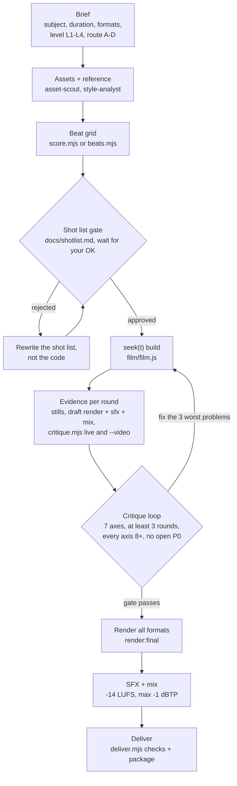

# motion-studio

<p align="center"></p>

[](https://github.com/yazzang-homelab/motion-studio/actions/workflows/ci.yml) [](LICENSE)

English | [한국어](README.ko.md)

motion-studio is a Claude Code plugin for code-rendered motion design. Claude
writes each film as a program: a pure function of time that paints any frame on demand. The plugin supplies the rest
of the harness: a film-project scaffold with a deterministic `seek(t)` canvas renderer, closed-form springs, a beat
grid, synthesized music and SFX, a two-pass loudness mix, an automated critique loop that makes Claude look at its own
frames, and delivery in 9:16, 1:1 and 16:9 from one timeline. On top of that it ships 12 skills
(`/motion-studio:motion-reel` for the whole pipeline plus one per pipeline step from 02 to 12), 7 specialist subagents,
4 guard hooks and an eval suite.

Version 0.1.0. Independent, unofficial implementation: not affiliated with Anthropic or any source credited in
[CREDITS.md](CREDITS.md).

<p align="center"></p>
<p align="center"><sub>The 12 s demo film that <code>studio-init</code> scaffolds, rendered by the plugin (16:9 here; the same timeline renders 9:16, 1:1 and 4:5).</sub></p>

## Contents

- [Pipeline](#pipeline)
- [Install](#install)
- [Quickstart](#quickstart)
- [Skills](#skills)
- [Agents](#agents)
- [Hooks](#hooks)
- [Render contract](#render-contract)
- [Korean / CJK videos](#korean--cjk-videos)
- [CLI reference](#cli-reference)
- [Requirements](#requirements)
- [Render time](#render-time)
- [Determinism](#determinism)
- [Levels and routes](#levels-and-routes)
- [Troubleshooting](#troubleshooting)
- [Evals and CI](#evals-and-ci)
- [Publishing checklist](#publishing-checklist)
- [Credits](#credits)
- [License](#license)

## Pipeline



The shot-list gate is a conversation step. The critique gate is enforced: a hook denies final renders until
`docs/review_log.md` shows at least 3 rounds whose last round scores every axis 8 or higher with no open P0 problem (any
`P0` token on a problem line counts; a P0 closes only through a `FIXES:` line `<n>. fixed|resolved|wontfix`). An `na`
score passes only on the axes in `gate.naAllowed` (default `["brand"]`), so a film that ships with audio cannot pass on
`sound=na`. By default only the last round is judged and the format in its heading is ignored; set `gate.requireFormats: true` when the brief ships several formats and every format in `formats` must have its own round and the latest round of each format must pass. When cues, music or picture timing changed, each round builds a draft render, `sfx` and `mix` first, then runs two evidence passes (`critique.mjs` on the live
film into `out/review/<fmt>/`, and `--video` on the mix into `out/review/<fmt>/video/`), because the critic scores sound
from real audio and cannot render or mix itself. The critic opens every page of a paged sheet. The live pass also checks that
every character the film draws has a glyph in its font: a missing one is a P0 `font-fallback` finding, which stays an open P0
(and blocks the gate) until a font that covers it is registered. The mix pass reports a silent span of 1 s or more as a P1
`audio-gap`, and `deliver` fails on one.

## Install

The repository is both the marketplace and the plugin (`.claude-plugin/marketplace.json` lists one plugin with
`"source": "./"`). Replace `OWNER` with the GitHub account that hosts it.

| Goal | Command |
|---|---|
| Add the marketplace (shell) | `claude plugin marketplace add yazzang-homelab/motion-studio` |
| Install the plugin (shell) | `claude plugin install motion-studio@motion-studio` |
| Both in one step, inside a session (Claude Code 2.1.275+) | `/plugin install motion-studio --marketplace yazzang-homelab/motion-studio` |
| Update | `claude plugin update motion-studio@motion-studio`, then restart or `/reload-plugins` |
| Skills only, no hooks or agents | `npx skills add yazzang-homelab/motion-studio` |
| Local development from a clone | `claude --plugin-dir .` (run in the repo root) |

Notes:

- `npx skills add` installs the `skills/` folders only (symlinked to one canonical copy by default; `--copy` makes
  independent copies). Hooks, agents and plugin metadata are not installed, so the critique gate, the determinism lint
  on edits and the subagent roles are missing; run `npm run lint` and `npm run gate` in the film project yourself.
  `${CLAUDE_PLUGIN_ROOT}` is not substituted there either: every skill command that uses it also names the
  `${CLAUDE_SKILL_DIR}/../<skill>/...` form for skills-only installs, and Claude does each stage itself. The `skills` CLI
  requires Node 22.20 or later.
- Third-party marketplaces do not auto-update by default. Run `claude plugin update` or enable auto-update in
  `/plugin` > Marketplaces.
- Organizations that restrict marketplaces in managed settings (`strictKnownMarketplaces`) refuse
  `marketplace add` for sources they do not list. Ask the administrator to allow the repository, or use
  `claude --plugin-dir` with a local clone.
- The plugin itself has no runtime dependencies. Playwright and ffmpeg-static are installed into each film project by
  `studio-init`, never into the plugin cache.

## Quickstart

```bash
# Git Bash, macOS, Linux (and PowerShell 7)
mkdir my-film && cd my-film && claude
```

```powershell
# Windows PowerShell 5.1 has no && chaining: one command per line, or use ;
mkdir my-film
cd my-film
claude
```

Then, in the Claude Code session:

```text
/motion-studio:studio-init .
/motion-studio:motion-reel https://your-product.example 20s 9x16
```

1. `studio-init` copies the film-project scaffold, runs `npm install`, makes sure a browser is there (on Windows that is
   Playwright's headless shell: `npx playwright install chromium-headless-shell`, about 115 MB) and runs `npm run doctor`.
2. `motion-reel` collects the missing inputs, gathers brand assets, builds the beat grid, shows you the shot list and
   waits for your OK, builds the film, runs at least 3 critique rounds, then renders, mixes and delivers.
3. To test the engine first, run `/motion-studio:showreel` (the course's one-line showreel prompt).

Without Claude driving, the same tools run from a clone of this repository:

```bash
# Git Bash, macOS, Linux (and PowerShell 7). --install runs npm install
node path/to/motion-studio/skills/studio-init/scripts/init.mjs my-film --title "My Film" --install
cd my-film
npx playwright install chromium-headless-shell   # Windows: required. macOS, Linux: optional when Chrome is installed
npm run doctor
npm run preview
```

```powershell
# Windows PowerShell 5.1: one command per line. --install runs npm install
node path\to\motion-studio\skills\studio-init\scripts\init.mjs my-film --title "My Film" --install
cd my-film
npx playwright install chromium-headless-shell
npm run doctor
npm run preview
```

On Windows the renderer uses Playwright's bundled headless shell, never your installed Chrome or Edge, unless you ask for
it. An installed browser started with a fresh profile counts as a failed Windows logon and can lock the account (see
[Troubleshooting](#windows-account-gets-locked-out-while-rendering-or-testing)). Without `--install`, run `npm install` in the
project first; `npm run setup:browser` is the same as the `npx playwright install` line.

## Skills

Invoke as `/motion-studio:<name>`. Each skill ends with a pointer to the next step.

| Skill | Course step | What it does |
|---|---|---|
| `motion-reel` | all (the skill from step 12) | End to end: inputs, init, doctor, assets, reference, music, shot list gate, build, critique loop (3+ rounds, all 8+, no P0), final render, SFX, mix, deliver, report with "what I'd improve next" |
| `studio-init` | 02 Setup | Scaffold a film project, install it, set up the browser (Windows: Playwright's headless shell), run doctor, explain layout, commands, effort levels and optional companions |
| `showreel` | 03 One-liner | The credited one-line showreel prompt, its anatomy (duration, subject = model, genre, effort multiplier), variants, and a randomizer against look-alike reels |
| `product-reel` | 04 Brand | Point a reel at a product: real screenshots, logo, colors and fonts from the URL (Chrome sandbox on, local and private addresses refused, credentials stripped from every file); music and beat grid, then story beats; voice and mascot; key hygiene |
| `reference-style` | 05 Reference | Frame, video or library references: `refs.mjs` extract/analyze, `docs/style_guide.md` and `docs/shotlist.md`, grammar never content, wait for OK |
| `ui-morph-spec` | 06 Spec | Six-section XML state spec (inputs, direction, structure, build, gotchas, start): one shape never cuts, states on downbeats, cursor-driven, last frame = first |
| `seek-engine` | 01 Pixels, 07 Engine | The render contract, capture modes, performance knobs, determinism fixes, and the route B handoff to HyperFrames or Remotion (license gate) |
| `springs` | 08 Springs | Presets, `springFromFeel`, `track()` superposition, `loopTrack`, `indicator`, `swapAlpha`, `stepTime`, the refactor-to-springs prompt |
| `sound-design` | 09 Sound | Measure a track (`beats.mjs`) or synthesize one (`score.mjs`), cues from the film, SFX voices, samples, voice, mix to -14 LUFS at exact length |
| `director-brief` | 10 Overnight | Long-form brief skeleton (PLAN FIRST or GO), `ANIMATION_GUIDE.md` + `STORYBOARD.md`, one chapter-animator per chapter, chunked render, optional generate-then-trace |
| `critique-loop` | 11 Critique | Mixed render first, then `critique.mjs` evidence (live film and `--video`), harsh 7-axis scores, P0/P1/P2 problems with timestamps in `docs/review_log.md`, fix the 3 worst, re-render only affected seconds, pass the gate |
| `ship-formats` | 12 Ship | Reframe per format with `layout()` (never crop), render every format, per-format checks, `deliver.mjs`, package your own brand skill, a service-offer template |

## Agents

Plugin subagents are namespaced `motion-studio:<name>`. They cannot ask you questions; they return questions to the
main session, which asks you and re-briefs them. `model: inherit` for all. A subagent that starts a command longer than
about 2 minutes runs it in the background and does not return while it is still running.

| Agent | Tools | Effort | Preloads | Role |
|---|---|---|---|---|
| `motion-director` | Read, Glob, Grep, Write, Edit, WebFetch | high | `director-brief` | Style guide and shot list on the beat grid; `ANIMATION_GUIDE.md` and `STORYBOARD.md` for long form; writes no film code |
| `motion-critic` | Read, Glob, Grep, Bash, Write, Edit | high | `critique-loop` | Reads the live-film and mixed-render evidence (`critique.mjs`, `critique.mjs --video`), looks at every PNG (every page of a paged sheet), scores 7 axes (sound from the mix), lists P0 to P2 with timestamps (a `font-fallback` finding is a P0), writes only `docs/review_log.md`; never renders or mixes |
| `render-engineer` | Read, Glob, Grep, Bash, Write, Edit | high | `seek-engine` | Engine, render, determinism, performance and encode debugging |
| `sound-designer` | Read, Glob, Grep, Bash, Write, Edit | medium | `sound-design` | Score, beats, cues, SFX, voice, mix, sync metrics |
| `asset-scout` | Read, Glob, Bash, Write, WebFetch | medium | `product-reel` | Playwright screenshots, logo (or the text wordmark, recorded as `manifest.brand.wordmark`), colors and fonts with a license registry (`manifest.fonts.registry`) from a URL into `assets/brand/` + `assets/manifest.json`; UI states with `states.mjs` (clicks, scroll frames, element crops) and canvas sprite sheets with `canvas-frames.mjs` (`frames.json`, `pack/pack.json`); never invents UI |
| `style-analyst` | Read, Glob, Grep, Bash, Write | medium | `reference-style` | `refs.mjs` analysis into `docs/style_guide.md` and shot-grammar notes; takes the grammar, not the content |
| `chapter-animator` | Read, Glob, Grep, Bash, Write, Edit | high | `springs`, `seek-engine` | Implements one chapter `film/scenes/chNN_*.js` per `ANIMATION_GUIDE.md`; lints and checks stills for its range; reports shared-file bugs instead of editing them |

## Hooks

Plugin hooks load at session start and fire on every matching event. All four are Node scripts in exec form, add well
under a second on top of Node startup, and fail open (allow) on any internal error.

| Event (matcher) | Script | What it enforces |
|---|---|---|
| PostToolUse (`Write\|Edit\|MultiEdit`) | `hooks/post-edit-lint.mjs` | After an edit to `index.html`, `film/**` or `lib/**` inside a studio project, lints the file with the project lint rules. Errors (e.g. `Math.random`, `Date.now`, timers, `requestAnimationFrame`, remote fetches) are fed back to Claude with the line and the fix; warnings are added as context |
| PreToolUse (`Bash\|PowerShell`) | `hooks/pre-bash-gate.mjs` | Denies final renders (`render.mjs ... --final`, `npm run render:final`, `npm run build`) until the critique gate passes, however the command is wrapped: package script bodies, `npm --prefix/-C/-w` anywhere before `--`, nested shells, PowerShell assignments (`$out = npm run build`), `Invoke-Expression`, `eval`, `Start-Process`, `-EncodedCommand`. Drafts, stills, previews and animatics are never gated |
| PreToolUse (`Write\|Edit\|MultiEdit`) | `hooks/role-guard.mjs` | Keeps plugin subagents in their lanes: chapter-animator writes `film/scenes/**` and `out/check/**` but never `film/scenes/shared_*` (shared by every chapter, so read-only for chapter subagents); motion-critic `docs/review_log.md` and `out/review/**`; style-analyst `docs/style_guide.md`, `docs/shotlist.md`, `refs/**`; asset-scout `assets/**`; motion-director `docs/**`. The main session is never restricted |
| SessionStart (`startup\|resume\|clear\|compact`) | `hooks/session-start.mjs` | Inside a studio project, adds a short status: title, formats, duration and BPM, gate rounds and last scores, finals present, the next suggested command |

Control:

- Disable every hook: start Claude Code with `MOTION_STUDIO_HOOKS=off` in the environment (or set it under `env` in
  your `settings.json`).
- Waive only the critique gate for one project: set `"gate": { "enabled": false }` in its `studio.json`. That is your
  decision; the hook tells Claude never to change it.
- Organization policy: when managed settings set `allowManagedHooksOnly: true`, plugin hooks do not fire at all
  (unless an administrator force-enables the plugin in managed `enabledPlugins`). Skills and agents still work, and
  the skills run `npm run lint` and `npm run gate` themselves, but nothing blocks a final render automatically.
- `claude plugin details motion-studio` lists the hook EVENTS the plugin registers (`Hooks (3)  PostToolUse, PreToolUse,
  SessionStart`: four scripts under three events; `hooks/hooks.json` names the scripts and matchers). It does not show
  script names, matchers or whether managed settings suppress them. To test that hooks fire, open Claude Code in a film
  project and have it write `film/hook-probe.js` containing `const x = Math.random();`: the post-edit lint answers with a
  `no-math-random` error when hooks run, and stays silent when they are suppressed. Delete the probe afterwards.

## Render contract

Full reference: [docs/ARCHITECTURE.md](docs/ARCHITECTURE.md). Every film project also gets a compact `docs/API.md` (the
signatures and defaults of `lib/`), so Claude finds them without the plugin repository.

- A film is `film/film.js`: `export default defineFilm((ctx) => ({ scenes, cues }))`. Every scene draws from `t`
  alone. No `Math.random`, `Date`, `performance.now`, timers, `requestAnimationFrame` or CSS transitions in film or
  library code; randomness comes from `rngFor(name, i)`, one seeded stream per element.
- Film API in short: `scene(from, to, name, draw)` (optional `layer` orders the drawing), `chapter()` for parallel
  chapter files, and `overlays` in the factory result for film-wide layers (captions, seam transitions) that paint above
  every scene and never count as shots. `ctx.grid` gives `beat(n)`, `bar(n)` and the measured accent peaks
  `grid.hits` / `grid.hitsIn(a, b)` from `audio/beats.json`. Keyed values use `track()` (a spring per change, optionally
  per key) and `loopTrack()` for seamless loops.
- `index.html` boots the film into `<canvas id="stage">`. Tools serve the project over `http://127.0.0.1:<random port>`
  (ES modules and `fetch` fail on `file://`).
- `window.seek(t)` paints frame `t` synchronously (an optional second argument `{ frameT, sub, subs }` marks it as one
  motion-blur subframe of an output frame). `window.__studio` exposes `ready`, `meta`, `frame({ t, sub,
  shutter })`, `hash(t, { sub, wrap })`, `pixels(t, w)`, `cues()`, `shots()`, `grid`, `textUse()`, `coverage(family, weight,
  style, chars)` and `textTrack`. `wrap: false` paints the raw end of a loop film, which is how the critique tests that
  `hash(0)` equals `hash(duration)`. `textUse()` and `coverage()` are the critique's font check: with
  `window.__TEXT_TRACK__ = true` set before the page loads (or `?texttrack=1`), `text()`, `kinetic()` and `textWidth()` record
  which characters are drawn with which font, `textUse()` returns `[{ family, weight, style, chars }]` for the frames painted so
  far, and `coverage()` says which of those characters a face cannot draw. Tracking is off by default, never changes a pixel, and a
  film that draws with `g.fillText` itself can call `recordText(str, cssFont)` from `lib/draw.js`. `text()` and `kinetic()` do not
  throw for an unregistered family (system and emoji fonts are legal); the critique reports it.
- Render mode (`?render=1`, `window.__RENDER__` or `navigator.webdriver`) disables the preview UI, which always lives
  outside the canvas.
- The 2D context is CPU-rasterized (`willReadFrequently`, `alpha: true` so text stays grayscale-antialiased, `--disable-accelerated-2d-canvas`) and
  scenes draw in the format's logical pixels. Bundled fonts are loaded with the FontFace API and asserted; a missing
  font fails the render.
- Motion blur: canvas films accumulate `sub` subframes (default 4, shutter 0.5) inside the page, centered on each
  frame time. DOM films (`capture: 'page'`) fall back to one screenshot per subframe blended by ffmpeg `tmix`. A scene
  sees `c.t` and `lt` as the SUBFRAME time (so motion blurs by itself) and `c.frameT`, `c.frameLt`, `c.frame` (the output
  frame index), `c.sub` and `c.subs` as the output frame's own values, identical for every subframe: `grain(g, W, H,
  c.frame)` looks the same in stills, preview and the final, and `stepTime(c.frameLt, 12)` is a hard cut. A first hook
  must not start at zero: a spring released at `lt = 0` draws nothing on frame 0, so release it before the scene
  (`kinetic(..., lt + 0.3, ...)`).
- Video: H.264 `yuv420p`, CRF 16, preset `slow`, tune `animation`, BT.709 tagged, `+faststart`. Outputs are staged in
  `out/<fmt>/.staging/` and published as one unit; a failure puts the old files back.
- The tools' static server (`127.0.0.1` only) answers 404 for every dot-file and dot-directory of the project, also
  through symlinks, junctions and 8.3 short names, and on Windows for request paths containing `\` or `:`.
- Audio: length is exactly frames / fps; the master is -14 LUFS integrated within 0.5 LU and at most -1 dBTP; AAC
  256 kb/s at 48 kHz; never `-shortest`.

## Korean / CJK videos

The bundled Instrument Serif and Inter are Latin-only. Hangul, kana or hanzi drawn with them come from a system font on
your machine, or as empty boxes (tofu) on a machine without one, so the render is neither portable nor reproducible.
Register a font that has the characters before you write the film:

```bash
# one full Hangul font file (a path or an https URL); the format is read from the file's bytes
npm run fonts -- add-file ./KoreanFont.woff2 --family "Korean Font" --license-file ./OFL.txt
# or a Google CJK family: about 100 numbered slices; prints the file count and size, --yes downloads
npm run fonts -- add "Noto Sans KR:400" --subsets korean,latin --yes
# prove every character of the film's text has a glyph (exit 1 when one is missing)
npm run fonts -- coverage --text "안녕하세요 모션 스튜디오" --family "Korean Font"
```

- `add-file` refuses HTML pages, Git LFS pointers and truncated files before writing anything, copies the license text
  next to the font (a missing license prints a warning) and records the font in `assets/fonts/fonts.json`.
- Sliced fonts are loaded eagerly, every slice, before frame 0; `unicodeRange` per entry and an optional `sample` string
  say which characters prove a slice loaded. `--subsets korean` is needed because Google labels only its Latin, Cyrillic and Vietnamese slices; the numbered Hangul
  slices carry no label.
- Point `brand.fonts.display` or `brand.fonts.ui` in `studio.json` at the new family. A `text()` or `font()` call without
  `family` then draws `brand.fonts.ui`, `kinetic()` draws `brand.fonts.display`, and a call without `weight` takes the
  nearest weight the family has (a 400-only face is never faked bold). `wrapText(g, text, maxW, font)` breaks lines at
  spaces and never inside a Hangul syllable; `fitFontSize(..., { step: 16 })` returns sizes that stay on the pixel grid
  of a bitmap font such as NeoDunggeunmo.
- Without `--family`, `coverage` judges every registered family separately, so the bundled Latin fonts fail on Korean
  text by design.
- A `fallback` result means a system font drew the character on this machine; do not rely on it. Check the font's license
  before commercial use: no font binary besides the two bundled Latin families ships with this plugin.
- The critique checks this for you. `npm run critique` opens the film with the text-use registry on, asks which characters each
  font drew (`textUse()`) and whether the font has a glyph for each (`coverage()`), and raises a P0 `font-fallback` for every font
  row with a gap. The finding names the family and weight, up to 40 of the missing characters and the fix: register a font that covers
  them with `add-file` (or change the family), then re-run `coverage`. An unregistered family (a name that is not in
  `fonts.json`) or a generic one such as `sans-serif` is a P0 of its own, because every character then comes from a system font.
  A P0 blocks the gate until it is fixed, so Hangul drawn with the Latin-only Inter cannot reach a final render. The check needs
  the `lib/runtime.js` of this plugin version (an older runtime gives the note `preflight: unavailable`, never a finding) and sees
  only text that the reviewed frames drew.

## CLI reference

### Film project (after `studio-init`)

Pass flags after `--`, e.g. `npm run render -- --format 1x1 --from 2 --to 4`. Every tool prints usage with `--help`.
Exit codes: 1 for a failure (a runtime error, a failed check, a `studio.json` that does not validate, including
`audio.lufs` outside -70 to -5), 2 for a usage error (an unknown or invalid flag). `--json` prints one JSON line on stdout:
the result on success and `{"ok":false,"error":"..."}` on any usage, configuration or runtime error, `gate.mjs` and `lint.mjs`
included (the human message stays on stderr). `gate.mjs` reports a failing gate as its own verdict (`pass: false`), and
`deliver.mjs` reports failed checks, and a run that cannot start, as `{ ok: false, error, failed: [...] }`. Commands
that take minutes (`render:final`, `build`, `mix`, `deliver`) belong in the background with a log you poll; expected
times are in the [render time](#render-time) table.

| Script | Runs | Purpose | Useful flags |
|---|---|---|---|
| `npm run preview` | `tools/serve.mjs --open` | Live preview in your browser: scrubber, Space play/pause, arrows step frames or beats, `[` `]` shots, F formats, G safe-area guides | `--port N` (default 4178) `--json` |
| `npm run render` | `tools/render.mjs` | Render the primary format to `out/<fmt>/silent.mp4` + `poster.png` + `render.json`, published as one unit (if a player holds an old file open the finished render stays in `out/<fmt>/.staging/` and the old outputs are untouched); a `--from`/`--to` range that leaves frames out writes `clip_<from>-<to>.mp4` and leaves `silent.mp4` alone, a range that covers the whole film is a full render | `--format f\|all\|a,b` `--fps` `--sub` `--shutter` `--from` `--to` `--scale` `--workers` `--crf` `--preset` `--draft` `--chunk S` `--out` `--no-poster` `--hash` `--json` |
| `npm run render:all` | `render.mjs --format all` | Every format in `studio.json` | as above |
| `npm run render:final` | `render.mjs --format all --final` | Final render of every format at scale 1 (gated by the hook); rejects `--draft`, `--scale` and `--from`/`--to`. About 4 min for the 12 s demo, so run it in the background | as above |
| `npm run animatic` | `render.mjs --scale 0.5 --fps 30 --sub 1 --draft --out out/animatic` | Fast pacing check | as above |
| `npm run stills` | `tools/stills.mjs --beats` | One still per beat as a labelled contact sheet. No image is taller than `--page-height` (default 1800 px) or wider than 1990 px: a longer sheet is split into pages of whole rows, page 1 is `contact.png`, then `contact-2.png`, `contact-3.png` ... (`--cols` is lowered to fit) | `--at 0.5,2` `--every S` `--beats` `--shots` `--from S` `--to S` `--format` `--width` `--cols` `--no-label` `--out` `--page-height N` `--frames-dir` `--sub` `--max` |
| `npm run critique` | `tools/critique.mjs` | Evidence for a critique round: contact, shots, phone, strip and (loop films) loop sheets plus `metrics.json`/`metrics.md` (determinism, glyph coverage of the drawn text, dead spans, pops, frame 0, loop seam, corners, borders, sync, loudness, silent spans). Sheets are paged like `stills` (same rule, `--page-height` default 1800 px; open every page). Live film into `out/review/<fmt>/`; `--video` on a mixed render into `out/review/<fmt>/video/` (the two never overwrite each other). `--from S --to S` review one chapter: stills, sheets and every metric cover only that range. Findings include a P0 `font-fallback` (live) and a P1 `audio-gap` (`--video`). Every evidence folder also gets `film-hash.json` (`filmHash` over `film/**`, `lib/**`, `studio.json`) and `baseline.json`: the next run lists which pop, jump and dead-span candidates are new. `studio.json` `critique.stepped` and `critique.popIgnore` keep hard-stepped looks out of the findings | `--format` `--video [PATH]` `--from S` `--to S` `--strip-at S` `--page-height N` `--no-determinism` `--skip-determinism-repeat` `--check-hash` `--json` |
| `npm run score` | `tools/score.mjs` | Original synthesized music + `audio/beats.json` + `audio/music.meta.json` (settings and WAV hash); `--if-missing` keeps a supplied track and a score whose settings still match, and regenerates a stale score of its own | `--bpm` `--dur` `--style pulse\|piano\|minimal\|cinematic` `--key` `--mode` `--seed` `--drop BAR` `--loop` `--out` `--beats` `--if-missing` |
| `npm run beats` | `tools/beats.mjs <track>` | Measure a supplied track: BPM, beats, downbeats, hits. The JS engine searches 70 to 180 BPM unless `--bpm-hint` widens it | `--engine auto\|librosa\|js` `--bpm-hint N` `--no-cache` `--out` |
| `npm run sfx` | `tools/sfx.mjs` | Read cues from the film, synthesize every SFX, write `audio/sfx.wav` | `--cues` `--format` `--out` `--dur` `--samples DIR\|none` (`--no-samples`) `--seed` `--dump-cues` `--list` |
| `npm run voice` | `tools/voice.mjs` | ElevenLabs voice lines from `audio/voice.json` into `audio/voice.wav` (then set `audio.voice` in `studio.json`); needs your `ELEVENLABS_API_KEY`; an identical line is synthesized and billed once | `--script` `--dry-run` `--voice-id` `--model` `--out` |
| `npm run mix` | `tools/mix.mjs --format all` | Measures every stem, then a two-pass loudness mix to `out/score.wav`, mux into `out/<fmt>/final.mp4`. A music, voice or sfx stem that is short (by over 0.25 s), empty or silent stops the mix (a silent sfx stem only warns). `--lufs` and `audio.lufs` accept -70 to -5; a bad flag is exit 2, a bad `studio.json` value is exit 1 | `--format` `--music P\|none` `--sfx P\|none` `--voice P\|none` `--lufs` `--tp` `--no-duck` `--allow-short-stems` |
| `npm run deliver` | `tools/deliver.mjs` | Delivery checks of `final.mp4` against the current `studio.json` (codec, frames, exact duration, size, fps, audio, loudness, true peak, silent spans, file size, poster, loop seam, gate; a render older than a `duration` or `fps` edit fails as stale; a silent span of 1 s or more below -50 dB fails as `silence`, except an intro, a fade-out or a `critique.allowSilence` interval) + package into `out/deliver/` (video, poster, every page of the contact sheet, `manifest.json`) and `docs/production.json`; exit 1 when a check fails. `--json` failure: `{ ok: false, error, failed: [...] }`. `--format` re-delivers only those formats and keeps the others | `--format f\|all\|a,b` |
| `npm run build` | score (if missing), sfx, render:final, mix, deliver | The whole finish in one command (gated by the hook) | |
| `npm run lint` | `tools/lint.mjs` | Determinism and house-rule lint of `index.html`, `film/**`, `lib/**`; exit 1 on errors. With `--json` a usage or runtime error prints `{"ok":false,"error":"..."}` | `[files...]` `--json` |
| `npm run gate` | `tools/gate.mjs` | Critique gate status from `docs/review_log.md` against `gate` in `studio.json` (`minRounds`, `minScore`, `axes`, `naAllowed`, `requireFormats`); the strict open-P0 rule is printed by `--help`; exit 0 pass, 1 fail. With `--json` a failing gate prints its verdict (`pass: false`, `reasons`); a usage or config error prints `{"ok":false,"error":"..."}` | `--json` |
| `npm run doctor` | `tools/doctor.mjs` | Node, Playwright, browser (Windows: the bundled headless shell is `ok`, an installed Chrome or Edge is `warn`, plus an info row `windows-logon-guard`), ffmpeg filters, Python/librosa, config, fonts, `.env` key presence, with fix commands per OS. Slow checks run concurrently under their own budgets (browser 60 s, ffmpeg 20 s, Python 60 s) and report `timeout` instead of hanging; exit 1 when a required check fails or times out | `--json` |
| `npm run setup:browser` | `playwright install chromium-headless-shell` | Downloads Playwright's headless shell (about 115 MB). Required on Windows, where it is the default browser; optional on macOS and Linux when Chrome or Edge is installed | none |
| `npm run refs` | `tools/refs.mjs` | `extract <video>` frames + contact sheet (`refs/contact.png`, paged like every sheet: `contact-2.png` ...); `analyze <video\|folder\|image>` cuts, shot lengths, palette, motion energy (a container without a Duration is measured from its packets) | `--every S` `--out` `--threshold` |
| `npm run fonts` | `tools/fonts.mjs` | `add "Family:400,700"` (Google Fonts woff2, latin + latin-ext by default), `add-file <path\|url> --family NAME` (a font you already have, license copied next to it), `coverage --text "..."` (which characters have no glyph), `list`, `remove <family>` | `--italic` `--subsets` `--yes` `--weight` `--style` `--license` `--license-file` `--unicode-range` `--family` `--text-file` |

Scaffold directly: `node skills/studio-init/scripts/init.mjs <dir> [--title T] [--duration S] [--fps N] [--bpm N]
[--formats a,b|all] [--loop|--no-loop] [--brand-url URL] [--force] [--install] [--json]`. In an existing folder it adds
only missing files (`package.json` and `.gitignore` are merged); `--force` refreshes template files but never
`studio.json`, `film/**`, `docs/**` or `assets/fonts/fonts.json`. In `package.json` it resets only a template script whose command
differs and never changes a dependency version; init lists what it kept (`kept your package.json values, which differ from the
template`) and what it reset. `--brand-url` is stored without `user:password@` and without secret-looking parameters (query,
`;matrix` path parameter, fragment: `token`, `key`, `secret`, `password`, `auth`, `sig`, `session`, `code` and similar): stderr names
what was removed and the `--json` result lists it in `redacted`. A secret that is a bare path segment cannot be recognized, so pass
a public URL and keep keys in `.env`.

### This repository (development)

| Script | Purpose |
|---|---|
| `npm test` | Unit tests: `node --test` over `test/*.test.mjs` (browser and ffmpeg tests skip when unavailable), at most min(4, cpus - 1) files at once; `npm test -- --test-concurrency=N` overrides |
| `npm run test:smoke` | End-to-end smoke test with `SMOKE=1`: scaffold a temp project, render 1 s twice (frame hashes must match), a partial clip, stills, score, sfx, mix, critique, deliver |
| `npm run lint` | `scripts/lint-plugin.mjs`: frontmatter allowlists, agent colors, names, description lengths, CRLF, JSON parse |
| `npm run validate` | `claude plugin validate . --strict` (marketplace) and `claude plugin validate .claude-plugin/plugin.json --strict` (plugin, hooks, skills, agents) |
| `npm run eval:lint` | `scripts/eval-lint.mjs`: loads every eval case at zero cost and fails on load errors or infeasible graders |
| `npm run eval:selftest` | `evals/_selftest`: grades every regex and `tool_used` grader against passing and failing samples and runs each scaffold, at zero cost |

## Requirements

| Need | Version | Notes |
|---|---|---|
| Node.js | 20 or later | Tested on 20.11. Route A never needs Node 22 |
| Browser (Windows) | Playwright's bundled headless shell | `npx playwright install chromium-headless-shell` (about 115 MB download, 270 MB on disk). `auto` never starts an installed Chrome or Edge here: every launch of one with a fresh profile counts as a failed logon and can lock the account. Opt in with `studio.json` `browser: "chrome"` or `"msedge"`, or `MOTION_BROWSER=chrome`; that prints a warning per launch and is refused past a limit (below) |
| Browser (macOS, Linux) | Chrome or Edge, or Playwright's browser | Auto order: Chrome, Edge, bundled browser (`npx playwright install chromium-headless-shell`). No warning, no guard |
| Browser overrides | `MOTION_CHROME_PATH`, `MOTION_BROWSER`, `studio.json` `browser` | In that order of precedence. `MOTION_CHROME_PATH` takes a Chromium-based executable, `MOTION_BROWSER` takes `auto`, `chrome`, `msedge` or `chromium` (`auto` is the way back to the safe default) |
| Launch guard (Windows, installed Chrome or Edge only) | 4 launches per 10 minutes | The launch being started counts, so 3 pass and the 4th is refused with the wait time. `MOTION_SYSTEM_BROWSER_MAX` (1 to 9) sets the limit, `MOTION_ALLOW_LOCKOUT_RISK=1` removes the refusal (the launch is still logged and warned about), `MOTION_LAUNCH_LOG` moves the log (default `%LOCALAPPDATA%\motion-studio\system-browser-launches.json`) |
| Playwright | ^1.63 | Installed into the film project by `studio-init` |
| ffmpeg | any recent build with `loudnorm`, `ebur128`, `alimiter`, `sidechaincompress`, `amix`, `tmix`, `scale`, `apad`, `atrim` | Default: the `ffmpeg-static` optional dependency (a GPL build, downloaded at `npm install`). Override with `FFMPEG_PATH`; PATH and `imageio-ffmpeg` are fallbacks |
| Python + librosa | Python 3.12 or later, librosa 1.0 | Optional, for `beats.mjs --engine librosa`. Without it the built-in JS beat tracker runs. Point `MOTION_PYTHON` at the interpreter (a pin: no other Python is tried, and `--engine auto` falls back to the JS engine with a message when it does not answer within 60 s) or use `<project>/.venv` |
| ElevenLabs key | `ELEVENLABS_API_KEY` in `.env` | Optional, only for `voice.mjs`. Uses your account and credits; not exercised in CI |

`npm run doctor` checks all of the above and prints the exact fix command for your OS.

## Render time

One measurement, used in every estimate of this plugin (skills, agents, docs):

| Item | Value |
|---|---|
| Film | The template's 12 s demo, in 9x16, 1x1 and 16x9 |
| Machine | 12-thread Windows laptop (Core i7-1255U), installed Chrome, ffmpeg 6.1.1 |
| Settings | 60 fps, 4 subframes, the default 4 workers, final encode (x264 preset slow, CRF 16), 720 frames per format |
| Per frame | 123 ms in 9x16, 75 ms in 1x1, 118 ms in 16x9 |
| Per format | 91 s, 55 s, 87 s: about 4 minutes for the three formats (3 min 55 s to 3 min 58 s on an idle machine, up to 5 min while other programs load it) |
| Rule of thumb | About 20 s of wall time per second of film for three formats at 60 fps; 15 s of film takes about 5 minutes |

In a capture-only benchmark on a synthetic scene (200 arcs, text, a gradient) the course's screenshot-per-subframe loop cost
1,575 ms per output frame and the in-page accumulation used here 148 ms; the table above is the real film end to end. Other commands on the same 12 s demo: `doctor`
20 to 35 s, `score` 4 to 11 s, `sfx` 10 to 15 s, a draft render (`--draft --sub 1 --scale 0.5`) about 20 s per format, one
`critique` live pass about 115 s (about 145 s for a 20 s film, `--video` about 85 s), `mix` 40 to 80 s, `deliver` about 40 s. Run anything past about 2 minutes in the background and poll its
log; a foreground call is cut off at 2 minutes by default and 10 at most. `npm run build` takes about 6 minutes.

These times come from an installed Chrome. The Windows default is now Playwright's headless shell, and its per-frame speed was
not re-measured. Its start-up is measured: the shell is unsigned, so a real-time antivirus scans each browser process
(AhnLab V3 on the measured laptop). There one browser start took 4 to 5 s: launch about 3.5 s, first page about 11 s, 15 to
25 s per tool run against 2.4 s for the signed installed Chrome. An antivirus exclusion for `%LOCALAPPDATA%\ms-playwright`
removes it (a decision for you or your IT, not something the plugin sets up).

## Determinism

| Guarantee | Scope |
|---|---|
| Same `studio.json`, film sources, fonts and browser build on the same machine produce bit-identical frames (sha256 of the PNG bytes), in any order and with any worker count | Guaranteed. `render --hash` writes `out/<fmt>/frames.sha256` (one `index t sha256` line per frame, plus a `framesDigest` in `render.json`, identical for a chunked render); `critique.mjs` hashes frames that straddle every shot boundary and cue in order, shuffled and on a fresh page |
| `score.mjs` and `sfx.mjs` output is sample-identical across runs | Guaranteed. Each SFX cue is seeded from its type, time and rank among identical cues, so adding, removing or reordering other cues never changes its sound |
| Identical pixels across operating systems, GPUs, drivers or browser versions | Not guaranteed. Font rasterization and Skia differ; compare hashes only within one machine and browser build (recorded in `render.json`). Switching between an installed Chrome and the bundled headless shell is a different build: re-render before comparing [pixel difference not measured] |
| Identical MP4 bytes | Not guaranteed. The encoder bitstream can vary with thread count; frames are the contract, not the container |
| Route C generated assets | Not deterministic by nature; the lint covers only the JavaScript layer |

## Levels and routes

Levels, from the course's prompt-size ladder (figures reported by creators, anecdotes rather than benchmarks):

| Level | Prompt size | Reported run time | Examples cited | Skill |
|---|---|---|---|---|
| L1 one-liner | ~150 characters | 15 to 50 min | @stephanlivera, @himanshutwtxs, @robj3d3 | `showreel` |
| L2 brand reel | ~350 characters | 30 to 45 min | @tdinh_me, @achxvi | `product-reel` |
| L3 state spec | 1.5k to 3k characters | ~1 to 2 h with fixes | @twoclipping, @verbove | `ui-morph-spec` |
| L4 director brief | 9.5k to 19k characters | 6 to 12 h autonomous | @donaldjewkes, @pradeepXkapoor, @pleometric | `director-brief` |

Routes, from the course's route table:

| Route | Best for | Strength | Weakness | In motion-studio |
|---|---|---|---|---|
| A code-drawn | Showreels, UI motion, loops, product films | Zero dependencies, fully editable, what Opus picks when unprompted | Characters and photoreal need a lot of spec | The whole pipeline; the default |
| B framework (Remotion, HyperFrames) | Explainers, product videos, series | Studio preview, reusable components | Remotion needs a Company License for for-profit organizations with more than 3 employees; HyperFrames and the `skills` CLI need Node 22+ | Handoff via `seek-engine`, only when you name the framework |
| C mixed pipeline | Music videos, character stories | Physics and faces from image/video models, code draws the visible layer | API spend, sync work, less determinism | Planned with `director-brief`; your keys and budget; no generator is bundled |
| D footage edit | Talking heads, recuts of real clips | Your real face and voice stay in | Needs raw footage and clean audio | Out of scope for 0.1.0 |

Effort: medium for fixes and re-renders, xhigh for new films, max when the first 3 seconds carry a launch.
`motion-reel` sets xhigh while it runs; change it with `/effort` or `/model`.

## Troubleshooting

| Symptom | Cause and fix |
|---|---|
| Blank page or `Failed to fetch dynamically imported module` when opening `index.html` by double-click | ES modules and `fetch('studio.json')` do not work on `file://`. Use `npm run preview`, which serves the project over http. All tools do the same, so paths with spaces, `#`, `%` or non-ASCII characters are fine |
| `Executable doesn't exist ... ms-playwright`, `could not launch a browser: no safe browser found.` (Windows) or no browser found | `npm install` does not download a browser. Run `npx playwright install chromium-headless-shell` (or `npm run setup:browser`), or set `MOTION_CHROME_PATH` to a Chromium-based executable. On macOS and Linux an installed Chrome or Edge also works. On Windows an installed Chrome or Edge is an opt-in with a lockout risk (next entry) |
| Windows: the account gets locked out while rendering or testing | A fresh-profile launch of an installed Chrome or Edge counts as a failed logon. See [Windows account gets locked out while rendering or testing](#windows-account-gets-locked-out-while-rendering-or-testing) below |
| `refusing to start chrome: N launches of an installed Chrome/Edge in the last 10 minutes ...` (Windows) | The launch guard, which only applies after you opted in to an installed browser. Wait the time the message names, or switch to the headless shell: `npx playwright install chromium-headless-shell`, then remove `browser` from `studio.json` and unset `MOTION_BROWSER` and `MOTION_CHROME_PATH`. `MOTION_ALLOW_LOCKOUT_RISK=1` starts anyway and accepts the risk |
| Windows: every tool run spends 15 to 25 s before it does anything | The headless shell is unsigned and a real-time antivirus scans each browser process (measured: launch about 3.5 s, first page about 11 s, on a machine with AhnLab V3). An exclusion for `%LOCALAPPDATA%\ms-playwright` removes it; that decision is yours or your IT's. Going back to the installed Chrome (2.4 s per run there) costs one failed logon per launch |
| `font missing: ...` | A face in `assets/fonts/fonts.json` or `studio.json` `fonts` did not load, or a sliced font's entry covers none of the characters it declares. Run `npm run fonts -- list`, re-add with `npm run fonts -- add "Family:400,700"`. Never link Google Fonts from the page (the lint rejects remote URLs) and never rely on system fonts, which differ per OS |
| Korean (or other CJK) text renders as boxes or in a different face | The bundled fonts are Latin-only. See [Korean / CJK videos](#korean--cjk-videos) and check the text with `npm run fonts -- coverage --text "..." --family "Your Font"` |
| The critique reports a P0 `font-fallback` | A character the film draws has no glyph in its font, or the font is not registered, so a system font (different on every machine) or a tofu box would draw it. Register a font that has the glyphs (`npm run fonts -- add-file ...`), check with `npm run fonts -- coverage --text "..." --family "Name"`, set `brand.fonts` or the `family` option, and run `npm run critique` again. See [Korean / CJK videos](#korean--cjk-videos) |
| A render or critique idles 10 to 20 s after it wrote its files (Windows) | The browser's shutdown can be slow (measured with the installed Chrome). Every browser and page close is bounded by `MOTION_CLOSE_TIMEOUT_MS` (default 8000): after that the browser is killed and a `note: the browser did not close within N s` line is printed. Lower it to trade cleanup for speed |
| ffmpeg not found | `ffmpeg-static` downloads its binary in an install script. If scripts were skipped or you were offline, run `npm rebuild ffmpeg-static`, or set `FFMPEG_PATH` |
| Windows: `python3` does nothing | It is often the Microsoft Store stub. Create a venv (`py -3 -m venv .venv`, then `.venv\Scripts\python -m pip install librosa`) or set `MOTION_PYTHON`; `beats.mjs` falls back to its JS engine anyway |
| First `beats.mjs` run with librosa takes a minute | numba compiles on first use. Results are cached by audio hash in `audio/.cache/` |
| Windows: `npx hyperframes` or `npx skills` fails with `does not provide an export named 'styleText'` or a Node version error | Route B tools need Node 22 (the `skills` CLI 22.20). Switch Node only for that work with nvm-windows, fnm or nvm; route A stays on Node 20 |
| Windows: PowerShell or Git Bash | Both work. npm runs scripts through `cmd.exe`; pass tool flags after `--` |
| Frame hashes differ from another machine | Expected; see [Determinism](#determinism). Compare only on one machine and browser build |
| Final render denied | The critique gate. Run `npm run gate` for the reasons (rounds, scores below 8, an open P0, an `na` on an axis outside `gate.naAllowed`), then continue the critique loop (`/motion-studio:critique-loop`) |
| Hooks never fire | Check `MOTION_STUDIO_HOOKS`, and whether managed settings set `allowManagedHooksOnly`. `claude plugin details motion-studio` only lists the registered hook events (see [Hooks](#hooks) for a real test) |
| `cannot replace <file>: EBUSY` at the end of a render (Windows) | A player or image viewer holds `silent.mp4`, `poster.png` or `render.json` open. The finished render is safe in `out/<fmt>/.staging/`: close the program and copy it, or render again. A warning at the start of the render names the open files; `MOTION_PUBLISH_WAIT_MS` (default 30000) sets how long a held file is waited for |
| `refusing to mix: ... stem problem(s)` | A music, voice or sfx stem is shorter than the film by over 0.25 s, empty or silent (a silent sfx stem only warns). Regenerate it (`npm run score`, `sfx`, `voice`) or pass `--allow-short-stems` for a stem meant to be short |
| `audio-gap` (critique `--video`) or a failing `silence` check in `deliver` | The soundtrack is silent for 1 s or more (below -50 dB) somewhere after the first 0.3 s and before the last second: a stem ends early, or a bed plays under nothing. The loudness still reads -14 LUFS, so only this check sees it. Regenerate the stem (`npm run score`, `sfx`, `voice`) and run `npm run mix` again. Intended silences belong in `studio.json` `critique.allowSilence: [[from, to], ...]`; this build's config validation rejects that key (see the changelog), so fix the stem instead |
| `invalid <path>/studio.json:` then `- audio.lufs must be between -70 and -5 (got -3)` (exit 1) | A config error, not a usage error: the tool stops before it reads any flag, and `--lufs -14` cannot rescue it. Fix the key in `studio.json`. Only a bad command-line flag exits 2 |
| deliver says `stale render` | `studio.json` `duration`, `fps` or the format changed after the render. Run `npm run render:final` and `npm run mix` again |
| True peak above -1 dBTP after AAC | `mix` reports the post-AAC loudness and warns; lower `audio.truePeak` or the stem gains in `studio.json` and remix |
| Skill descriptions look truncated | The skill listing shares a character budget across all installed plugins. Call skills by full name (`/motion-studio:<name>`) |

### Windows account gets locked out while rendering or testing

Symptoms:

- Windows locks the account (10 minutes on the measured laptop) or refuses your password while you only ran renders, critiques,
  `doctor` or the test suite.
- The Security log holds many events 4625 (failed logon) written by `chrome.exe` or `msedge.exe`, logon type 2, package
  Negotiate, SubStatus `0xc000006a` (wrong password), and events 4740 (account locked out).

Mechanism: every launch of an installed Chrome or Edge with a fresh user-data-dir makes the browser test the Windows account
for a blank password, and Playwright creates a new temporary profile for every launch. The test fails, is logged as a failed
logon and counts toward the lockout threshold (10 failed logons in 10 minutes, then 10 minutes locked, on the measured laptop).
Measured on that laptop: 464 events 4625 from `chrome.exe` in 24 h, 2 from `msedge.exe`, 45 lockouts (4740) since the previous
afternoon.

Confirm it in PowerShell (needs an elevated session or membership of Event Log Readers):

```powershell
Get-WinEvent -FilterHashtable @{LogName='Security'; Id=4625; StartTime=(Get-Date).AddHours(-1)} | Group-Object {([xml]$_.ToXml()).Event.EventData.Data | Where-Object Name -eq 'ProcessName' | ForEach-Object '#text'}
```

A `chrome.exe` (or `msedge.exe`) group whose count matches your recent launches is the cause. To see the SubStatus as well:

```powershell
Get-WinEvent -FilterHashtable @{LogName='Security'; Id=4625; StartTime=(Get-Date).AddHours(-1)} | ForEach-Object { $d = @{}; ([xml]$_.ToXml()).Event.EventData.Data | ForEach-Object { $d[$_.Name] = $_.'#text' }; [pscustomobject]@{ Process = Split-Path $d.ProcessName -Leaf; SubStatus = $d.SubStatus } } | Group-Object Process, SubStatus
```

`chrome.exe, 0xc000006a` is the blank-password test.

Fix: the Windows default is Playwright's bundled headless shell, which does not run the test (measured: 3 launches, 0 failed
logons; one fresh launch of the installed Chrome: +1). Install it with `npx playwright install chromium-headless-shell`, remove
`browser: "chrome"` or `"msedge"` from `studio.json` and unset `MOTION_BROWSER` and `MOTION_CHROME_PATH`. `npm run doctor` then
shows `browser ... chromium-headless-shell` as `ok`.

Do not fix it by turning the lockout off. `net accounts /lockoutthreshold:0` stops the lockout and removes the protection against
password guessing for every account on the machine: NOT recommended.

A persistent profile also avoids the repeats: an installed Chrome with one persistent profile directory failed on its first
launch only (measured: +1, then 0 on the second launch). The plugin does not do this; every tool starts a fresh profile.

Side effect: the headless shell is unsigned, so a machine with a real-time antivirus starts each browser process in 4 to 5 s
(launch about 3.5 s, first page about 11 s, 15 to 25 s per tool run; the signed installed Chrome took 2.4 s). An antivirus
exclusion for `%LOCALAPPDATA%\ms-playwright` removes the delay. Whether to ask for one is the user's or IT's decision.

## Evals and CI

`evals/` holds the `claude plugin eval` suite (12 cases): trigger cases for `motion-reel`, `showreel` and the asset stage
of `product-reel`, content cases for springs, the XML spec, the director brief and the Remotion license gate,
scaffolded cases that critique a planted contact sheet (in the main session and through the `motion-critic` subagent)
and edit a film without breaking determinism, a negative case that must not fire any skill, and a render smoke case.

| Workflow | Trigger | Jobs | Cost |
|---|---|---|---|
| `.github/workflows/ci.yml` | push to main, pull requests, manual | lint + validate + unit tests on Ubuntu, Windows and macOS (90 min limit; the headless shell is installed first on all three); smoke render on Ubuntu (outputs uploaded); eval lint + eval self-test on Ubuntu, Windows and macOS | Free, no secrets |
| `.github/workflows/evals.yml` | manual (tag, cost cap, model inputs) and weekly | `claude plugin eval . --trust-plugin --no-publish --threshold 0.8 --max-cost-usd <cap> -j 2 --scaffold` (cap: input `max_cost_usd`, default 20) with Write, Edit and `node`/`npm`/`npx` Bash grants, on ubuntu-22.04 with bubblewrap + socat and the headless shell's system libraries | Paid; needs the `ANTHROPIC_API_KEY` secret |

Browser in CI: the workflows install Playwright's headless shell (`npx playwright install chromium-headless-shell`, with `--with-deps`
on Linux) before the browser tests, because on Windows the default policy ignores the runner's preinstalled Chrome. On Ubuntu and
macOS `auto` still tries the runner's Chrome first. The render eval's scaffold downloads the shell into its workspace and never
falls back to a system Chrome. None of this has run on a real runner yet (the 90 min limit assumes hosted runners are not slower than
the measured laptop, about 45 min for the whole suite [assumption]).

Cost: every case runs 3 times in two arms (with and without the plugin), plus 3 judge calls per LLM grader per run.
A single small case on Haiku measured about $0.04; the full suite is estimated at about $24 to 55 at Opus-class prices,
so the workflow caps each run at $20 by default (list-price estimate); raise `max_cost_usd` for a full run.

Locally:

```bash
npm run eval:lint                                                   # free: load and feasibility check
npm run eval:selftest                                               # free: graders vs samples, scaffolds graded untouched and edited
claude plugin eval . --tag smoke --ablation none --runs 1 --allow-tools Write Edit   # paid, quick
```

Cases that grant Bash (the render case) run only on Linux or macOS: on native Windows the eval sandbox refuses shell
tools.

## Publishing checklist

1. Replace every `OWNER` placeholder (`.claude-plugin/plugin.json`, `.claude-plugin/marketplace.json`,
   `package.json`, both READMEs, `CONTRIBUTING.md`, `CHANGELOG.md`): `git grep -n OWNER`.
2. Bump `version` in `.claude-plugin/plugin.json` (the only place the plugin version lives; the marketplace entry has
   none) and in `package.json`, and add a `CHANGELOG.md` entry. Users get nothing new until the version changes.
3. Run `npm run lint`, `npm run validate`, `npm test`, `npm run eval:lint` and `npm run eval:selftest`; push and wait for CI.
4. Keep the root free of `package-lock.json`: with a lockfile, Claude Code would `npm ci` the development
   dependencies into every user's plugin cache on install.
5. Preview the release tag with `claude plugin tag . --dry-run` (expect `motion-studio--v0.1.0`), then
   `claude plugin tag . --push`.
6. On a clean machine: `claude plugin marketplace add yazzang-homelab/motion-studio`, `claude plugin install
   motion-studio@motion-studio`, then `/motion-studio:studio-init` in an empty folder.
7. Add the `ANTHROPIC_API_KEY` repository secret and run the evals workflow once by hand.

## Credits

The course and its 12-step structure are by Movez ([@0xMovez](https://x.com/0xMovez/status/2104216919033192746)). The
patterns packaged here come from public posts by the creators the course cites and from open repositories, including
buildwithhanif/claude-animation-skill, JohnHeibel/ClaudeAnimationBase and PDoomVideo, HyperFrames, Remotion's skills,
awesome-ai-motion, awesome-opus-5-5-videos and Battle-of-Austerlitz-Film. No code was copied and no prompt text was reused; the one quoted prompt is @stephanlivera's one-line showreel sentence,
credited as the course credits it, next to a few short attributed phrases (under 15 words each) that correct a claim or
name an example, listed with their sources in [prompts/README.md](prompts/README.md). Two licensed texts are
used with their terms: the director-brief acceptance gates are adapted from athemeroy/awesome-opus-5-5-videos (CC BY 4.0,
with a changes note) and the Remotion license terms are quoted with a link. The template bundles Instrument Serif and
Inter under the SIL Open Font License 1.1. Full table with licenses, what was taken and what was not:
[CREDITS.md](CREDITS.md).

## License

Dual-licensed. Free under the [PolyForm Noncommercial License 1.0.0](LICENSE) for personal, research, education,
hobby and other noncommercial use. Commercial use (a company, agency or freelancer making videos for a product, a client
or an ad) needs a paid commercial license: see [COMMERCIAL.md](COMMERCIAL.md). Bundled fonts keep their OFL-1.1 license (license files ship next to them in
`skills/studio-init/template/assets/fonts/`). The `ffmpeg-static` binary that film projects download is a GPL build of
FFmpeg and is not part of this repository.
