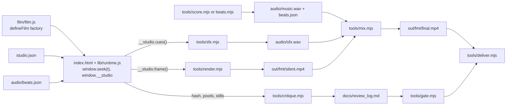

# motion-studio architecture

This is the public reference for the film-project scaffold that `studio-init` creates: the render contract, the film
API, the configuration and data formats, every tool, and the plugin hooks. Times are seconds. Drawing coordinates are
logical pixels of the format (1080 x 1920 for 9:16), whatever the render scale. Flags and defaults below match the
tools' own `--help` output.

## 1. Two layers

| Layer | Lives in | Role |
|---|---|---|
| Plugin | this repository (installed into Claude Code's plugin cache) | Skills, agents and hooks that direct the work; the scaffold template; no runtime dependencies |
| Film project | any folder, created by `skills/studio-init/scripts/init.mjs` | The film source, the tools, the dependencies (`playwright`, optional `ffmpeg-static`) and every output |

The plugin never renders anything itself. Skills and agents call the project's own `tools/*.mjs` (through `npm run`),
and the hooks import two modules from the template (`tools/lint.mjs`, which imports `tools/lint-flow.mjs` beside it, and
`tools/gate.mjs`) to lint edits and gate final renders.



## 2. Film project layout

```text
CLAUDE.md                  house rules for the film (render contract, look, motion, sound, loop, commands, keys)
studio.json                project configuration (section 3)
package.json               scripts (section 9.7), devDependencies playwright, optionalDependencies ffmpeg-static
index.html                 <canvas id="stage"> + module script that boots film/film.js
film/film.js               the film: default export defineFilm(...); ships a 12 s demo
film/scenes/               chapter modules chNN_<name>.js (one owner each); shared_*.js is director-owned
lib/motion.js rng.js timeline.js layout.js draw.js   isomorphic (importable from Node)
lib/fonts.js runtime.js    browser code (fonts.js keeps its pure helpers importable from Node)
tools/studio.mjs studio-web.mjs render.mjs stills.mjs serve.mjs
tools/audio.mjs instruments.mjs score.mjs sfx.mjs beats.mjs beats.py mix.mjs voice.mjs
tools/critique.mjs (CLI driver) critique-live.mjs critique-video.mjs critique-report.mjs critique-fonts.mjs critique-sheets.mjs
critique-metrics.mjs critique-pin.mjs critique-baseline.mjs lint.mjs lint-flow.mjs gate.mjs doctor.mjs fonts.mjs refs.mjs refs-pixels.mjs refs-silence.mjs deliver.mjs
prompts/critique-pass.txt prompts/refactor-springs.txt
docs/API.md style_guide.md shotlist.md review_log.md ANIMATION_GUIDE.md STORYBOARD.md
assets/fonts/              bundled woff2 + OFL license files + fonts.json (a plain array)
assets/img/  audio/  refs/
.gitignore                 node_modules/ out/ .env audio/.cache/ *.log .venv/
.env.example               ELEVENLABS_API_KEY=, FAL_KEY=
```

`index.html` has no network dependency:

```html
<!doctype html><meta charset="utf-8"><title>motion film</title>
<meta name="viewport" content="width=device-width,initial-scale=1"><link rel="icon" href="data:,">
<style>html,body{margin:0;background:#141413;height:100%}canvas{display:block}</style>
<canvas id="stage"></canvas>
<script type="module">import film from './film/film.js'; import { boot } from './lib/runtime.js'; boot(film);</script>
```

The empty `data:` favicon stops Chrome from requesting `/favicon.ico`. ES modules and `fetch('studio.json')` do not work
from `file://`, so every tool serves the project over `http://127.0.0.1:<port>` (`tools/studio.mjs#startServer`).

## 3. studio.json

The single source of truth. `tools/studio.mjs#loadConfig` deep-merges the file over these defaults, keeps unknown keys,
and reports every invalid value in one readable error. Command-line flags override the file. `lib/runtime.js` carries
its own copy of the defaults it needs (the browser cannot import the Node-only `studio.mjs`) and merges them under the
fetched `studio.json` the same way.

```json
{
  "title": "Untitled Film",
  "duration": 12,
  "fps": 60,
  "subframes": 4,
  "shutter": 0.5,
  "bpm": 120,
  "beatsPerBar": 4,
  "loop": false,
  "formats": ["9x16", "1x1", "16x9"],
  "primaryFormat": "9x16",
  "capture": "auto",
  "browser": "auto",
  "encode": { "crf": 16, "preset": "slow", "tune": "animation", "previewPreset": "veryfast" },
  "poster": null,
  "safe": { "9x16": { "top": 0.10, "bottom": 0.16, "left": 0.06, "right": 0.08 },
            "1x1":  { "top": 0.07, "bottom": 0.07, "left": 0.07, "right": 0.07 },
            "16x9": { "top": 0.08, "bottom": 0.08, "left": 0.06, "right": 0.06 },
            "4x5":  { "top": 0.07, "bottom": 0.09, "left": 0.07, "right": 0.07 } },
  "brand": { "name": "", "url": "",
             "colors": { "bg": "#141413", "fg": "#F0EEE6", "accent": "#D97757", "muted": "#6C6B73" },
             "fonts": { "display": "Instrument Serif", "ui": "Inter" } },
  "fonts": [],
  "audio": { "music": "audio/music.wav", "style": "pulse", "sfx": "audio/sfx.wav", "voice": null, "master": "out/score.wav",
             "lufs": -14, "lufsTolerance": 0.5, "truePeak": -1, "musicGainDb": -2, "sfxGainDb": 0, "voiceGainDb": 0, "duck": true },
  "gate": { "enabled": true, "minScore": 8, "minRounds": 3,
            "axes": ["hook", "readability", "motion", "variety", "composition", "brand", "sound"],
            "naAllowed": ["brand"], "requireFormats": false },
  "critique": { "deadSpanSec": 2.0, "staticEps": 0.35, "cornerPct": 0.08, "popRatio": 3.0, "stepped": false, "popIgnore": [] },
  "deliver": { "maxBytes": { "x": 536870912 } }
}
```

The shipped `studio.json` adds `audio.style: "pulse"`; `tools/studio.mjs#DEFAULTS` has no `audio.style` (the tool falls
back to `pulse`).

| Key | Meaning |
|---|---|
| `duration`, `fps` | Film length and output frame rate. Frame count = round(duration x fps) |
| `subframes`, `shutter` | Motion blur: subframes per output frame and the shutter as a fraction of one frame |
| `bpm`, `beatsPerBar` | Uniform beat grid, used when `audio/beats.json` has no measured beats |
| `loop` | `true`: `seek` wraps time, `score.mjs` builds a loop and the critique checks the seam |
| `formats`, `primaryFormat` | Subset of `9x16`, `1x1`, `16x9`, `4x5`; the primary format must be listed |
| `capture` | `auto` (the film decides, default canvas), `canvas` or `page` (DOM films, section 4.6) |
| `browser` | `auto` (default), `chrome`, `msedge`, `chromium`, or an absolute path to a Chromium-based executable. On Windows `auto` starts only Playwright's bundled headless shell; `chrome` and `msedge` (an installed browser) are an explicit, guarded opt-in there. `MOTION_CHROME_PATH` and `MOTION_BROWSER` override it (section 9.10) |
| `encode` | x264 CRF, preset and tune for normal renders; `previewPreset` for `--draft` |
| `poster` | Poster time in seconds; `null` means 0.35 x duration |
| `safe` | Safe-area insets per format, as fractions of width and height: each side in [0, 0.5), and left + right and top + bottom at most 0.9 each (at least 10% of the frame stays per axis) |
| `brand` | Name, URL, the four colors and the display/UI font families (both must be bundled, section 6.4) |
| `fonts` | Extra FontFace entries `{ family, src, weight, style, unicodeRange?, sample? }`, merged with `assets/fonts/fonts.json` (section 7.4): manifest entries first, then these, exact duplicates dropped, no precedence. `tools/fonts.mjs` coverage reads both lists but `add`/`remove` only touch `fonts.json`, so use `fonts.json` only and leave this `[]`. Table: `docs/API.md`, "The two font lists" |
| `audio` | Stem paths relative to the project root (`null` or `"none"` skips a stem), master path, loudness targets, stem gains, ducking under voice. Optional keys read by single tools: `style`, `key`, `mode`, `seed` (`score.mjs`) and `voiceId` (`voice.mjs`) |
| `gate` | Critique gate: minimum score, minimum rounds, required axes, and `naAllowed`, the axes where a last-round `na` passes (default `["brand"]`). `requireFormats` (boolean, default `false`): when `true`, every format in `formats` also needs a logged round, and the latest round of each format must pass on its own (section 7.3). `enabled: false` waives the gate (a user decision) |
| `critique` | Heuristic thresholds for `critique.mjs` (dead-span length, static threshold, corner box size, pop ratio). Optional `allowSilence: [[from, to], ...]` (seconds, `from < to`): intended silent spans that neither `critique.mjs --video` nor `deliver.mjs` reports as a gap (section 9.5; see the validation note below). `stepped` (boolean, default `false`): a hard-stepped film (pixel art, on twos) lists jump candidates as info (`pops.info`), never as findings; a one-frame flicker stays a P1. `popIgnore: [[t0, t1], ...]` (seconds, `0 <= t0 < t1`, default `[]`): spans where the pop scan reports nothing as a finding; held-back candidates go to `pops.ignored` and `metrics.md` lists them. `null` counts as unset for both |
| `deliver.maxBytes` | Platform size limits checked by `deliver.mjs` (X: 512 MiB) |

`validateConfig` checks the types and ranges of every key above and reports all problems at once.

- Range messages name only the real bounds: `fps must be > 0 and <= 240 (got 300)`, `bpm must be > 0 and <= 999`,
  `>= 0` for a minimum-only bound, never `-Infinity`.
- `safe` uses `layout.js`'s own rule (`safeProblems(fmt, safe)`: each side in [0, 0.5), left + right and top + bottom at
  most 0.9), so a `studio.json` that passes `doctor` cannot make `layout()` throw at render time; property test:
  `validateConfig` accepts exactly the insets that `layout()` accepts.
- `audio`: stem paths are strings or `null`; `lufs` -70 to -5, the range loudnorm accepts (`audio.lufs must be between -70
  and -5 (got -3)`); `lufsTolerance` > 0 and at most 10; `truePeak` -20 to 0; the three
  `*GainDb` -60 to 24; `duck` boolean. When present: `style` (pulse, piano, minimal, cinematic), `key` (a note name A to G
  with an optional # or b, and a trailing m or M for the mode), `mode` (minor, major), `seed` (integer), `voiceId` (string).
- `gate.naAllowed` must be a list of axis names; valid names are the seven default axes plus those in `gate.axes`
  (`gate.mjs` itself falls back to `["brand"]` when `naAllowed` is not a list of strings).
- `critique.*` thresholds are numbers >= 0, except `critique.allowSilence`, which must be a list of `[from, to]` second pairs with
  `0 <= from < to` (intended silent spans; `critique.mjs` and `deliver.mjs` read it via `allowedSilence` in `refs-silence.mjs`).
  `deliver.maxBytes.*` are numbers > 0.
- Exit codes: a `studio.json` that does not validate is a configuration error and exits 1 in every tool that calls
  `loadConfig`, `mix.mjs` included (`invalid <file>:` then `- audio.lufs must be between -70 and -5 (got -3)`, no usage text, nothing
  written); a flag such as `--lufs` on a bad `studio.json` cannot rescue it. Only a bad command-line flag is a usage error and
  exits 2 (`mix --lufs -3`: `--lufs must be ...`). With `--json` both print the `{"ok":false,"error":"..."}` line (section 9).

## 4. Render contract (`lib/runtime.js`)

`boot(film, { canvasId = 'stage' } = {}) → Promise<void>` wires a film to the page.

### 4.1 Load sequence

1. Read the query: `format` (default `primaryFormat`), `scale` (0.1 to 1, default 1), and the render flag.
   Render mode is `window.__RENDER__ === true || ?render || navigator.webdriver === true`. The preview also reads `t`
   and `paused`. `window.__TEXT_TRACK__ === true` set before the page loads, or `?texttrack=1`, switches the text-use
   registry on (section 4.2); `critique.mjs` sets it, a film has no reason to.
2. Fetch `studio.json` (required) and `audio/beats.json` (optional; a 404 is fine), and build the film context with
   `filmContext` (section 5.6). Measured beats win over `bpm`; measured `hits` reach `grid.hits` even without beats.
3. Size the canvas to even(round(W x scale)) by even(round(H x scale)) and create the context with
   `getContext('2d', { willReadFrequently: true, alpha: true })`. `willReadFrequently` keeps rasterization on the CPU
   path, which is what makes pixels reproducible. The stage stays `alpha: true` on purpose: an opaque canvas lets
   Chrome draw LCD sub-pixel text (red and blue fringes that follow the OS text setting), and every frame fills the
   background first anyway. Before each paint the transform is reset to `setTransform(canvas.width / W, 0, 0,
   canvas.height / H, 0, 0)`, so scenes draw in logical W x H (the per-axis factors map even-rounded canvases exactly).
4. Load fonts (`loadFonts`, section 6.4) and assert the brand fonts, then set the `lib/draw.js` default families from
   `brand.fonts` (`text()`/`font()` use `ui`, `kinetic()` uses `display`). Fonts load before the film factory runs, so the
   factory and `setup(ctx)` can measure text. Then build the film, run its `setup(ctx)`, and paint frame 0.
5. Define `window.seek(t, blur?)`: a synchronous paint; loop films wrap `t`, others clamp it to [0, duration]. The optional
   `blur = { frameT, sub, subs }` says the paint is subframe `sub` of `subs` of the output frame centred on `frameT`, so scenes see
   `c.frameT`, `c.frame`, `c.sub` and `c.subs` (section 5.2).
6. Publish `window.__studio` and resolve `ready`. On any error, `__studio.error` holds the stack, the stack goes to
   `console.error`, and `ready` rejects (in preview mode the page also shows an error box).

`window.__studio` exists from the first synchronous moment of `boot()` with `frame`, `hash` and `pixels` rejecting
until `ready` resolves, so a tool can wait for the object and then for `ready`.

### 4.2 `window.__studio`

| Member | Type | Meaning |
|---|---|---|
| `version` | `1` | Contract version |
| `ready` | Promise | Resolves after the load sequence; tools wait on it (60 s) |
| `error` | string or null | Stack of the load failure |
| `render` | boolean | Render mode flag |
| `meta` | object | `{ title, duration, fps, format, width, height, logicalWidth, logicalHeight, scale, bpm, loop, capture }` |
| `grid` | object | `grid.toJSON()` of the beat grid in use (section 5.5) |
| `cues()` | Cue[] | Normalized cues (section 5.4) |
| `shots()` | array | `[{ name, from, to }]` for every scene (overlays excluded), in time order |
| `frame({ t, sub = 1, shutter = 0.5, fps, type = 'image/png', quality, wrap = true })` | Promise<dataURL> | One frame; a bare number `frame(t)` also works. With `sub > 1`, paints subframes at `t + ((j + 0.5) / sub - 0.5) x shutter / fps`, accumulates the RGBA in integers and writes the round-half-up mean |
| `hash(t, { sub, shutter, fps, wrap })` | Promise<hex> | sha256 of the RGBA bytes after `paint(t)`; `{ sub }` hashes the blended frame; `hash({ t, ... })` is the same call with one object |
| `pixels(t, w = 160)` | Promise<base64> | RGBA of the frame downscaled to width `w` (even height by aspect), for metrics. Always uses the wrapped time |
| `textUse()` | Promise<array> | The text-use registry: `[{ family, weight, style, chars }]`, one row per font the painted frames drew with (below). `[]` while tracking is off or before anything was drawn |
| `coverage(family, weight = '400', style = 'normal', chars)` | Promise<{ missing, checked }> | The characters of `chars` that this one face cannot draw: `missing` is the sorted string of them (`''` = all covered), `checked` the number of distinct visible characters looked at. Call it after `ready` |
| `textTrack` | boolean | Whether the registry is recording right now (a getter: it follows `setTextTracking()`, also when a film switches it after boot) |
| `seek` | function | Same as `window.seek(t, blur?)` |

`wrap: false` paints the raw time clamped to [0, duration], even in a loop film, for a single frame and for every
subframe of a blend. `window.seek`, `pixels` and the preview always wrap. Loop films wrap every time by default, so
`hash(0)` equals `hash(duration)` there; the critique compares `hash(0)` with `hash(duration, { wrap: false })` for a
real loop invariant (section 9.5).

Text-use registry (the glyph preflight of the critique). Off by default: with `window.__TEXT_TRACK__ === true` set before the page
loads, or `?texttrack=1`, `lib/draw.js` records which characters the film draws with which font, and `__studio.textUse()` hands the
list over. Recorded: the string of `text()` when it draws (alpha above 0), the whole string of `kinetic()` as soon as it is called
(even before its letters spring in, so a missing glyph shows on any frame of the scene), the strings `textWidth()` measures (so
`wrapText()` and `fitFontSize()` are covered) and whatever a film passes to `recordText(str, cssFont)` when it draws with
`g.fillText` itself. `family` is the first name of the CSS list (quotes stripped, case as first written), `weight` is `'400'`,
`'700'` ..., `style` is `normal`, `italic` or `oblique`, and `chars` is the sorted string of distinct non-whitespace characters.

- Coverage. `critique.mjs` feeds each row to `__studio.coverage(family, weight, style, chars)`, which uses the same rasterized
  check as `fonts.mjs coverage` (`glyphCoverage`), so there is one definition of "missing".
- What it lists. `textUse()` reports only what the frames painted so far drew (frame 0 is painted at boot): `seek()` through the film
  first. Text drawn only on frames a pass skips is not seen: films longer than 7,200 frames (the pixel pass then strides) and the
  sheet-capture pages are not tracked. A chapter `placeholder()` card draws with `g.fillText` and is not recorded.
- Cost and safety. Off = one boolean check per call. On = a set of code points per font and a bounded memo of the strings already
  added; measured in Node about 0.4 microseconds more per `text()` or `kinetic()` call (120,000 calls: 622 ms off, 674 ms on), and ten frame
  hashes (five times, sub 1 and sub 4) are identical with tracking on and off. The registry never touches the canvas.
- No throw. `text()` and `kinetic()` do not reject a family that is neither registered nor generic: system and emoji fonts are
  legal per call, and a synchronous throw inside `paint()` would kill a render. `boot()` asserts only `brand.fonts` (an async `hasFont`
  check), never the families passed per call. An unregistered family is recorded as written, `coverage()` says every character is
  missing, and the critique reports it as a P0 `font-fallback` (section 9.5).

`runtime.js` also exports `sha256js(bytes)`, a pure-JavaScript SHA-256 used for `hash` when `crypto.subtle` is missing
(an insecure context such as a preview opened through a LAN address).

`window.addEventListener('hf-seek', e => window.seek(e.detail.time))` lets a HyperFrames host page drive the film
(experimental).

### 4.3 Preview mode

Outside render mode the runtime adds a real-time player. Its DOM overlay sits outside the stage canvas, so the stage
never shows preview UI. Every preview line in `runtime.js` carries `// studio-allow preview` for the lint.

| Key | Action |
|---|---|
| Space (or K) | Play / pause |
| Left / Right | One frame back / forward |
| Shift + Left / Right | One beat back / forward |
| `[` / `]` | Previous / next shot |
| Home / End | First frame / last frame |
| F | Next format (reloads with `?format=`) |
| G | Toggle safe-area guides (drawn on an overlay canvas, with the corner boxes of the corner heuristic) |
| M | Play `out/score.wav` (else `audio.music`) in sync with the clock |

The bottom strip shows shots, beats, downbeats and cues and scrubs on click. `?t=<seconds>` opens the preview at a time
and `?paused` starts it paused.

### 4.4 Determinism rules

- Film and library code is a pure function of time. No `Math.random`, `Date`, `performance.now`, timers,
  `requestAnimationFrame`, CSS transitions or animations, or network fetches at render time.
- Randomness comes from `rngFor(name, i)`: one seeded stream per element, so drawing order never shifts other values.
- Hashes are compared on one machine and one browser build. `render.json` records the browser version.
- `__studio.hash` hashes RGBA bytes; `render --hash` hashes the PNG bytes of each captured frame. Both are stable
  under the rules above and neither is comparable across machines.

### 4.5 Capture

Canvas capture (the default) calls `__studio.frame()` per output frame: subframe blending happens in the page, and the
PNG data URL goes straight to ffmpeg.

### 4.6 Page capture (DOM films)

A film factory may return `capture: 'page'` and update DOM elements from `t` inside its scenes. The renderer then
seeks with `window.seek(t, { frameT, sub, subs })` (so a DOM film gets the same `c.frame` semantics as a canvas film) and takes `page.screenshot` once per subframe, feeds them at `fps x sub`, and blends with
`tmix=frames=SUB,select='eq(mod(n\,SUB)\,SUB-1)',setpts=N/FPS/TB`. A frame hash then covers the concatenated subframe
screenshots. Canvas mode is faster and recommended.

### 4.7 How tools load a film and how they fail

`tools/studio-web.mjs#openFilm` opens a fresh browser context sized to the canvas, sets `window.__RENDER__ = true`
before any script, loads `index.html?render=1&format=..&scale=..`, waits for `window.__studio` and then for
`__studio.ready`, and collects page errors and console errors.

- Two waits. First `window.__studio` must exist (15 s). Then `waitReady` (exported) awaits `__studio.ready` inside the page and
  maps it to `null` or the rejection text; the promise itself is never returned from a `waitForFunction` predicate, because
  Playwright would await it and surface a boot failure as a raw exception. A page error, a crash or a console error that
  outlives a 3 s grace fails at once, so a 404'd import (a console error, no page error) does not wait out the timeout.
  After a page error `waitReady` snapshots the state of `__studio.ready` (bounded to 400 ms), so one rule gives one message
  whatever order the events arrived in.
- The failure text starts with the cause: `film failed to load (<url>): <first line>`, then a few stack lines and up
  to 6 `pageerror:` / `console:` lines. First lines: `__studio.ready rejected: <cause>[ (__studio.error: <other line>)]` whenever ready
  rejected, `the page threw while booting: <error>[ (__studio.error: ...)]` when the page threw and ready did not reject,
  `window.__studio was never created within 15 s (index.html must import lib/runtime.js and call boot(film))`,
  `__studio.ready did not resolve within N s`.
- Console errors that only report a 404 of an optional file are ignored: `/audio/beats.json`,
  `/assets/fonts/fonts.json` and `/favicon.ico`, matched on the message's location URL. Any other error, and a 500 of
  those files, counts.
- Closing is bounded. The installed Chrome's shutdown on Windows sometimes takes 15 to 20 s (measured 1 to 23 s for the same
  page; not re-measured with the headless shell that is now the Windows default).
  `browser.close()` and every `context.close()` from `launchBrowser` are bounded by `MOTION_CLOSE_TIMEOUT_MS` (default
  8000) and idempotent. A browser that misses the bound is killed by the pid read over CDP at launch (its process group
  first on POSIX) and gets 3 s more; a context close resolves `true` (closed) or `false` (abandoned) and never rejects.
  An abandoned close prints `note: the browser did not close within N s; killed it` (or `not waiting for it ...`) on
  stderr. A CLI that returns a number also ends the process 1 s later (3 s after an error) even if a handle leaked.

## 5. Film API (`lib/timeline.js`)

### 5.1 `defineFilm(factory)`

`film/film.js` exports `defineFilm((ctx) => spec)`. The factory runs once per page load.

`ctx = { dur, fps, bpm, loop, grid, L, W, H, u, brand, fmt, title, rngFor, cfg }`.

`spec = { scenes, overlays?, cues?, background?, capture?, setup? }`:

| Field | Type | Meaning |
|---|---|---|
| `scenes` | array | Scenes, chapter results or nested arrays of them (`null` and `false` are skipped) |
| `overlays` | array | Film-wide scenes painted after every scene, same collection rules as `scenes` (section 5.3) |
| `cues` | Cue[] or `(grid, ctx) => Cue[]` | Sound cues (section 5.4) |
| `background` | color or `(g, t, c) => void` | Painted before the scenes; default `brand.colors.bg` |
| `capture` | `'canvas'` or `'page'` | Default `'canvas'` |
| `setup` | `async (ctx) => void` | One-time preparation before frame 0 (image decoding, measurement) |

`buildFilm(film, ctx)` turns that into `{ background, capture, scenes, overlays, shots, cues, setup }`: `scenes` sorted by
(`layer`, `from`, declaration order), `overlays` in array order, `shots = [{ name, from, to }]` for scenes only in time
order, and `cues` normalized.

### 5.2 `scene(from, to, name, draw)`

Also `scene(from, to, draw)` and `scene({ from, to, name, draw, layer?, ...extra })` (extra keys are kept). A scene
draws while `from <= t < to`; overlaps are allowed. A scene without a name is called `scene@<from>`. At `t == duration`
scenes that end there still draw, so `seek(duration)` shows the last state.

Draw order is the stable sort by `layer` (a finite number, default 0), then `from`, then declaration order, so a higher
layer sits on top of every lower-layer scene whatever its start. Layered scenes still count as shots. A non-number
`layer` throws `scene "<name>": layer must be a finite number`.

`draw(g, lt, c)`: `g` is the 2D context in logical pixels, `lt = t - from`, and

`c = { t, lt, frameT, frameLt, frame, sub, subs, dur, p, W, H, u, fmt, L, grid, brand, fps, scene, chapter, film }`, where
`dur` is the scene length, `p = clamp(lt / dur)`, `scene` is the scene name, `chapter` is `{ name, from, to }` or `null`, and
`film` is the factory `ctx`. With motion blur on, one output frame is painted `subs` times, and the fields say which time is which:

| Field | Meaning |
|---|---|
| `t`, `lt` | The time being painted and `t - scene.from`: the SUBFRAME time when blur is on, so springs, tracks and camera moves blur by themselves |
| `frameT`, `frameLt` | The output frame's centre time and `frameT - scene.from`; identical for every subframe (equal to `t` and `lt` without blur) |
| `frame` | The output frame index `floor(frameT x fps + 1e-6)` at the film fps, shared by all subframes |
| `sub`, `subs` | Subframe index 0 to subs - 1 and the number of subframes (0 and 1 without blur) |

Recipes: `grain(g, W, H, c.frame, ...)` looks identical in a still, in the preview and in a blurred final;
`grain(g, W, H, c.frame * c.subs + c.sub, ...)` gives every subframe its own grain, which the blur averages (softer);
a hard "on twos" is `stepTime(c.frameLt, 12)` (or `stepTime(c.frameT, rate)` for absolute time), while `stepTime(c.t, 12)` or
`stepTime(lt, 12)` blends two steps on the frames where a step changes. Invalid blur information degrades to no blur. Which clock to use for what (hard steps, grain, springs) is a table in the template's `docs/API.md` ("Which clock"): a stepped edge must be built from `frameLt`, or the blur blends two steps into a half-blended edge. The
`background` function gets the same fields. The context state (alpha, composite, styles, line and shadow settings, font,
text alignment, filter, letter spacing, smoothing) is reset before each scene and restored after it.

### 5.3 Chapters, placeholders, overlays

`chapter({ name, from, to, shots, cues })` returns `{ name, from, to, scenes, cues }`. `shots = [{ at, name, draw }]`
sorted by `at`; shot i spans `at_i` to `at_{i+1}` and the last one runs to `to`. Scene names become `<chapter>/<shot>`
(the 1-based index when a shot has no name) and each scene carries `chapter: { name, from, to }`. A shot outside
`from..to`, or two shots at the same time, throws. A chapter with no shots renders `placeholder(name, from, to)`, a
visible "chapter <name> not painted yet" card, so a film stays renderable while chapter animators work in parallel on
`film/scenes/chNN_<name>.js`. A chapter's `cues` join the film's cues. Chapters can sit anywhere in `scenes` or
`overlays`, at any nesting depth. By convention (`docs/ANIMATION_GUIDE.md`) a chapter module exports
`BARS = [a, b]` (bar indices; 0 = film start, `null` = film end) and computes `from` and `to` from `ctx.grid` inside the
factory, so a measured track that moves the first downbeat cannot push a shot outside its chapter.

`overlays` replace the old trick of wrapping every shot's draw: they paint after all scenes each frame (captions,
seam transitions), in array order, with the same `from <= t < to` rule (end-inclusive at `duration`), ignore `layer`,
and are never shots, so stills labels, critique shot boundaries and the preview strip do not list them.

### 5.4 Cues

`normalizeCues(cues) → [{ t, type, gain = 1, pan = 0, pitch = 1 }]`, sorted by `t` (stable). It accepts `time` for `t`,
`sfx` for `type` and `vol` for `gain`, clamps `pan` to [-1, 1], and drops cues with a negative or non-finite `t`. A cue
without a type is an error.

`SFX_TYPES = click, tick, pop, thump, whoosh, swoosh, riser, hit, chime, type, glitch, snap`.

Anchors (what `t` means, section 9.4): the transient of a hit-like voice lands on `t`; `whoosh` and `swoosh` peak on `t`;
a `riser` starts on `t` and swells into the next `hit`, `thump` or `snap` cue 0.4 to 4 s later (else it lasts 1.6 s).

### 5.5 Beat grid

`beatGrid({ bpm = 120, offset = 0, beatsPerBar = 4, beats = null, downbeats = null, duration = null, hits = null }) → grid`

| Member | Meaning |
|---|---|
| `bpm`, `beatsPerBar`, `offset`, `spb`, `measured`, `duration` | Grid parameters; `spb` = seconds per beat; `measured` is true when `beats` was given; `duration` is `null` when unknown |
| `beat(n)` | Time of beat `n` (fractional allowed). Measured beats interpolate between entries and extrapolate with the edge intervals |
| `bar(n)` | Time of downbeat `n` (measured downbeats when given, else `beat(n x beatsPerBar)`) |
| `position(t)`, `barPosition(t)` | Fractional beat / bar index at `t` (inverse of `beat` / `bar`) |
| `index(t)`, `barIndex(t)` | Integer beat / bar at or before `t` |
| `nearest(t)`, `isOnBeat(t, tol = 0.02)` | Nearest beat time; on-beat test |
| `beatsIn(a, b)`, `barsIn(a, b)` | Beat / downbeat times in [a, b) |
| `hits`, `hitsIn(a, b)` | Measured accent peaks (frozen, sorted, deduplicated, limited to [0, duration)); `[]` without measured hits, a bpm grid has none. `hitsIn` uses the same [a, b) window as `beatsIn` |
| `count`, `toJSON()` | Beat count within the duration; serializable form `{ source: 'measured' \| 'bpm', bpm, beatsPerBar, offset, duration, count, beats, downbeats, hits }` |

An empty or zero-BPM grid falls back to 120 BPM. `hits` come from `audio/beats.json`; film code reads them through
`ctx.grid.hits` and `c.grid.hits` instead of fetching the file itself.

### 5.6 `filmContext(cfg, fmt, beats)`

Builds the factory `ctx` from a loaded config, a format and the parsed `audio/beats.json` (or `null`): the beat grid
(measured beats when the file has any, else `bpm`), `L = layout(fmt, cfg.safe[fmt])`, `dur`, `fps`, `loop`, `brand`,
`title`, `rngFor` and `cfg`. Tools import it from Node to read a film's cues and shots without a browser.

### 5.7 `renderFrame(built, g, t, frameCtx)`

Paints frame `t`: the background, every scene with `from <= t < to` in sorted order, then every overlay by the same rule.
It has no early exit on `from > t`, because a higher layer restarts the time order. `frameCtx = { W, H, u, fmt, L, grid,
brand, fps, dur, film, frameT, sub, subs }` (the last three default to `t`, 0 and 1); the caller owns the transform.

## 6. Library reference

### 6.1 `lib/motion.js` (pure, self-contained)

| Function | Meaning |
|---|---|
| `clamp(x, a = 0, b = 1)`, `lerp(a, b, p)`, `invLerp(a, b, x)`, `remap(x, inA, inB, outA = 0, outB = 1, doClamp = true)`, `smoothstep(e0, e1, x)` | Scalar helpers |
| `springPV(t, k = 170, d = 26, m = 1) → [x, v]` | Unit step response 0 to 1 released at t = 0 with zero velocity. Exact under-, critically (a small band around ζ = 1) and over-damped closed forms; `t <= 0` gives `[0, 0]` |
| `spring(t, k, d, m)`, `springVel(t, k, d, m)` | Position / velocity of the same response |
| `SPRINGS` | Presets (below), frozen |
| `resolveSpring(p) → { k, d, m? }` | `p` is a preset name, `{ k, d?, m? }` (no `d` = critically damped) or `{ duration, bounce }` |
| `sp(t, preset = 'default')` | Spring by preset |
| `springFromFeel({ duration = 0.5, bounce = 0 })`, `feelFromSpring({ k, d })` | Apple-style mapping: k = (2π / D)², d = 4π(1 - b) / D for b ≥ 0, d = 4π / (D(1 + b)) for b < 0, m = 1 |
| `track(t, keys, spring = 'default')`, `trackVel(...)` | Value with many targets: `v0 + Σ (v_i - v_{i-1}) x spring(t - t_i)` over `keys = [[time, value, spring?], ...]`. The optional third element overrides the spring for that change; `keys[0]` is the rest value (its time is ignored). Continuous in position and velocity, still a pure function of t |
| `loopTrack(t, keys, dur, spring = 'default', cycles = null)` | Periodic superposition for seamless loops (last value must equal the first). Key times stay unwrapped inside `0..dur`: a key at `dur` is the seam change, felt from the start of the next cycle. A time outside `0..dur` throws. Sums the spring tails of the previous cycles (default `ceil((settle + latest key time) / dur) + 1`, settle to 1e-4). Accepts per-key springs |
| `indicator(t, stops, { width = 120, lead = 'snappy', trail = { k: 140, d: 22 } } = {}) → { left, right }` | Tab indicator whose edges ride different springs, so it stretches |
| `swapAlpha(t, tIn, tOut, { inDelay = 0.08, inDur = 0.12, outLead = 0.1, outDur = 0.1 } = {})` | Alpha for content inside a morphing container: in after the morph starts, out before the next |
| `loopT(t, dur)`, `stagger(i, step = 0.03)`, `stepTime(t, rate = 12)` | Wrap time; stagger offsets; "on twos" for drawings only, never the camera |
| `settleTime(spring = 'default', eps = 0.01)`, `overshoot(spring = 'default')` | Settle time in seconds (numeric, memoized); overshoot fraction (0 when ζ ≥ 1) |
| `easeOutCubic(p)`, `easeInOutCubic(p)` | For non-physical fades only |

| Preset | k | d | ζ | Use |
|---|---|---|---|---|
| `snappy` | 320 | 30 | 0.84 | Buttons, toggles, leading edges (tiny overshoot) |
| `default` | 170 | 26 | 1.00 | Cards, containers, camera |
| `heavy` | 90 | 20 | 1.05 | Big type, logo lockups (no overshoot) |
| `playful` | 220 | 14 | 0.47 | Mascots, stickers (peak about 1.186 at 0.24 s) |

### 6.2 `lib/rng.js`

| Function | Meaning |
|---|---|
| `hash32(...parts) → uint32` | FNV-1a over `String(part)` joined with `\u0001` |
| `mulberry32(seed) → () => [0, 1)` | Seeded PRNG |
| `rngFor(...parts)` | `mulberry32(hash32(...parts))`: one stream per element, e.g. `rngFor('tile', i)` |
| `range(r, a, b)`, `pick(r, arr)`, `shuffle(r, arr)` | Helpers over a stream (`shuffle` returns a copy) |
| `noise1(x, seed = 0)`, `noise2(x, y, seed = 0)` | Smooth value noise in [-1, 1] |

### 6.3 `lib/layout.js` (isomorphic)

| Format | Size | Label |
|---|---|---|
| `9x16` | 1080 x 1920 | Reels, TikTok, Shorts |
| `1x1` | 1080 x 1080 | X / feed |
| `16x9` | 1920 x 1080 | YouTube, site |
| `4x5` | 1080 x 1350 | Feed portrait |

`layout(fmt, safe = DEFAULT_SAFE[fmt])` returns
`{ fmt, label, W, H, u, cx, cy, portrait, landscape, square, orientation, safe, S, pos, pick, split, cols, rows }`:

| Member | Meaning |
|---|---|
| `u` | min(W, H) / 1080: multiply every size by it |
| `safe`, `S` | The insets used (partial objects merge over `DEFAULT_SAFE`; each fraction must be in [0, 0.5) and left + right and top + bottom must each be at most 0.9) and the safe rectangle `{ x, y, w, h }`. `safeProblems(fmt, safe)` (exported) returns the readable messages that `validateConfig` also uses, for example `safe.9x16.left must be a fraction in [0, 0.5) (got 0.6)` or `safe.9x16: left + right = 0.91 leaves no room (only 9% of the width; keep at least 10%, so left + right <= 0.9)`; `layout()` throws the first one |
| `orientation`, `label` | `'portrait'`, `'landscape'` or `'square'`; the format's display label |
| `pos(ax, ay) → [x, y]` | Point inside `S` (`ax`, `ay` in 0..1; values outside are allowed) |
| `pick(map)` | `map[fmt] ?? map[orientation] ?? map.default` (falsy picks such as `0` are valid) |
| `split(dir = 'auto', ratio = 0.5, gap = 0) → { dir, a, b }` | Two regions: stacked in portrait and square, side by side in landscape; `'row'` / `'column'` force it |
| `cols(n, gap = 0) → [{ x, w }]`, `rows(n, gap = 0) → [{ y, h }]` | Columns / rows inside `S` |

`fitFontSize(g, text, maxW, makeFont, lo = 8, hi = 1000, opts)` binary-searches the largest size that fits; `text` may be an
array of lines (the widest decides). `opts = { tracking, step }` may also be passed as the 5th or 6th argument. `tracking` is in
em and measured like `text()` does, at every candidate size, so a fitted headline still fits once it is drawn with the same
tracking (without it the context's `g.letterSpacing` applies). `step` quantizes DOWN to a multiple of `step`, never below `step`
and exact at the grid (`step <= 0` throws `RangeError`); `fitFontSize(g, text, maxW, makeFont, 16, 200, { step: 16 })` is the
size rule for a bitmap font such as NeoDunggeunmo. Without `step` the result can be fractional (hundredths).

Reframe per format with these helpers; never crop one format out of another.

### 6.4 `lib/fonts.js` (browser)

`loadFonts(list = [], { manifest = 'assets/fonts/fonts.json' }) → Promise<string[]>` merges the manifest with `list`
(`studio.json` `fonts`), turns every entry into its own `FontFace` (`unicodeRange`, `stretch` and variable weights such
as `"100 900"` are kept) and loads all of them before frame 0. Each entry is then probed with the text it can draw: its
`sample` (every code point must be covered), else the first printable code point of its `unicodeRange`, else `"A"`.
The probe asserts `document.fonts.load(spec, text)` returns faces and `document.fonts.check(spec, text)` passes;
otherwise it throws `font missing: <spec>`, with `(no loaded face covers U+XXXX "c"; entry <src>)` appended for entries
that declare a sample or range. A face that fails to fetch throws `font failed to load: <family> <style> <weight> from
<src> (<reason>)`. `document.fonts.ready` alone does not load fonts used only on a canvas, and a canvas that draws while
a face is still loading paints the fallback and is never repainted; hence the eager load. The return value is the list
of unique spec strings.

| Export | Meaning |
|---|---|
| `hasFont(family, weight = '400', style = 'normal', text?)` | True only when the family is loaded, not a silent system fallback. Without `text`, a family `loadFonts` registered is probed with the characters its entries declare (so a Hangul-only slice set passes); other names use the browser default probe (a space). Matching is case-insensitive |
| `glyphCoverage(faces, text, { size = 48, fallbacks = ['serif', 'monospace'] })` | Per `{ family, style?, weight? }`, the characters of `text` the face cannot draw: rasterizes each character and compares it with the missing-glyph box (`tofu`), the same character in the fallback alone (`fallback`) and blank output (`blank`). Both fallbacks must agree before a character counts as missing. Spaces, controls and zero-width characters are never reported. Returns `{ size, fallbacks, tofu, characters, invisible, faces: [{ family, style, weight, spec, needed, present, missing: [{ ch, cp, reason }] }] }` |
| `coverage(family, weight = '400', style = 'normal', chars)` | The one-face form of `glyphCoverage`, behind `window.__studio.coverage()`: resolves `{ missing, checked }` with `missing` = the sorted string of characters that face cannot draw (`''` = all covered). `family` may be a CSS list (its first name counts), `chars` a string or an array of strings. A name that is not loaded (an unregistered or generic family) has no glyph of its own, so every character comes back missing |
| `firstFamily(stack)`, `parseFontSpec(css)` | First family name of a CSS list (quotes stripped); a CSS font string to `{ style, weight, size, family }`, or `null` without size or family. Used by the text-use registry |
| `normalizeFonts(items)`, `sampleFor(entry)`, `firstCodePoint(range)`, `probeWeight(weight)` | Entry validation and dedup (same family, weight, style, src and range), probe text selection, a representative weight for a range |
| `registerFaces(items)`, `registeredFaces(family)` | `loadFonts` records every face it loads; `registeredFaces` returns `[{ style, weight, lo, hi }]` for a family (case-insensitive) |
| `bestWeight(family, want = 700, style = 'normal')`, `weightRange(weight)` | CSS-style matching of a wanted weight to the nearest registered one (an unknown family returns `want`); `[lo, hi]` of a weight or a range such as `"100 900"` |
| `FONT_MANIFEST` | `'assets/fonts/fonts.json'` |

Film code may call `glyphCoverage` at setup to assert its own text; `node tools/fonts.mjs coverage` does the same from
the command line (section 9.5). The bundled Instrument Serif and Inter cover Latin only: Korean, Japanese and Chinese
text needs a font added with `fonts.mjs add-file` or `add ... --subsets korean`.

### 6.5 `lib/draw.js` (canvas helpers)

All helpers are deterministic and skip the draw on non-finite input, with a one-time console warning. Units are logical
pixels; `tracking` is in em everywhere (0.02 = 2% of the font size). `boot()` calls `setFontDefaults` with the brand fonts once the
fonts are loaded, so a call without `family` draws the brand face.

| Helper | Meaning |
|---|---|
| `parseColor(c)`, `mixColor(a, b, p)`, `rgba(c, alpha)` | `#rgb`, `#rrggbb`, `#rrggbbaa` and `rgb()`/`rgba()` in, with comma or space syntax, alpha after `,` or `/`, channels and alpha as numbers or percentages (`rgb(255 255 255 / 12%)`), clamped to 0-255 and 0-1; `mixColor` and `rgba` return CSS color strings. Anything else throws `unsupported colour ... (use #rgb, #rrggbb, #rrggbbaa or rgb()/rgba() with numbers or percentages)` instead of drawing with a NaN |
| `font(size, family, weight, style = 'normal')` | CSS font string, quoting the family. `family` defaults to `brand.fonts.ui` (`'Inter'` only before `boot()`); `weight` defaults to 700 when the family has that weight, else to the nearest registered one (`defaultWeight(family, style)`), so a 400-only face such as Instrument Serif or a bitmap font is never drawn fake-bold. An explicit weight or style that no registered face backs logs a one-time `console.warn` |
| `withAlpha(g, a, fn)` | Multiplies the alpha for `fn`; skips it when `a <= 0` |
| `withTransform(g, { x = 0, y = 0, s = 1, sx, sy, r = 0, ox = 0, oy = 0 }, fn)` | Translate to `(x, y)`, rotate, scale, then draw with `(ox, oy)` landing on `(x, y)`: `{ x: cx, y: cy, ox: cx, oy: cy, s: 1.2 }` scales around `(cx, cy)` |
| `text(g, str, x, y, { size = 64, family, weight, style, color, align, baseline, tracking, alpha })` | Draws one run and returns its width; `family` and `weight` default as in `font()` |
| `textWidth(g, str, cssFont, tracking = 0)` | Width of a run (the px size is read from the CSS font string) |
| `wrapText(g, text, maxW, cssFont, { tracking = 0, maxLines, ellipsis = false, breakWords = 'space' })` | `string[]` of lines no wider than `maxW`. Greedy; breaks at spaces (`breakWords: 'char'` between any two characters); a word wider than `maxW` starts a fresh line and is cut between characters; never splits a Hangul syllable or cluster (NFD jamo, combining marks, ZWJ sequences); a line never starts with a closing mark (`. , ! ? ; : ) ] } " ' % …` and their CJK forms) nor ends with an opening bracket; `\n` starts a paragraph line, blank lines are kept, runs of spaces collapse, `''` gives `[]`. `maxLines` keeps the first N lines and `ellipsis` (`true` = `…`, or a string) shortens the last one. Line positions and line height (>= 1.2) are the caller's job |
| `getFontDefaults()`, `setFontDefaults({ text, kinetic })` | The families `text()`/`font()` and `kinetic()` use when `family` is left out |
| `setTextTracking(on = true)`, `isTextTracking()`, `resetTextUse()`, `recordText(str, cssFont)`, `getTextUse()` | The text-use registry (section 4.2): switch it on or off (`boot()` does it for `window.__TEXT_TRACK__` and `?texttrack=1`), ask whether it is on, forget what was recorded, record a string drawn with `g.fillText` yourself (a no-op while tracking is off), and read `[{ family, weight, style, chars }]`. `text()` and `kinetic()` never throw for an unregistered family (see "No throw" in section 4.2) |
| `kinetic(g, str, x, y, lt, { size, family, weight, style, color, tracking, stagger = 0.035, spring = 'snappy', rise, align, by = 'char' \| 'word', mask, delay, alpha, baseline })` | Per-character or per-word spring type; `family` defaults to `brand.fonts.display`. A unit whose spring is still 0 is not drawn, so a hook released at the scene start is empty at `lt = 0`: release it earlier (`lt + 0.3`, or `delay: -0.3`). `rise` defaults to 0.6 em (1.1 with `mask`). `mask: true` (or `{ top, bottom }` in em) clips the run to its line box so glyphs rise from behind an invisible edge instead of fading; `delay` shifts the whole run. Returns `{ width, left, right }` |
| `roundRect`, `fillRoundRect`, `strokeRoundRect`, `circle(g, x, y, r, color)` | Shapes |
| `clipRect`, `maskReveal(g, { x, y, w, h }, p, dir = 'up' \| 'down' \| 'left' \| 'right' \| 'center', fn)` | Clipping and reveal windows |
| `stepProgress(p, steps = 6)`, `scanReveal(g, { x, y, w, h }, p, { steps = 6, dir = 'down' }, fn)`, `steppedText(g, str, x, y, p, { size, family, weight, style, color, steps = units, by, snap = true, alpha, align, baseline, tracking })` | Hard-step helpers for pixel-art and on-twos looks: no alpha ramp, no rise, clip edges snapped to whole pixels (edges rounded, not widths). `stepProgress` rounds `p` up to `steps` (0 only for `p <= 0` or NaN). `scanReveal` is `maskReveal` in steps (same `dir` names, an unknown `dir` throws) and returns the quantised progress. `steppedText` reveals a string in steps, records the whole string for the glyph preflight like `kinetic()` and returns `{ width, left, right }`. Ceil quantisation: the first step shows as soon as `p > 0` |
| `lineProgress(g, points, p, { width, color, cap, join })` | Strokes the first `p` of a polyline by arc length; returns the tip |
| `ring`, `cursor(g, x, y, { scale, pressed, fill, stroke })` | Progress ring; arrow pointer with its hotspot at `(x, y)` |
| `grain(g, W, H, frameIndex, { amount, seed, cell })`, `vignette(g, W, H, { strength, color })` | Texture (a pure function of seed and frame index; pass `c.frame` so stills, preview and blurred finals match) and edge darkening |

## 7. Data files

### 7.1 `audio/beats.json`

Written by `score.mjs` (analytically, `source: "grid"`) or `beats.mjs` (measured).

```json
{
  "version": 1,
  "source": "librosa | js | grid",
  "bpm": 120.0,
  "offset": 0.0,
  "beatsPerBar": 4,
  "duration": 12.0,
  "beats": [0.0, 0.5, 1.0],
  "downbeats": [0.0, 2.0],
  "downbeatPhase": 0,
  "hits": [0.51, 2.02],
  "audioSha256": "hash of the audio file",
  "librosaVersion": "librosa only"
}
```

| Extra key | Written by | Meaning |
|---|---|---|
| `snapped`, `warnings`, `phaseScores`, `track` | `beats.mjs` | Beats and hits moved onto a fine onset function; warnings such as a silent track; downbeat phase scores; the analyzed file's project-relative path |
| `sections`, `generator` | `score.mjs` | Arrangement sections; `{ tool, style, key, mode, seed, dropBar, finalBar, loop }` |

`offset` is the first downbeat. Silence gives `beats: []` with a warning; the runtime then falls back to the `bpm` grid.
`hits` may be present without `beats`; they still reach `grid.hits`.

### 7.2 Other files

| File | Written by | Contents |
|---|---|---|
| `audio/cues.json` | `sfx.mjs` | The film's normalized cues as a plain array `[{ t, type, gain, pan, pitch }]` (`--cues` also accepts `{ cues, duration }`) |
| `audio/music.meta.json` | `score.mjs` | Sidecar of the generated music (named `<out basename>.meta.json`): `{ version, tool: 'score.mjs', audioSha256, samples, params: { bpm, dur, style, key, mode, seed, loop, beatsPerBar, dropBar } }`. `--if-missing` compares it with `studio.json` and the flags, and uses the WAV hash to tell a score it made from a track you supplied or replaced |
| `audio/voice.json` | you or Claude | `[{ t, text, voiceId? }]` (or `{ lines }`) for `voice.mjs` |
| `audio/samples/<type>.wav` | you | Optional licensed sample that replaces the synthesized voice for that cue type. Check the sample's license |
| `audio/.cache/` | `beats.mjs`, `voice.mjs` | `beats-<sha>.json`, `voice-<sha>.mp3` |
| `assets/fonts/fonts.json` | template, `fonts.mjs` | Font entries (section 7.4) |
| `assets/brand/`, `assets/manifest.json` | asset-scout | Captured screenshots, logo, colors and fonts from a URL |
| `refs/frames/`, `refs/contact.png` (+ `contact-2.png` ...), `refs/analysis.json` | `refs.mjs` | Reference frames (a tall contact sheet is paged like every other sheet, section 9.2) and analysis |
| `docs/review_log.md` | motion-critic | One block per critique round (7.3) |
| `docs/production.json` | `deliver.mjs` | Delivery log (7.6) |

### 7.3 Review log and gate

Append one block per round to `docs/review_log.md`:

```text
## Round 2 — 9x16 — <what changed>
SCORES: hook=8 readability=9 motion=8 variety=8 composition=8 brand=na sound=7
PROBLEMS:
1. [P1] [00:04.20] text overlaps during the swap into the chart state
2. [P2] [00:07.80] ...
FIXES: ...
```

- Axes: `hook`, `readability`, `motion`, `variety`, `composition`, `brand`, `sound`, each 1 to 10. `na` passes only on the
  axes in `gate.naAllowed` (default `["brand"]`, for a pure showreel). A last-round `na` on any other axis fails with
  `na not allowed for <axes>`, so a film that ships with audio cannot pass on `sound=na`.
- Severities: P0 broken or banned (must be fixed before a final render), P1 clearly hurts the film, P2 polish.
- Open P0 rule (strict by default; `gate.mjs --help` prints it). Any `P0` token (case-insensitive, word boundary) on a problem
  line of the LAST round is an open P0, however it is written: `[P0]`, `P0:`, `**P0**`, `(P0)`, `Severity: P0`, a trailing
  `(P0)`, a table cell; `[BLOCKER]`, `[CRITICAL]` and `SEV0` count too. Not counted: the unfilled placeholder `[P0|P1|P2]` and a
  sentence that says there is none (`no P0`, `P0: 0`). A P0 written outside `PROBLEMS:` and `FIXES:` (a notes line, loose
  text under the heading) fails the gate as `P0 mentioned outside PROBLEMS`. Problem sections are `PROBLEMS:`, `PROBLEM:`,
  `ISSUES:`, `Open problems:` (optionally bold or bulleted) or a heading of such a name; items are numbered or bulleted lines
  or table rows. A P0 closes only through a line in the same round's `FIXES:` block that starts with its number and `fixed`,
  `resolved` or `wontfix` (`1. fixed: ...`, `#2 resolved`, `problem 3: wontfix`); `not fixed`, `will fix` and prose close nothing.
- The gate passes when `gate.enabled` is false, or when there are at least `minRounds` scored rounds and the last round
  has every axis in `gate.axes`, every numeric score is at least `minScore`, every `na` sits on an allowed axis, and
  there is no P0. By default only the last round is judged and the format in its heading is ignored, so one `9x16` round can
  pass a film that lists three formats.
- `gate.requireFormats: true` (default `false`) adds one rule: for every format in `studio.json` `formats` there must be
  a logged round whose heading format token matches, and the LATEST such round must pass on its own, so an earlier pass never covers a later regression (all axes scored and at least
  `minScore`, `na` only on `naAllowed`, no open P0, no stray P0). Turn it on when the brief ships several formats. The per-round
  test is `judgeRound()`, shared with the last-round check.
- The parser ignores fenced code blocks and HTML comments (so a template that shows the block format never counts as a
  round) and accepts common axis spellings such as `sound sync` or `brand_accuracy`.

`tools/gate.mjs` exports `parseReviewLog(text) → [{ n, title, format, line, scores, unscored, problems: [{ id, severity, time,
timeEnd, stamp, text }], fixes, stray: [{ line, text }] }]`, `closedProblemIds(fixes)` and `checkGate(root, cfg) → { pass, reasons[],
rounds, last, enabled, minScore, minRounds, axes, naAllowed, p0: { open, closed }, log }` (`rounds` counts rounds with at least one score; `cfg` is read from `studio.json`
when omitted). `gate.mjs --json` prints the same fields, plus `requireFormats` and `formats` (`{ required: false }`, or `{ required, list, covered }`); the CLI prints a `formats` line.

### 7.4 `assets/fonts/fonts.json`

A plain JSON array (`{ "fonts": [...] }` is also read). Tools that write it keep the array shape.

```json
[{ "family": "Instrument Serif", "src": "assets/fonts/instrument-serif-400-latin.woff2", "weight": "400", "style": "normal",
   "unicodeRange": "U+0000-00FF, ...", "license": "OFL-1.1", "licenseFile": "assets/fonts/OFL-InstrumentSerif.txt" }]
```

| Field | Meaning |
|---|---|
| `family`, `src` | Required. `src` is a project-relative path |
| `weight`, `style` | Default `"400"`, `"normal"`. A variable font uses a range: `"100 900"` |
| `unicodeRange` | CSS range of a subset file. Several entries may share one family (one per slice) |
| `sample` | Optional string; `loadFonts` proves every code point of it is covered |
| `license`, `licenseFile` | Informational; `doctor` checks that the license file exists |

### 7.5 `metrics.json` (written by `critique.mjs`)

`out/review/<fmt>/metrics.json` for the live film and `out/review/<fmt>/video/metrics.json` for a `--video` run, one file per
critique run (the same numbers are in `metrics.md`). The two modes write to different folders and never overwrite each other:

| Key | Contents |
|---|---|
| `version`, `createdBy`, `tool`, `format`, `mode`, `dir`, `seconds` | `version` 1, `"motion-studio"`, `"critique"`; `mode` is `"live"` or `"video"`; `dir` is `out/review/<fmt>` or `out/review/<fmt>/video` |
| `critique` | The thresholds used (`deadSpanSec`, `staticEps`, `cornerPct`, `popRatio`) |
| `browser`, `film`, `video` | Live mode: `{ via, version }`. `film`: title, duration, fps, frames, size, loop, capture, bpm. Video mode: the file path |
| `range` | The reviewed range: `{ from, to, fromFrame, toFrame, frames, full }` (seconds snapped to the frame grid, `toFrame` exclusive; `full` is true without `--from`/`--to`). With a range, `shots` are the shots that overlap it and `cues` and `beats` are the counts inside it |
| `shots`, `cues`, `beats` | Shot list, and the counts of cues and beats |
| `determinism` | `{ skipped, samples, passes, mismatches: [{ t, frame, inOrder, shuffled, freshPage }], pass }`; with a range only frames inside it are sampled |
| `fonts` | The glyph preflight (live mode only; section 9.5): `{ available, skipped, source, faces, characters, entries: [{ family, weight, style, chars, registered, reason, missingCount, missing: [{ ch, cp, reason }], pass }], pass, note? }`. `reason` is `'unregistered'` (not a registered font), `'system'` (a generic family) or `null`; `missing` lists at most 40 characters and `missingCount` is the total. When the check cannot run (`textUse` absent on the page, tracking off, a coverage error): `{ available: false, skipped: true, reason: 'preflight: unavailable (...)', entries: [], pass: true }`, which the report prints as a note and never raises as a finding. Video mode always skips it (`reason: 'video mode (glyph coverage needs the live film ...)'`). `note` = `the film drew no canvas text in the reviewed frames` when nothing was recorded |
| `deadSpans` | `{ staticEps, minSec, spans: [{ from, to, sec }], beatEnergy: [{ beat, t, energy }], staticBeats }` |
| `pops` | `{ ratio, list: [{ kind: 'flicker' \| 'jump', frame, t, diff, neighbours, ratio, atShotBoundary, nearCue }], info, ignored, suppressed, cuts, note? }`. `list` holds only candidates that are findings. With `critique.stepped` the jump candidates sit in `info`; `critique.popIgnore` spans move both kinds to `ignored`; `suppressed` counts what `studio.json` held back (`metrics.md` has a "Suppressed by studio.json (not findings)" section) |
| `filmHash`, `filmHashFiles`, `filmChangedDuringRun` | sha256 over the sorted `film/**`, `lib/**` and `studio.json` (text normalised to LF, so a CRLF checkout hashes the same), the per-file hashes, and `true` when a film file changed while the run was in progress. Not covered: `assets/` |
| `determinismCache`, `baseline` | `{ key, reused, enabled }` for `--skip-determinism-repeat` (a reused result reads `determinism: { skipped: true, pass: true, reused: { at, key } }`), and `{ file, first, delta }` for the comparison with the previous run (section 9.5) |
| `frame0` | `{ content, edgeShare, background, pass }`; `content` is the share of pixels that differ from a smooth (quadratic) background surface by more than 24 levels, so an empty gradient or vignette reads under 0.5% and raises the P0 `frame 0 is nearly empty` |
| `loop` | `{ enabled }`, and for loop films `unwrapped, invariant, hashEqual, endDiff, seamDiff, prevDiff, ratio, continuity, closes, pass, note` |
| `corners`, `borders` | `{ pct, share: { tl, tr, bl, br }, pass }`, `{ share, sides: { top, bottom, left, right }, pass }`; a border line must be thin (at most 6% of the frame), uniform, of a color that differs from the background, and end in an abrupt step (at least 12 levels) inside that band, so `vignette()`, gradients and cards on a colored backdrop do not trip it |
| `sync` | `{ tolMs, cues, onBeat, share, impactShare, offGrid: [{ t, type, offMs }], shotChanges, shotChangesOnDownbeat }` |
| `audio` | Live mode `{ skipped, reason }`; video mode `{ present, codec, sampleRate, channels, I, TP, LRA, target, tol, truePeak, duration, videoDuration, pass, silence, scope? }`. `silence` = `{ noiseDb: -50, minSec: 1, spans, gaps: [{ from, to, sec }], ignored: [{ from, to, sec, why: 'start' \| 'end' \| 'allowed' }], allow: [[from, to], ...] }`, or `{ skipped: true, reason }` when ffmpeg's `silencedetect` failed; with a range it keeps the gaps that touch the range and `scope` says that loudness is the whole file |
| `strip`, `images`, `pages`, `sampled` | Strip start, frame count and whether it was chosen automatically; the first PNG of each sheet (`images.contact` = `contact.png`); every page of each sheet, `pages.contact = [{ file, tiles, from, to }, ...]` (`from` and `to` are the times of the first and last tile); the pixel-series sampling |
| `findings` | Machine-found candidate problems `[{ severity, t, text, metric }]`, P0 first. `metric` is the metric that raised it, among them `font-fallback` (P0) and `audio-gap` (P1) |
| `gate`, `nextRound` | `{ pass, rounds, reasons }` and the number for the next round block |

Video mode adds `shotsFrom`, `cutsDetected` and `cuesFrom`. `critique.mjs --json` returns `{ ok, format, mode, dir, other, images, pages, range, summary, findings, nextRound, gate }`, where `other` is the folder, mode and time of the other mode's evidence or `null` and `filmHash`, `delta` (`{ same, total, new, gone }`) and `summary` = `{ determinism, fonts, deadSpans, pops, frame0, loop, corners, borders, syncShare, audio, audioGaps }` (`determinism` is `'pass'`, `'fail'`, `'skip'` or `'reused'`, `fonts` is `'pass'`, `'fail'` or `'skip'`; findings may carry `new: true`, and an unchanged one ends with `[same as the previous run]`; `audioGaps` is the number of silent gaps, `null` without a silence check). The module exports `reviewDir(root, fmt, video)`.

### 7.6 `manifest.json` and `production.json` (written by `deliver.mjs`)

`out/deliver/manifest.json`: `{ version, createdBy, tool: 'deliver', createdAt, title, slug, pass, complete, missing, gate, formats }`
(`complete` = every format delivered; `missing` = formats without delivered files), where each format holds `format`, `file`, `checks: [{ id, pass, value, expected, note }]`, `audioLength: { seconds, from:
'container' | 'packets' }`, `bytes`, `fps`, `frames`, `duration`, `width`, `height`, `loudness`, `render` (final flag,
scale, sub, crf, preset, browser), `silence` (`{ noiseDb: -50, minSec: 1, gaps: [{ from, to, sec }], ignored }`, where `ignored` is the
number of silent spans that were not counted: a silent intro, a fade-out, or an `allowSilence` interval) and, after a full pass,
`files: [{ path, bytes, sha256 }]`. `files` holds the video, the poster and every page of the contact sheet
(`<slug>_<fmt>_contact.png`, then `<slug>_<fmt>_contact-2.png` ...).

An entry kept from an earlier delivery by a `--format` run carries `carriedOver: true`.

`docs/production.json` (updated on every run, pass or fail): `{ version, createdBy, updatedAt, title, delivered, complete, missing,
formats [{ format, pass, duration, frames, fps, size, bytes, loudness, carriedOver? }], audioTargets, critique { rounds, minRounds,
gateEnabled, gatePass, lastRound }, effort (from `CLAUDE_EFFORT` when set), tools { node, platform, ffmpeg, playwright, browser } }`.

## 8. Outputs

```text
out/<fmt>/silent.mp4            picture only (staged in out/<fmt>/.staging/, published with the other outputs as one unit)
out/<fmt>/poster.png            poster frame (full renders only; a full render with --no-poster removes the old one)
out/<fmt>/render.json           render sidecar
out/<fmt>/frames.sha256         with --hash: "<index> <t> <sha256>" per frame
out/<fmt>/clip_<from>-<to>.mp4  partial renders (--from/--to), with clip_<from>-<to>.json and .sha256 sidecars
out/<fmt>/.parts/               --chunk: seg_<a>_<b>.mp4 + .sha256 (resumable), parts.json (fingerprint), concat.txt
out/<fmt>/final.mp4             picture + master audio
out/score.wav                   the mixed master (24-bit PCM, 48 kHz stereo)
out/final.mp4, out/poster.png   copies of the primary format
out/review/<fmt>/               live film: contact.png shots.png phone.png strip.png (each paged: page 1 is <name>.png, page n is <name>-n.png, e.g. contact-2.png) loop.png metrics.json metrics.md
out/review/<fmt>/video/         critique.mjs --video: the same files for a rendered mp4, in a folder of their own
out/deliver/                    <slug>_<fmt>.mp4, <slug>_<fmt>_poster.png, <slug>_<fmt>_contact.png (+ _contact-2.png ...), manifest.json
out/check/                      chapter-animator check renders (render --out out/check)
out/animatic/                   npm run animatic
```

`<from>` and `<to>` are formatted with two decimals (`clip_0.00-2.00.mp4`), snapped to the frame grid so a clip's frame
`k` is film frame `round(from x fps) + k` at the identical time. Whether a render is partial is decided in whole frames
(`frameRange(duration, fps, from, to)`): only an explicit `--from`/`--to` that leaves frames out is partial. A range that
covers the whole film, a `--to` past the end, and any duration and fps combination (2 s at 29.97 fps, 1.3 s at 24 fps) are full
renders. A partial range never touches `silent.mp4`, `render.json` or `poster.png`, so `mix` and `deliver` cannot mistake it for
the film.

Publishing is all-or-nothing (`publishFiles`). A full render writes `silent.mp4`, `render.json`, `poster.png` and (with `--hash`)
`frames.sha256` into `out/<fmt>/.staging/` first; then the old files move to `.staging/.previous`, the new ones move in with
`silent.mp4` last, and any failure moves the old ones back. A file another program holds open (a video player or image viewer on
Windows) is waited for up to `MOTION_PUBLISH_WAIT_MS` (default 30000); a warning at the start of the render names the locked
outputs. On failure the error names the file and the kept path (`cannot replace <file>: EBUSY ... The finished render is kept in
out/<fmt>/.staging`) and `.staging` is KEPT with the finished files, because it holds the only copy; the previous outputs stay
untouched. `.staging` is emptied at the start of the next render of that format. `stills.mjs` writes `contact.new.png` beside a
locked sheet instead of losing it.

`render.json` (or `clip_<from>-<to>.json`):

| Field | Meaning |
|---|---|
| `format`, `file`, `title` | Format key, output file name, film title |
| `width`, `height`, `logicalWidth`, `logicalHeight`, `scale` | Pixel size and logical size |
| `fps`, `sub`, `shutter`, `frames`, `from`, `to`, `duration`, `workers` | Range and settings; `duration = frames / fps` |
| `browser`, `via`, `capture` | Browser version, how it was launched (`chromium-headless-shell`, `chromium`, `chrome`, `msedge`, `executable:<path>`; section 9.10), `canvas` or `page` |
| `encode` | `{ codec, crf, preset, tune, draft, pixFmt, colorspace, range, ffmpeg }` (ffmpeg version) |
| `chunk`, `seconds`, `captureSeconds`, `msPerFrame` | Chunk length or `null`; wall time; capture time; ms per rendered frame |
| `final`, `gate` | `--final` flag; with `--final`, `{ pass, rounds }` from `gate.mjs` at render time (a warning, never a block), else `null` |
| `poster`, `posterTime` | Poster file name and time, or `null` |
| `hash`, `framesDigest` | Hash file name and sha256 of the hash column joined by `\n`, or `null` without `--hash` |
| `createdAt`, `createdBy` | ISO timestamp, `"motion-studio"` |

`frames.sha256`: one line per frame, `<index> <t> <sha256>`, where `t` has 6 decimals and the digest covers the PNG bytes
of the captured frame (page capture: the concatenated subframe screenshots). A chunked render and a plain render of the
same film give the same `framesDigest`.

## 9. Tool reference

Every tool lives in `tools/`, reads `studio.json`, prints usage on `--help`, logs to stderr, and prints one JSON line on stdout
with `--json`: the result on success and `{"ok":false,"error":"<message>"}` on any usage, configuration or runtime error (the human
`error: ...` message and the usage stay on stderr). Exit codes: 0 success, 1 failure (a runtime error, a failed check, a
`studio.json` that does not validate), 2 usage error (an unknown or invalid flag, an unexpected argument). The failure line comes
from `main()` (section 9.6), so it covers every tool that runs through it. `gate.mjs` and `lint.mjs` run their own CLI to keep the
hooks dependency-free; each has a local `wantsJson` with the same rule as `studio.mjs` and prints the same one-line envelope
(`gate.mjs` loads `studio.mjs` only inside its CLI). A bare `--` ends the options in `gate.mjs` as in `lint.mjs`; anything after it
is `unexpected argument X` (exit 2) and a `--json` after it is an argument, not a switch. Two tools also report failed checks as
their own JSON: `gate.mjs --json` prints the verdict with `pass: false` and the reasons (also outside a project, where the reason
is `not inside a motion-studio project (no studio.json found)`), and `deliver.mjs --json` prints `{ ok: false, error, failed: [...], ... }` on a failing
check, and `{ ok: false, error, failed: [error] }` on ONE line with exit 1 (2 for a usage error) when the run cannot start (an
invalid `studio.json`, an unknown format, a bad flag). Flags are also accepted as `--flag=value`;
kebab-case flags are exposed camelCased in code.

### 9.1 `render.mjs`

`node tools/render.mjs [--format f|all|a,b] [--fps N] [--sub N] [--shutter S] [--from S] [--to S] [--scale s]
[--workers N] [--crf N] [--preset p] [--draft] [--chunk S] [--out DIR] [--final] [--no-poster] [--hash] [--json]`

- Frames = round((to - from) x fps). A partial range (an explicit `--from`/`--to` that leaves frames out, decided in whole
  frames by `frameRange`) writes `clip_<from>-<to>.mp4` and never replaces `silent.mp4`; a range covering the whole film is a
  full render. One browser, W worker pages (default min(4, max(1, floor(cpus / 3)))) that join as they finish
  booting, a frame dispenser in order, and a reorder buffer (4 x W) feeding one ffmpeg process in order.
- Encode: `-f image2pipe -framerate <fps> -c:v png -i -`, then
  `-vf pad=ceil(iw/2)*2:ceil(ih/2)*2,scale=out_color_matrix=bt709:out_range=tv,format=yuv420p`
  `-r <fps> -c:v libx264 -preset <p> -crf <c> [-tune <t>] -pix_fmt yuv420p -colorspace bt709 -color_primaries bt709
  -color_trc bt709 -color_range tv -movflags +faststart`. `--draft` uses `previewPreset` and CRF 23.
- The poster is captured crisp (one subframe) at `poster` seconds (default 0.35 x duration) before the outputs are
  published, so a failure leaves the previous files untouched. Publishing is all-or-nothing (section 8): staged in
  `out/<fmt>/.staging/`, old files moved aside, new ones moved in with `silent.mp4` last, rolled back on any failure. A held-open
  output is waited for up to `MOTION_PUBLISH_WAIT_MS` (default 30000) and named in a warning at the start; on failure
  `.staging` is kept. `--no-poster` on a full render removes the previous `poster.png`, and a render without `--hash` removes
  the previous `frames.sha256`.
- `--chunk S` renders resumable segments (`.part.mp4`, then rename; a segment with its `.sha256` is reused). The
  segment cache is keyed by a fingerprint of `index.html`, `studio.json`, `audio/beats.json`, `film/`, `lib/`, `assets/`
  and the render settings; when it differs the old segments are discarded. Segments are joined with the concat demuxer
  without re-encoding.
- `--final` renders the whole film at scale 1 without draft settings and records the gate status in `render.json`; it
  rejects `--draft`, `--scale` other than 1 and `--from`/`--to` (exit 2); a bare `--final` is always a full render. The plugin
  hook is what blocks a final render that fails the gate.
- Errors stop ffmpeg, close the browser and exit 1 with the page or ffmpeg cause; with `--json` `main()` prints one
  `{"ok":false,"error":"..."}` line on stdout. Success prints `{"ok":true,"formats":[{ format, file, frames,
  fps, seconds, msPerFrame, partial, poster, hashes, framesDigest, renderJson }]}`. Progress (fps, ms per frame, ETA)
  goes to stderr once per film second.
- `MOTION_FRAME_TIMEOUT_MS` (default 120000) bounds one frame's capture; `MOTION_CLOSE_TIMEOUT_MS` (default 8000)
  bounds every browser and context close (section 4.7); `MOTION_PUBLISH_WAIT_MS` (default 30000) bounds the wait for a
  held-open output.
- Exports for tests and reuse: `frameRange`, `publishFiles`, `lockedFiles`, `publishWaitMs`, `defaultWorkers`, `frameTime`,
  `subTimes`, `encodeArgs`, `filmPool`, `runPipeline`, `render`.

Browser launch (`tools/studio-web.mjs#launchBrowser`): the browser policy of section 9.10 picks the browser. On Windows
`auto` is Playwright's bundled headless shell only (`npx playwright install chromium-headless-shell`); on macOS and Linux
`auto` tries `channel: 'chrome'`, then `'msedge'`, then the bundled browser. An installed Chrome or Edge on Windows is an
explicit, guarded opt-in. Flags: `--disable-accelerated-2d-canvas
--force-color-profile=srgb --disable-lcd-text --hide-scrollbars --mute-audio --font-render-hinting=none`, plus
`--no-sandbox` on Linux. Playwright's default leaves Chrome's renderer sandbox off on every OS, which suits the tools' own
trusted film pages; `capture.mjs`, which loads third-party pages, uses its own launcher with the sandbox on (section 9.9).
Pages get a viewport equal to the canvas size, device scale factor 1 and `window.__RENDER__ = true` before any script runs.

### 9.2 `stills.mjs`

`node tools/stills.mjs [--at 0.5,2,4.2] [--every S] [--beats] [--shots] [--from S] [--to S] [--format f|all|a,b] [--width 270]
[--cols 6] [--no-label] [--out out/review/<fmt>/contact.png] [--page-height 1800] [--frames-dir DIR] [--sub N] [--max N] [--json]`
(modes combine; with none given, `--beats`). `--from` and `--to` keep only stills inside the range, for reviewing one chapter. Stills are read from the live film with `seek(t)`, no render needed, at the page scale
`width / W` (they are rendered at that size, not downscaled), snapped to the frame grid, sorted and de-duplicated. At
most `--max` tiles (120 by default) are kept, thinned evenly. Tiles are labelled `00:04.20 · beat 8 · shot hook`; the
sheet is built as a small HTML grid and screenshotted, so it needs no ffmpeg fonts.

Page rule, one for every contact sheet of the plugin (`stills.mjs`, `critique.mjs`, `refs.mjs extract`). The image viewer a critic
looks through shrinks anything past about 2000 px, so no image handed to it is taller than `--page-height` (default 1800 px,
minimum 200, `0` = one tall sheet) or wider than 1990 px. A taller sheet is split into pages of whole tile rows, each with a
`page i/N · tiles a-b` header. Page 1 is always `<name>.png` (`contact.png` exists after every run) and page n >= 2 is
`<name>-n.png` (`contact-2.png`, `contact-3.png` ...). `--cols` is lowered until a page fits 1990 px (6 tiles of 270 px = 1670 px; 5
tiles of 360 px = 1844 px; 6 of 360 would be 2210 px, so the sheet gets 5 columns). A run deletes the pages it no longer writes and the `<name>-1.png` that an older
version wrote, so a short run never leaves the pages of a longer one beside it. `--json` per format: `contact` (page 1), `contacts[]`
(every page in order), `pages`, `width` and `cols`, the number of columns actually used. A sheet another program holds open is
written as `<name>.new.png` with a warning.

Exports: `beatTimes`, `captureStills(root, cfg, { format, times, width, browser, serverUrl, sub, shutter, max })` (`times` may be a
function of `{ meta, duration, fps, beats, shots, grid }`), `contactSheet(browser, items, { cols, width, title, gap })`,
`contactSheetPages(browser, items, { cols, width, title, gap, maxHeight = PAGE_HEIGHT }) → [{ png, from, to, cols }]` (`from`/`to` = tile
index range, `to` exclusive), `fitCols(cols, width, { gap, maxWide })`, `rowsPerSheet`, `pngSize`, `SHEET_MAX_SIDE` (1990),
`PAGE_HEIGHT` (1800), `sheetFile(out, n)` (the file of page n), `writeSheet`, `writeSheetPages(out, pngs) → files` and
`clearStaleSheets(out, pages)`. `critique.mjs` and `refs.mjs` call the same functions. `stills.mjs` and `critique.mjs` both write
`out/review/<fmt>/contact.png`: the later run wins and removes the pages of the earlier one that it does not write.

### 9.3 `serve.mjs`

Static server on 127.0.0.1 that prints `http://127.0.0.1:PORT/index.html?format=<f>` for every format. `--port N`
(default 4178, falling back to a free port when busy; 0 = any); `--open` opens the primary link in the default browser;
`--json` prints one line with the links and keeps serving.

### 9.4 Audio: `audio.mjs`, `instruments.mjs`, `score.mjs`, `sfx.mjs`, `beats.mjs`, `beats.py`, `mix.mjs`, `voice.mjs`

| Tool | Command | Behavior |
|---|---|---|
| `audio.mjs` | library | 48 kHz DSP: WAV read/write (16/24-bit PCM, 32-bit float), ffmpeg decode (`decodeAudio`: a mono source becomes stereo at -3 dB per side and a multichannel one is downmixed by ffmpeg's `-ac`, whatever the container or rate; the no-ffmpeg WAV fast path needs the rate and the channel count to match already), buffers, equal-power pan (`addAt` also takes stereo sources and `wrap: true`), biquads and state-variable filters, one-pole filters, resampler, limiter (optional true peak), compressor, soft clip, BS.1770 loudness, reverb, ping-pong delay, seeded noise (`noiseGen(...seed)`), ADSR, `mtof` |
| `instruments.mjs` | library | The synthesized voices `score.mjs` arranges: `kick`, `clap`, `hat`, `shaker`, `taiko`, `boom`, `impact`, `pluckNote`, `pianoNote`, `bowNote`, `blip`, `monoLine`, `pump`. Deterministic; every tail ends at exactly 0 |
| `score.mjs` | `[--bpm N] [--dur S] [--style pulse\|piano\|minimal\|cinematic] [--key A] [--mode minor\|major] [--seed N] [--drop BAR] [--loop] [--out audio/music.wav] [--beats audio/beats.json] [--if-missing] [--json]` | Original, deterministic music: sparse intro, build, drop on a downbeat around 40% with a riser, final hit on the last downbeat, decay tail; exact length; stereo 48 kHz 16-bit limited to -1 dBFS; writes `beats.json` analytically and the sidecar `audio/music.meta.json` (section 7.2). `--style`, `--key`, `--mode` and `--seed` default to `audio.style` (`pulse`), `audio.key`, `audio.mode`, `audio.seed`. `--loop` (default: `loop` in `studio.json`) drops the intro and ending and wraps tails to the start. `--if-missing` keeps an existing WAV that is a supplied or replaced track (its hash does not match the sidecar, or there is no sidecar) and one whose settings still match; it regenerates a score `score.mjs` made when duration, bpm, style, key, mode, seed, loop, beats per bar or drop bar differ (the JSON then has `regenerated`, for example `duration 6 -> 12, drop bar 1 -> 2`). Loudness is only roughly at target (limiting is capped per style); `mix.mjs` does the final normalization. Exports `scoreParams`, `paramDiff`, `metaPathFor`, `generatedParams` |
| `sfx.mjs` | `[--cues audio/cues.json] [--format f] [--out audio/sfx.wav] [--dur S] [--seed N] [--samples audio/samples\|none] [--dump-cues] [--list] [--json]` | Reads `__studio.cues()` headlessly, writes `audio/cues.json`, synthesizes every `SFX_TYPES` voice, applies gain/pan/pitch, limits to -1 dBFS, length = film duration. The noise seed of a cue is `hash32(cueKey, type, seed)` with `cueKey = hash32(type, round(t x 1000), rank among identical (type, t) cues)`, so a cue keeps its exact sound when other cues are added, removed or reordered (older versions seeded from the time-sorted index, so renders made before this change differ in bytes). Anchors: transients land on `t`, `whoosh`/`swoosh` peak on `t`, a `riser` starts on `t` and swells into the next hit-like cue (0.4 to 4 s later, else 1.6 s). Unknown type = error listing valid types; no cues = silence. `audio/samples/<type>.wav` replaces a voice; `--samples none` or `--no-samples` skips the folder even when it exists. Exports `cueKeys` |
| `beats.mjs` | `<track> [--out audio/beats.json] [--engine auto\|librosa\|js] [--bpm-hint N] [--no-cache] [--json]` | Decodes with ffmpeg to mono 22.05 kHz first. `auto` uses librosa when importable, else the JS engine (STFT spectral flux, tempo by autocorrelation with a prior at 120 BPM over 70 to 180 BPM, dynamic-programming beat tracking, low-band downbeat phase scoring, peak-picked hits). `--bpm-hint N` (30 to 300) widens the JS search to min(70, 0.75 x N) .. max(180, 1.35 x N), so tempos of 45, 60, 65, 200 and 250 BPM are found; without a hint a 60 BPM track reads as 120. Both engines' beats and hits are then snapped to a fine onset function after removing the engine's median lag, `bpm` comes from an outlier-robust regression of the beat times, and beats extrapolated into silence or tails are trimmed. Cached by audio hash in `audio/.cache/beats-<sha>.json`; the entry records the engine version, the hint and the beats per bar and is recomputed when one differs, so a cache written by an older engine is never reused. A `MOTION_PYTHON` that does not answer is a pin, not a hint: `--engine auto` logs `MOTION_PYTHON=<path> is not usable: <why> - using the JS engine` and continues (exit 0), `--engine librosa` exits 1 with that message. Default track: `audio.music` |
| `beats.py` | `python tools/beats.py <wav> <bpm-hint> [beats-per-bar]` | The librosa engine (`beat_track`, `onset_strength`, `peak_pick`, phase scoring); prints JSON |
| `mix.mjs` | `[--format f\|all\|a,b] [--music P\|none] [--sfx P\|none] [--voice P\|none] [--lufs -14] [--tp -1] [--no-duck] [--allow-short-stems] [--json]` | Length = frames / fps from `out/<fmt>/render.json` (else the studio duration). Every stem is decoded once first (48 kHz stereo; `probeStem` gives decoded duration and peak). A music, voice or sfx stem shorter than render start + length by more than 0.25 s, empty, or with a peak below -80 dBFS stops the mix (`refusing to mix: ... stem problem(s) do not fit the N s film`, nothing written) unless `--allow-short-stems` turns that into warnings; a silent sfx stem only warns (a film without cues renders silence) and a longer stem warns that its end is cut. Stem gains, music ducked under voice (`sidechaincompress`), `amix normalize=0`, `apad` + `atrim` to the exact sample count. A premix above about -1 LUFS is scaled to -20 LUFS in a float copy first (warning and `preAttenuationDb`). Two-pass `loudnorm` (linear); the result is kept only when the master is within `lufsTolerance / 2` of the target and the true peak is under the ceiling. Otherwise a gain + 4x-oversampled `alimiter` search runs (up to 8 renders, each measured with `ebur128`, the best compliant one kept). `--lufs` accepts -70 to -5 (loudnorm's cap) and `--tp` -20 to 0; loudnorm receives max(TP, -9) and below that the limiter path enforces the ceiling. Writes `out/score.wav` (24-bit PCM) and muxes `-c:v copy -af apad=whole_dur=<len> -c:a aac -b:a 256k -ar 48000 -t <len>` (never `-shortest`), checks loudness after AAC and re-masters up to twice when AAC pushes the true peak over the ceiling, then copies the primary format to `out/final.mp4` (retried briefly; if a player holds it open the copy is skipped with a warning and the JSON `final` names `out/<fmt>/final.mp4`). `out/.mix` is removed on every exit path. No stems = a silent AAC track with a warning. The `--json` result adds `stemInfo { music, sfx, voice: { duration, peakDb } }`. Exports `probeStem`, `stemFindings`, `copyWhenFree` |
| `voice.mjs` | `[--script audio/voice.json] [--dry-run] [--voice-id ID] [--model eleven_multilingual_v2] [--out audio/voice.wav] [--json]` | ElevenLabs text-to-speech with `ELEVENLABS_API_KEY` from the environment or `.env` (never printed); the voice id comes from `--voice-id`, a line's `voiceId`, `audio.voiceId` or `ELEVENLABS_VOICE_ID`. Requests `mp3_44100_128`, retries 429 and 5xx responses (3 attempts, the body download shares the 120 s timeout), caches MP3s by text, voice, model and format, places each line at its `t`, writes 48 kHz stereo at exact film length; set `audio.voice` to the output so `mix.mjs` includes it and ducks the music. Lines with the same text, voice id and model are synthesized once (`--dry-run` marks repeats, `lines[].repeatOf` in the JSON; `billableChars` counts unique characters). Network errors name the cause (`ElevenLabs request failed: fetch failed (getaddrinfo ENOTFOUND api.elevenlabs.io)`, with a `NODE_EXTRA_CA_CERTS` hint for TLS); a 200 whose content type is not audio is rejected before it is cached; a cache file under 100 bytes is not a hit and one that ffmpeg cannot decode and that does not look like MP3 is deleted. `--dry-run` plans and counts characters without network access. Uses your account and credits; not exercised in CI |

### 9.5 QA: `critique.mjs`, `lint.mjs`, `gate.mjs`, `doctor.mjs`, `fonts.mjs`, `refs.mjs`, `deliver.mjs`

`critique.mjs [--format f] [--video [PATH]] [--from S] [--to S] [--strip-at S] [--page-height PX] [--no-determinism] [--skip-determinism-repeat] [--json]` and `critique.mjs --check-hash [--format f] [--video] [--json]`
writes `out/review/<fmt>/` for the live film and `out/review/<fmt>/video/` with `--video`, so the live evidence and the evidence of
the mixed render never overwrite each other (the printed report names both folders). A critique round builds a draft render,
`sfx` and `mix` first, then runs both passes; the sound axis is scored from the `video/` pass (the live pass says `audio n/a`):

| Output | Contents |
|---|---|
| `contact.png` | One labelled still per beat |
| `shots.png` | One still per shot midpoint |
| `phone.png` | One still per second at 360 px wide |
| `strip.png` | 12 consecutive frames around `--strip-at` or the moment of most motion (inside the range when `--from`/`--to` is given) |
| `loop.png` | Loop films (canvas): last frame, the end state at `t = duration` unwrapped (only when the runtime honours `wrap: false`), `seek(0)`, the difference last frame vs first x4 (should look like one normal step), and, when unwrapped, the difference end state vs first x4 (black = the loop closes). A run that does not write one removes the `loop.png` of an earlier whole-film run |
| `metrics.json`, `metrics.md` | The checks below (`metrics.json` schema in section 7.5) |
| `film-hash.json`, `baseline.json` | The film pin and the candidate times of this run (below). Both live in every evidence folder (live and `video/`) |
| `determinism-cache.json` | Live folder only: the last passing determinism result and its key (below) |

Paging. `contact`, `shots`, `phone` and `strip` follow the page rule of section 9.2: no page is taller than `--page-height`
(default 1800 px, `0` = one tall sheet, minimum 200) or wider than 1990 px; page 1 is `<name>.png` and page n >= 2 is `<name>-n.png`
(`contact-2.png` ...); pages that an earlier run wrote and this one does not are deleted. The critic opens every page. Every page is
listed in `metrics.md` (`page i/N`, tile count, time span) and in the `--json` result (`pages`).

Range. `--from S` and `--to S` review one chapter of a long film: the stills, every sheet and every metric cover only that range
(`metrics.json` `range`): beats, dead spans, pops, determinism samples, glyph coverage, silent spans, cues and shots. Frame 0 and the loop
seam belong to the whole film and are reported as skipped; loudness and true peak are always the whole file (`audio.scope` says so).
`--from` must be >= 0 and inside the film, `--to` greater than `--from`, and the range must hold at least 3 frames; a violation is a
usage error (exit 2). `--strip-at` is honoured wherever it points; the automatic strip stays inside the range.

| Metric | Method |
|---|---|
| determinism | `__studio.hash` at times straddling every shot boundary and cue (±1 frame), plus even coverage (up to 240 times): in order, shuffled with a seeded stream, and on a fresh page in reverse order |
| fonts (live mode) | Glyph preflight. Every page of the pixel pass and the determinism pass opens with `window.__TEXT_TRACK__ = true`, `lib/draw.js` records what `text()`, `kinetic()` and `textWidth()` drew (section 4.2), and once the frames are painted the tool asks `__studio.textUse()` for the rows and `__studio.coverage()` for each one. A character with no glyph in its family is drawn by a system font (different on every machine) or as a tofu box: one P0 `font-fallback` per font row. The finding names the family and weight, up to 40 of the missing characters (`… +N more` past that), the total, and the fix (`node tools/fonts.mjs add-file <file> --family "Name"`, check with `node tools/fonts.mjs coverage --text "…" --family "Name"`, or change the family). A family that is not registered, or a generic one (`sans-serif`), is its own P0 (`"X" is not a registered font, so every character comes from a system font`). A page without `textUse()` (an older `lib/runtime.js`) gives the note `preflight: unavailable (...)`, never a finding |
| deadSpans | Mean absolute difference of consecutive samples at 10 fps below `staticEps` for at least `deadSpanSec`; energy per beat and the list of static beats |
| pops | Two kinds, both above an absolute floor of 1.0 level. `flicker` (P1): one frame unlike both neighbours by more than `popRatio` x their mutual difference. `jump` (P2): a difference spike more than `popRatio` x the mean of the ±2 neighbouring differences. A spike within 1.5 frames of a shot boundary counts as a hard cut, not a problem. `critique.stepped: true` sends jump candidates to `pops.info` (a hard-stepped film jumps on purpose; a one-frame flicker stays a P1) and `critique.popIgnore` spans silence both kinds (`popSplit()` in `critique-metrics.mjs`) |
| frame0 | Frame 0 must show content: under 0.5% of the pixels differing from a smooth background (a plain fill, a gradient or a vignette) is the P0 `frame 0 is nearly empty` |
| loop | Loop films: `hash(0) == hash(duration, { wrap: false })` when the runtime honours `wrap: false` (checked by asking that `hash(1.5 x duration, { wrap: false })` equals the end hash), or a mean end-vs-start difference under 0.1; plus a continuity ratio (last to first step vs the step before) of at most 1.5. Without unwrapped hashes only continuity is judged |
| corners | Share of frames with content in the four corner boxes (`cornerPct`): the "corner labels" heuristic |
| borders | Thin, uniform edge-band lines with an abrupt inner step on 3 or more sides: the "frame borders" heuristic (a `vignette()`, a smooth gradient or a card on a colored backdrop is not a border) |
| sync | Share of cues within 25 ms of a beat (lead-in cues such as `whoosh` and `riser` are excluded from the hit share); off-grid cues listed; shot changes on downbeats |
| audio | With `--video` and an audio stream: integrated LUFS and true peak against targets; audio length from the container edit list; video duration and frames |
| silence (`--video`) | ffmpeg `silencedetect` at -50 dB for 1.0 s on the audio stream. A silent span of 1 s or more is an `audio-gap` (P1 per gap; the first 6 are listed, one line counts the rest) unless it starts in the first 0.3 s (a silent intro), starts in the last 1.0 s (a fade-out that ends in silence) or lies inside an interval of `critique.allowSilence` (each interval padded by 0.15 s; a span half inside keeps the part outside). A soundtrack that drops out for seconds still measures -14 LUFS after the mix, so loudness cannot see it. The audio row reads WARN when there is a gap. The finding names the span (`silence 3.2 s at 00:08.1`), says to fix the stem (`npm run score`, `sfx`, `voice`, then `mix`) and, for an intended silence, to list it in `critique.allowSilence` (validation note in section 3) |

Film pin. `critique-pin.mjs` computes `filmHash` = sha256 over the sorted `film/**`, `lib/**` and `studio.json`, text normalised to LF (a CRLF checkout hashes the same; `assets/` is not covered). It goes into `metrics.json` and `film-hash.json` (with per-file hashes). A run also notices a film edit made while it ran (`filmChangedDuringRun`). `critique.mjs --check-hash [--format f] [--video]` starts no browser, exits 0 on a match, exits 1 on a mismatch or on evidence without a hash, and names the changed files; the critic runs it before any zoom still so that frames from two film versions are never mixed. Exports: `filmFiles`, `filmHash`, `writeFilmHash`, `checkFilmHash(root, dir)`, `toolHash`, `detKey`, `readDetCache`, `writeDetCache`, `HASH_FILE`, `DET_FILE`.

Determinism reuse. `--skip-determinism-repeat` reuses the passing determinism result in `determinism-cache.json` when the key matches: key = sha256 of `{ version, filmHash, assets, format, --from, --to, hash of critique-live.mjs }` (`assets` = `assetsHash()`: name, size and content of every file below `assets/`). Any edit of `film/`, `lib/`, `studio.json` or `assets/`, another format or range, or a change of the pass code gives a different key and the passes run again. A failing or skipped result is never reused. The browser build and the other files in `tools/` are not in the key: after a Chrome or headless-shell upgrade run once without the flag. Measured on the 12 s demo (9x16, headless shell): 114.7 s without the flag, 94.7 s with it (the passes run beside the pixel pass, so only their CPU share is saved).

Baseline. Every run writes `baseline.json` (pop, jump and dead-span candidate times, stepped info jumps included). The next run marks each candidate `new` or `same`, prints `same as previous run: N of M candidates` and the new ones first, and sorts findings new-before-old inside a severity. A range review compares and replaces only its own part. Exports of `critique-baseline.mjs`: `candidatesOf`, `compareBaseline`, `nextBaseline`, `readBaseline`, `writeBaseline`, `deltaLines`, `suppressedLines`.

Evidence timing, measured on this class of PC: a live run about 115 s for the 12 s demo and about 145 s for a 20 s film (the 15 to 25 s browser start and the determinism passes dominate), `--video` about 85 s for a 20 s film, one `motion-critic` run 5 to 12 minutes. Critic runs append to the same `docs/review_log.md` and must run one after another.

Live mode samples the pixel series (`__studio.pixels`) on extra pages at scale `pixelScale(W) = min(1, max(0.5, 320 / W))`
for canvas films and 320 / W for DOM films (10 fps from screenshots). Chrome's CPU canvas snaps glyphs under about 256
device px to whole pixels vertically, so a smaller page would turn slow text motion into isolated 1 px steps that the
pop scan reads as jumps.

With `--video`, stills come from the video through ffmpeg, the files go to `out/review/<fmt>/video/` and the determinism and font
checks are skipped; shots, cues and the grid come from the live film when it loads (best effort), else scene-detected cuts,
`audio/cues.json` and `audio/beats.json`. The tool never exits non-zero because of findings (that is the gate's job); it prints
the report, the 7-axis rubric with anchors, the P0 to P2 definitions, the hunt list and the review-log block to append.

Modules. `critique.mjs` is the CLI driver (it exports `reviewDir`); `critique-live.mjs` is the live pass, `critique-fonts.mjs` the glyph
preflight, `critique-video.mjs` the rendered-mp4 pass, `critique-sheets.mjs` the paged sheets, `critique-report.mjs` the printed report
and `critique-metrics.mjs` the pure metric maths, `critique-pin.mjs` the film hash and the determinism cache and `critique-baseline.mjs` the comparison with the previous run, exported for tests and reuse (`critique-metrics.mjs`): `CRIT_DEFAULTS` (with `stepped` and `popIgnore`), `popSplit`, `pixelScale`, `frameStats`,
`surfaceContent`, `Analyzer`, `beatTimes`, `syncMetrics`, `loopClosure`, `loopVerdict`, `diffImage`, `resolveRange`, `mergeTextUse`,
`fontVerdict`, `fontsUnavailable` and `findings`. `refs.mjs` re-exports `refs-pixels.mjs` (PNG codec, `meanAbsDiff`, `imageStats`,
`palette`) and `refs-silence.mjs` (`SILENCE`, `parseSilence`, `detectSilence`, `allowedSilence`, `judgeSilence`, `silenceLabel`,
`audioGaps`). Every critique, refs, stills and deliver file stays under 600 lines; `test/gate.test.mjs` enforces it.

`lint.mjs [files...] [--json]` scans `index.html` (inline scripts and styles) and `film/**` and `lib/**` (`.js`, `.mjs`,
`.css`, `.html`); exit 1 on errors. It ignores comments and string literals, except that remote URLs are checked in
strings and CSS declarations inside strings count for the two CSS warnings.

| Rule | Severity | Catches |
|---|---|---|
| `no-math-random` | error | `Math.random()` |
| `no-date` | error | `Date.now`, `new Date(`, `performance.now` |
| `no-timers` | error | `setTimeout`, `setInterval`, `setImmediate`, `requestIdleCallback` |
| `no-raf` | error | `requestAnimationFrame` |
| `no-remote-fetch` | error | http(s) URLs loaded at render time: in `fetch`, `import`, `url(` or `<link href>` (stylesheet, icon, preload, preconnect; not `rel=canonical`, `alternate`, `author` and similar), including Google Fonts, and URLs held in a constant, array, object property, alias, destructuring or `base + path` that is later used as `.src`/`.href`, `fetch(...)`, `import(...)`, `loadImage()`/`load*()`/`preload*()`, `new Image/Audio/Worker/WebSocket/EventSource`, `setAttribute('src', ...)` or an `ASSETS[k]` lookup. A URL that is only drawn as text (`fillText`, `brand.url`) stays clean |
| `no-infinite-repeat` | error | `repeat: -1`, `Infinity` iterations |
| `no-css-transition` | warn | `transition:`, `animation:` and `@keyframes` in a string that reaches a style sink (`cssText`, `insertRule`, `setAttribute('style', ...)`, `innerHTML`, `.replace`) or is a rule block, so on-screen copy that mentions them is fine; `.animate(` with a keyframes array or a WAAPI options object (`mascot.animate(t)` is fine); `new Animation(`, `new KeyframeEffect(` |
| `no-will-change` | warn | `will-change` (blurry scaled text) |
| `no-random-uuid` | warn | `crypto.randomUUID`, `getRandomValues` |
| `shared-rng` | warn | A stream from `mulberry32`/`rngFor` declared outside a draw and read inside a function that runs later: module-level or factory streams read in scene draws, `draw:` properties, method draws, helpers passed as values or stored closures. A stream created in the draw and read in an immediate callback (`Array.from`, `map`, `forEach`, `filter`, `reduce`, `sort`, `new Promise` ...) or in a private helper called from its declaring function is the recommended pattern and stays clean |

`lint.mjs` and `gate.mjs` parse their own few flags instead of importing `studio.mjs` at load time, so the hooks that import them stay
dependency-free (measured import cost: `gate.mjs` 66 ms, `lint.mjs` 22 ms). `lint.mjs` keeps the URL-taint and shared-RNG flow analysis in
`lint-flow.mjs` beside it (`lintSource`, `RULES` and `lintProject` are unchanged). With `--json` both print the failure envelope of section 9.

Pragmas: lines containing `studio-allow preview` are exempt; `// studio-lint-disable-line <rule>` silences one line,
`// studio-lint-disable-next-line <rule>` the next; `/* studio-lint-disable <rule> */` silences a rule for the file (no
rule = all). Exports: `lintSource(text, filename)`, `lintProject(root) → { files, problems }`, `RULES`.

| Tool | Command | Behavior |
|---|---|---|
| `gate.mjs` | `[--json]` | Prints the gate status (7.3), including the strict open-P0 rule (`--help`); exit 0 pass, 1 fail. With `--json` a usage, configuration or runtime error prints one `{"ok":false,"error":"..."}` line; a failing gate prints the verdict (`pass: false`, `reasons`) |
| `doctor.mjs` | `[--json]` (exit 1 when a required check fails or times out) | Node ≥ 20; Playwright importable (30 s budget); browser launchable (`via` and version; 60 s; on Windows the bundled headless shell is `ok` and an installed Chrome or Edge is `warn` with the lockout risk and the fix, section 9.10); on Windows an info row `windows-logon-guard` after it (installed-browser launches logged in the last 10 min, the limit, whether the next one is refused; the browser check itself counts as a launch when it starts an installed browser); ffmpeg path and version (20 s per probe) and filters (`loudnorm`, `ebur128`, `alimiter`, `sidechaincompress`, `amix`, `tmix`, `scale`, `apad`, `atrim`), noting that ffmpeg-static is a GPL build; Python and librosa (optional; 60 s; a `MOTION_PYTHON` pin that does not answer is reported as `MOTION_PYTHON=... is not usable: <why>; beats.mjs --engine auto (default) uses its JS engine, --engine librosa stops`); `studio.json` valid; bundled fonts and their license files present (a font `src` that leaves the project, a drive, UNC or `..` path, fails with `is outside the project: keep fonts under assets/fonts/`) and the brand fonts bundled; `.env` keys present or absent (never values); a Node ≥ 22 note for route B. The slow checks run concurrently, and a check that does not answer in time is reported as `timeout`. A table plus exact fix commands per OS. `--json`: `{ ok, os, root, timeouts, checks: [{ id, label, status: ok\|fail\|warn\|info\|timeout, detail, fix, required }] }`. Exports `FILTERS`, `TIMEOUTS`, `PROBES`, `withTimeout`, `checks`, `failedChecks` |
| `fonts.mjs` | `add "Family:400,700" [--italic] [--subsets latin,latin-ext] [--yes]`, `add-file <path\|https-url> --family NAME [--weight 400] [--style normal] [--license-file P\|URL] [--license "SIL OFL 1.1"] [--unicode-range "U+..."]`, `coverage --text "..." [--text-file F] [--family A,B] [--format 9x16]`, `list`, `remove <family>` | See below |
| `refs.mjs` | `extract <video> [--every 0.5] [--out refs/frames]`, `analyze <video\|folder\|image> [--threshold 0.3] [--json]` | Frames plus `refs/contact.png` (up to 60 tiles, paged by the rule of section 9.2: `contact-2.png`, `contact-3.png` ...; the extract result has `contact` = page 1 and `contacts[]` = every page); `refs/analysis.json` with cut times (ffmpeg scene detection), shot lengths, a 6-color palette with shares, brightness and contrast, motion energy per second, a text-heavy hint. A container without a `Duration` (a streamed webm or mkv) is measured from its packet timestamps (`durationFrom`: `container`, `packets` or `decoded frames`); a single-frame clip, a clip shorter than 0.2 s, or an `extract` that samples no frame exits 2 with the reason and a suggested `--every`; an image file is analyzed as a one-image set. Also the home of the media helpers below |
| `deliver.mjs` | `[--format f\|all\|a,b] [--json]` | For each format (default: every format in `studio.json`) checks `out/<fmt>/final.mp4` against the CURRENT `studio.json`: expected frames (round(duration x fps)), size (`FORMATS`) and fps come from the config, not from `render.json`. Check ids: `final.mp4 readable` (an unreadable mp4 fails the check and the normal fail path runs), `video codec` (h264), `pixel format` (yuv420p), `dimensions` (a scaled render fails), `fps`, `frames`, `duration`, `matches studio.json` (fails with `stale render: studio.json says 12 s @ 60 fps (720 frames, 1920x1080), final.mp4 has ...`), `render.json` (fails when the sidecar disagrees with `studio.json` or the mp4; missing or unreadable is a warning), `audio stream`, `audio length` (container edit list, packet timestamps as fallback), `loudness`, `true peak`, `silence` (fails for a silent span of 1 s or more below -50 dB, for example `silence 2.2 s at 00:02.1`, unless it starts in the first 0.3 s, starts in the last 1.0 s or lies inside a `critique.allowSilence` interval; if `silencedetect` fails the check fails as `not measured`), `size (<platform>)`, `poster`, `loop seam`, `final render` (fails for a draft encode; a full-size cut without `--final` warns), `sources` (warning only: index.html, studio.json, `film/**`, `lib/**`, `assets/**`, `audio/beats.json` or the music, sfx and voice inputs newer than the render, with 2 s slack); then gate status. Only a fully passing delivery is copied into `out/deliver/` (the video, the poster and every page of the contact sheet: `<slug>_<fmt>_contact.png`, `<slug>_<fmt>_contact-2.png` ...); `manifest.json` and `docs/production.json` are written either way (section 7.6); exit 1 naming each failed check. With `--json` a failing delivery prints `{ ok: false, error, failed: [...], warnings, ... }` on one line, and a run that cannot start (an invalid `studio.json`, an unknown format, a bad flag) prints `{ ok: false, error, failed: [error] }` (exit 1, or 2 for a usage error). `--format` re-delivers only the named formats: the other formats keep their delivered files and manifest entries (`carriedOver: true`) while those files are still on disk, the formats are still in `studio.json` and the title is unchanged; a failing critique gate is project-wide and withdraws every delivered file. `--json` adds `warnings[]`, `kept[]` and `missing[]` |

`fonts.mjs` in detail:

- `add` fetches woff2 files from the Google Fonts CSS2 API into `assets/fonts/<slug>-<weight>[-italic]-<subset>.woff2`
  and updates `fonts.json` (unicode ranges kept) and the family's license file. `Family:100..900` asks for a variable
  range. Google's CJK families come as about 100 unlabeled numbered slices: `--subsets korean` (aliases `cjk`,
  `slices`) selects them (files are named `...-slice-<n>.woff2`). More than 12 files prints the file count and total size, downloads nothing and exits 2 unless
  `--yes` is given; downloads run 6 at a time (Noto Sans KR: 121 files, about 1.8 MB). Every slice becomes one
  `fonts.json` entry and is loaded at boot.
- `add-file` registers a font you already have, from a local path or an `https://` URL (up to 64 MB), as
  `assets/fonts/<ascii-slug>-<weight>[-italic][-u<hash>].<ext>`. The extension comes from the magic bytes (woff2, woff,
  ttf, otf); HTML pages, Git LFS pointers, `.ttc` collections, truncated woff/woff2 and broken sfnt tables are refused
  before anything is written. The license text is copied byte for byte to `assets/fonts/OFL-<Family>.txt`
  (`LICENSE-` or `UFL-` for other licenses); the license id is inferred from the text when `--license` is omitted, a
  Reserved Font Name declaration prints a note, and no license at all prints a warning and omits the license keys.
  Adding the same family/weight/style/range again replaces the entry; another family's file is never overwritten.
- `remove <family>` drops every entry of the family from `fonts.json` and deletes its font and license files under `assets/fonts/` (a license another family still uses stays). `insideFontsDir(root, rel)` (exported) decides what may be deleted: a path that is not a string, has a NUL, a drive letter, a UNC or a leading-slash form, is absolute, or whose `path.relative()` from `assets/fonts` is empty, `..` or starts with `..` is never deleted, on every platform; it is listed as `left alone, not inside assets/fonts/` and the entry is still dropped. `addFile` replacement follows the same rule.
- `coverage` opens a blank probe page in the headless browser (`launchBrowser`, section 9.10), loads the project's fonts with `loadFonts` and runs
  `glyphCoverage` for the text. Without `--family` every registered family is judged separately, so the bundled Latin
  fonts fail on Korean text by design: pass `--family` for the fonts a text is drawn with. Exit 1 when any needed
  character is missing, 2 with no text. `--json`: `{ ok, text, tofu, faces: [...] }`. A `fallback` result means a
  system font drew the character on this machine; on a machine without that font it would be tofu, so film code must not
  rely on either.

`refs.mjs` exports the media helpers that `critique.mjs` and `deliver.mjs` share: `probeMedia`, `streamStats` (packet
counts and durations through `framecrc`), `mp4Durations` (the container's edit-list durations: a 12.000 s AAC track
decodes to 576,512 samples but presents 576,000), `measureLoudness` (`ebur128`), `readFrames` (raw RGBA, optional scene
detection in the same pass), `detectCuts`, `encodePNG`, `decodePNG`, `VIDEO_NOISE` (a per-channel noise floor of 3 levels for decoded video),
`meanAbsDiff` (with an optional noise floor),
`imageStats`, `palette` (OKLab k-means), `makeSheet`, `extractFrames`, `analyzeVideo`, `analyzeImages` and
`summaryMarkdown`.

### 9.6 `studio.mjs` and `studio-web.mjs` (shared utilities)

`studio.mjs` re-exports every export of `studio-web.mjs`: the server and page helpers, `launchBrowser`, `isChromeUnsafePort`,
`waitReady` and the browser-policy helpers of section 9.10 (`classifyBrowser`, `browserAttempts`, `launchLogPath`,
`systemBrowserMax`, `readLaunchLog`, `launchGuard`, `recordLaunch`, `lockoutRefusal`, `systemBrowserWarning`, `guardSystemLaunch`,
`launchFailureMessage`, `LAUNCH_WINDOW_MS`); import everything from `./studio.mjs`. The list is explicit in the source, and a test
compares the two modules' export sets and pins the bindings, so a new `studio-web.mjs` export cannot be forgotten.

| Export | Purpose |
|---|---|
| `DEFAULTS`, `FORMATS`, `UsageError`, `TOOLS_DIR` | Config defaults, formats, usage errors (exit 2), the `tools/` folder |
| `findProjectRoot(start)`, `projectRoot(start)`, `loadConfig(root)`, `validateConfig(cfg)`, `deepMerge`, `jsonErrorOffset(text)`, `resolveFormats(cfg, value)` | Walk up to `studio.json` (`projectRoot` also tries the tools folder's project and throws a readable error); load and validate it; `"all"`, `"a,b"` or a list to a validated format list |
| `parseArgs(argv, spec, { title })`, `usage(title, spec, extra)`, `main(fn)`, `wantsJson(argv)`, `isMainModule(url)` | Flag parsing (`--k v`, `--k=v`, `--no-k` (false for a boolean, `null` for other types), `-h`, one-letter aliases; spec entries `{ type: 'string' \| 'number' \| 'boolean' \| 'list', default, alias, desc, arg, optional, of }`; `optional: true` lets a string flag appear bare, `of: 'number'` parses list items as numbers), usage text, exit-code mapping (`DEBUG` prints stacks; a returned number ends the process about 1 s later even if a handle leaked), import-versus-run detection. `main(fn)` prints exactly one stdout line `{"ok":false,"error":"<message>"}` on any thrown error or `UsageError` when `--json` is present (`wantsJson`: `--json`, `--json=true`, the last of `--json` and `--no-json` wins, nothing after a bare `--` counts); the human `error: ...` line and the usage stay on stderr and exit codes 1 and 2 are unchanged |
| `resolveFfmpeg(root)` | `FFMPEG_PATH` or `FFMPEG`, then `ffmpeg-static`, then `ffmpeg` on PATH, then Python `imageio_ffmpeg`; otherwise an error with install hints per OS |
| `resolvePython(root)` | `MOTION_PYTHON` is a pin, never a hint: when set, that interpreter alone is probed (`import sys`, 60 s) and if it does not answer the call throws `MOTION_PYTHON=<path> is not usable: <why>` instead of quietly using another Python (a wrong librosa would change the beat grid); callers that can live without Python (`beats.mjs --engine auto`, `doctor`) catch it and show the message. Unset: `<root>/.venv`, then `python3`, `python`, `py -3`, the first that answers within 20 s (so a Microsoft Store stub cannot stall the search); `null` when none does. The answer, failure included, is cached per project root and `MOTION_PYTHON` value |
| `run`, `ffmpeg`, `ffmpegSink` | Child processes with argument arrays (no shell; `run` never rejects and reports `code`, `signal`, `timedOut`); ffmpeg with `-hide_banner` and the last stderr lines on failure (stdout is a Buffer when the last argument is `-`); a backpressured stdin sink `{ proc, closed, write, end, kill }` |
| `startServer(root, { port = 0, host })` | node:http on 127.0.0.1: `GET`/`HEAD`/`Range`, MIME map, `Cache-Control: no-store`, 403 on path traversal, 404 for dot-paths (`.env`, `.git`), 403 for a `Host` other than 127.0.0.1, localhost or [::1] with the port (DNS rebinding). Dot-segments are re-checked on the canonical path (`realpath.native`), so 8.3 short names (`/ENV~1`, `/GIT~1/config`) and symlinks or junctions to dot-files are 404 too, and on Windows a request path containing a backslash or `:` (an NTFS stream such as `::$DATA`) is 404. An ephemeral port (`port = 0`) that Chrome refuses to navigate to (Chromium's restricted-port list, for example 6000, 6665 to 6669, 10080, 2049, 5060; `isChromeUnsafePort(port)`) is closed and drawn again, up to 100 times; an explicit port is used as given. Returns `{ url, port, server, close() }` |
| `importPlaywright(root)`, `launchBrowser(root, cfg)`, `openFilm(browser, url, opts)`, `waitReady(page, errors, { timeoutMs, pageError })`, `captureFrame(page, meta, t, opts)` | Browser plumbing (4.7, 9.1): `launchBrowser(root, cfg, { headless = true }) → { browser, via, version, system, risk }` (`system` = an installed Chrome or Edge, `risk` = `'windows-blank-password-logon'` or `null`; section 9.10); `openFilm(browser, url, { format, scale = 1, query = {}, timeoutMs = 60000 }) → { page, context, meta, errors: { page, console } }`; `captureFrame(page, meta, t, { sub, shutter, fps, blur }) → Buffer` (PNG), where `blur = { frameT, sub, subs }` is passed to `window.seek` for page capture so a DOM film sees the same frame semantics |
| `boundClose`, `settleWithin(promise, ms)`, `closeTimeoutMs()`, `isBenignConsoleError`, `OPTIONAL_RESOURCES`, `BROWSER_ARGS`, `mimeType`, `even`, `dataUrlToBuffer` | Bounded-close helpers, the ignored optional 404s, launch flags |
| `sha256`, `ensureDir`, `readJSON`, `writeJSON`, `writeFileAtomic`, `renameWithRetry`, `parseEnv`, `loadEnv`, `fmtTime`, `slug`, `log`, `outDir` | Helpers. `writeFileAtomic` and `renameWithRetry(from, to, { waitMs = 1800, onWait, rename })` retry briefly when Windows holds the target open. `loadEnv` parses `.env` without logging values or touching `process.env` |

### 9.7 npm scripts

| Script | Command |
|---|---|
| `preview` | `node tools/serve.mjs --open` |
| `render`, `render:all`, `render:final` | `render.mjs`, `--format all`, `--format all --final` |
| `animatic` | `render.mjs --scale 0.5 --fps 30 --sub 1 --draft --out out/animatic` |
| `stills`, `critique`, `score`, `beats`, `sfx`, `voice`, `deliver`, `lint`, `gate`, `doctor`, `refs`, `fonts` | the tool of the same name (`stills` adds `--beats`) |
| `mix` | `mix.mjs --format all` |
| `setup:browser` | `playwright install chromium-headless-shell` (the Windows default browser, section 9.10) |
| `build` | `score.mjs --if-missing && sfx.mjs && render.mjs --format all --final && mix.mjs --format all && deliver.mjs` |

### 9.8 `studio-init`

`node skills/studio-init/scripts/init.mjs <dir> [--title T] [--duration S] [--fps N] [--bpm N] [--formats a,b|all]
[--loop|--no-loop] [--brand-url URL] [--force] [--install] [--json]` copies the template (skipping `node_modules` and
`out`). In a non-empty folder it adds missing files only and lists what it skipped; `--force` overwrites template files
except `studio.json`, `film/**`, `docs/**` and `assets/fonts/fonts.json`. Two files are merged rather than skipped or
overwritten: `package.json` and `.gitignore` (missing template lines appended). `package.json` gets `type: module` and every
missing template script or dependency. Under `--force` only a template SCRIPT whose command differs is reset to the template
value (reported as `field: was "...", now "..."` and returned in `packageReset`); a dependency version is never changed: an
existing `devDependencies` or `optionalDependencies` range stays as it is (newer, older or pinned), and only missing template
entries are added. Without `--force` a differing script keeps your command. Init prints every script and dependency version of
yours that differs from the template under `kept your package.json values, which differ from the template` (`packageKept` in
the `--json` result), with a hint that those `npm run` names run YOUR command and that `--force` resets template scripts. A
`scripts`, `devDependencies` or `optionalDependencies` value that is not an object is left untouched with a warning. `init.mjs`
exports `runInit(argv, io)` (returns the exit code); setting `MOTION_STUDIO_INIT_AS_LIBRARY=1` before importing it stops the CLI
from starting (tests). `--brand-url` is stored in `studio.json` `brand.url` without credentials: `user:password@` and secret-looking
parameters are removed before anything is written or printed, wherever they sit (query, a `;matrix` parameter in the path, a `;` query
separator, a fragment). The word list follows the capture guard (`token`, `key`, `secret`, `password`, `auth`, `sig`, `session`,
`api_key`, `access_token`, `jwt`, `code`, `cookie`, `ticket`, `bearer`, `otp`, `sid` and their forms; `keyword`, `author` and `monkey`
stay), so `?country_code=us` is dropped too, with a note. A single-page-app fragment route keeps its path and loses only its own
secrets (`#/reset?token=X` becomes `#/reset`). stderr gets one line `note: --brand-url carried credentials; removed before writing
studio.json: <names only>` and the `--json` result has `redacted: string[]` (empty when nothing was removed). A plain URL is stored
exactly as typed. Only named parameters are recognized: a secret that is a bare path segment (`/reset/<token>`) passes through, so
pass a public URL. `redactUrl(input) → { url, removed[] }` is exported. The failure line `{ ok: false, error, usage }` follows the last
of `--json`, `--json=<bool>` and `--no-json`; nothing after `--` counts. Init validates an existing `studio.json` before copying
anything and refuses to scaffold into the template or a plugin root. Flags patch `studio.json`. `--install` runs `npm install` (`npm.cmd` through a shell on Windows).

### 9.9 Brand capture (`skills/product-reel/scripts/capture.mjs`)

`node capture.mjs <url> [--root DIR] [--out assets] [--viewports desktop,tablet,mobile] [--full-page] [--selector CSS]...
[--max-components N] [--dismiss-banners] [--dark] [--settle S] [--timeout S] [--no-fonts] [--apply-brand] [--allow-private]
[--no-sandbox] [--json]` captures screenshots, logo candidates, component crops, palette, fonts and copy into
`assets/brand/`, `assets/fonts/` and `assets/manifest.json` (schema: `skills/product-reel/references/asset-capture.md`). The page is
untrusted content, so the script protects the machine it runs on. It runs from the plugin, uses the film project's Playwright and
never calls the project's own `launchBrowser`.

| Concern | Behavior |
|---|---|
| Browser | Own launcher with the same browser policy as `launchBrowser` (section 9.10, a byte-identical block): `MOTION_CHROME_PATH`, then `MOTION_BROWSER`, then `studio.json` `browser`; `auto` = the bundled headless shell on Windows (never Chrome or Edge there) and Chrome, Edge, bundled elsewhere; an installed Chrome or Edge on Windows only by explicit choice, with a warning and the launch guard. 60 s launch timeout, bounded closes. The manifest's `browser` field is the `via` value |
| Renderer sandbox | ON on every OS. Off only with `--no-sandbox`, `MOTION_NO_SANDBOX` set to `1`, `true`, `yes` or `on`, or as root on Linux; a note prints whenever it is off, `manifest.sandbox` records it, and a start failure names the fix. Contrast: the template's tools (`tools/studio-web.mjs`) run Playwright's default (sandbox off) for trusted film pages, plus `--no-sandbox` on Linux |
| Network policy | Requests to loopback, RFC 1918, CGNAT (100.64/10), link-local (169.254/16, including 169.254.169.254), IPv6 ::1, ULA and link-local, mapped, NAT64, 6to4 and Teredo forms, multicast and reserved ranges, `localhost`, `*.localhost`, `metadata.google.internal`, names that resolve to any of those, and every scheme except http(s), `data:`, `blob:` and `about:` are aborted unless they go to the target's own host and port. `--allow-private` lifts only the address check. Layers: a context route (first URL of every page request), a per-page DevTools Fetch session (redirect hops), a browser-wide session (workers, prerender), `routeWebSocket`, service workers blocked |
| Node-side downloads | Images, icons, `og:image`, font CSS, font files and license probes go through the same check on every hop (at most 5 redirects, followed by hand); a `Content-Length` over the cap (images 5 MB, fonts 10 MB, font CSS 2 MB, license probe 200 KB) is refused before the body is read; the body is never echoed into notes |
| Refused navigation | `navigation refused (<reason>): <url>. Pass --allow-private only when you trust the page.`, nothing saved. A redirect hop answered before it could be blocked aborts the run |
| Residual risk | Speculation rules (`<script type="speculationrules">`) are fetched by Chrome's browser process and reach no filter (a manifest note says so unless `--allow-private`); UDP (WebRTC), bare TCP preconnects and DNS rebinding between the check and Chrome's own lookup are not filtered |
| Credentials | `user:pass@` in the URL becomes HTTP auth for the target's origin only. `user:pass@` and secret-looking query or fragment values (`token`, `secret`, `password`, `auth`, `sig`, `signature`, `session`, `sid`, `jwt`, `key`, `apikey`, `code`, `cookie`, `ticket`, `sas` ... whole-word and suffix forms such as `access_token`; `keyword` and `author` are not matched) are replaced by `***` in stderr, error messages, `manifest.json`, the `--json` line, `states.json` and `studio.json` `brand.url` (with `--apply-brand`) |
| Fonts | A WOFF or WOFF2 whose header declares a decompression bomb (over 256 MiB, or over 64 KiB and more than 200 times its compressed size) is refused for that source and the next `src` is tried (`fonts.skipped[].reason`); the license lookup inflates at most min(32 MiB, 200 x compressed) and never more than the declared size |
| Banners | `--dismiss-banners` matches whole-label consent phrases in English, Korean, Japanese, Chinese, German, French and Spanish (NFKC, case and punctuation folded). Strong labels (accept, agree, allow, `동의`, `모두 허용` ...) count anywhere; weak ones (OK, got it, close, `확인`, `닫기` ...) only inside a fixed or sticky box, a dialog or a cookie, consent or modal container. A note says which button was clicked, `dismiss-banners: no banner matched (N visible buttons and links checked ...)` or `the check failed` |
| File names | Slugs keep Unicode letters, marks and digits (NFC, at most 40 code points) and a second different input that slugs to the same name gets a `-<6 hex>` hash suffix |
| Exports | `capture.mjs`: `isMain`, `sandboxDecision`, `slugify`, `makeSlugger`, `launch` and the browser-policy block (`classifyBrowser`, `browserAttempts`, `launchGuard`, `recordLaunch`, `guardSystemLaunch` and the rest of section 9.10); `capture-guard.mjs`: `createGuard`, `isPrivateAddress`, `redactUrl`, `redactText`, `redactDeep`, `parseTarget`, `isSensitiveParam`; `capture-banner.mjs`: `consentKind`, `dismissBanner`, `bannerNote`, `CONSENT_STRONG`, `CONSENT_WEAK`; `capture-fonts.mjs`: `inflateProblem`, `licenseState` |

`states.mjs` (same folder; the former ~400-line script inside `agents/asset-scout.md` is gone) captures UI states: `00-first`, `01-escape`, `scroll-NN`, `10-click-*`, `crop-20-*` (element crops with computed styles) and optional mobile and full-page shots, into `assets/brand/states/<name>/` with a `states.json`. `node states.mjs <url> [--root DIR] [--name N | --out DIR] [--viewport desktop|mobile|tablet|both] [--click SEL]... [--crop SEL]... [--full-page] [--scroll-frames N] [--wait ms] [--settle S] [--timeout S] [--locale L] [--no-dismiss-banners] [--no-escape] [--allow-private] [--no-sandbox] [--project-launcher]` prints one JSON line `{ ok, states, shots, crops, blocked, via, sandbox, notes, errors }`; exit 0 ok, 1 failed or a state errored, 2 usage error (a wrong `MOTION_BROWSER` too). The old `<outDir> <url>` order is still accepted. It runs from a skills-only install (`${CLAUDE_SKILL_DIR}/scripts/states.mjs --root <folder with playwright>`; no `studio.json`, no `tools/`). Rules are those of `capture.mjs`: sandbox on, the same guard, secret and consent lists, crops named `<vp>-crop-<20+i>-<slug>.png`, `states.json` carrying `sandbox` and `blocked`. `--project-launcher` starts the browser with the project's `tools/studio.mjs` `launchBrowser` instead, which leaves the renderer sandbox off on every OS: for pages you trust only.

`canvas-frames.mjs` samples a `<canvas>` over time. `canvas-frames.mjs <url> --canvas SEL [--clip name[=click SEL]]... [--before-each SEL] [--before-wait ms] [--probe SEL] [--seconds N] [--step-ms N] [--cols N] [--frame WxH | --down N] [--viewport V] [--dpr N] [--locale L] [--ready SEL] [--settle S] [--out DIR]` finds the canvas (any Playwright selector), optionally clicks per clip at t = 0 inside the page, then runs a self-correcting `setTimeout` loop (fixed start + n x step) that copies the canvas buffer into a sheet with `drawImage` and `imageSmoothingEnabled = false`. Output: `<out>/<clip>.png` sprite sheets plus `frames.json` (version 1: frame size, scale factor, real time and FNV hash per frame, `distinct`, `blank`, `maxLagMs`, optional `--probe` text per frame). The frame size must be a whole-number reduction of the buffer on both axes, else exit 2 and nothing is written (element screenshots resample a canvas drawn into a bordered box, for example 1280 to 1272 px; a whole-number reduction does not). The film uses the stored `times[]` and `hashes[]`, not the nominal step: wall-clock sampling is not deterministic. `canvas-frames.mjs pack [--dir D] [--range clip=first:count]... [--trim-lead] [--cols N]` writes `pack/<clip>.png` and `pack.json` with pixels copied, not resampled (`png-sheet.mjs` is a pure-Node PNG reader and writer, so pack needs no ffmpeg). Default output folder: `assets/brand/frames/`.

Brand record. `capture.mjs` looks for a text wordmark when it finds no logo image or SVG and stores `manifest.brand.wordmark` (`text`, `displayText`, `html`, `parts[]` with per-span color, role and font, `colors`, computed `font`, `fontLoaded`, `fontRegistry`, `selector`, `box`, `link`, `crop` at `assets/brand/logo/wordmark-crop.png`, `score`); the note says to rebuild the mark from the record, and the "ask the user for an SVG or PNG logo" warning stays only when neither a logo nor a wordmark exists. A stale wordmark and crop are removed when a later run finds a logo. `capture-registry.mjs` (`fontRegistry`, `brandReport`) writes `manifest.fonts.registry` rows `{ family, usedBy, status, license, registered, added, text }` for every family in use and prints `font registry:` lines. `status` is `registered`, `registered+added`, `added`, `not-registered` or `system`; `license` is `verified`, `unverified`, `mixed` or `found`. A new face of an already verified family reuses its license (`licenseState()`, `reuseLicense()` in `capture-fonts.mjs`; `collectFonts` files carry `reuse`), so a second UNVERIFIED entry is never added beside a verified one. `--json` gains `wordmark` and `fontRegistry`. `buildPalette`, `sniffImage` and `parseDataUrl` moved to `capture-palette.mjs` and `capture-image.mjs` and are re-exported from `capture.mjs`. `capture-session.mjs` and `capture-cli.mjs` are shared by `states.mjs` and `canvas-frames.mjs`: browser start through `capture.mjs` `launch()`, guard, banner dismissal and option parsing. `roll.mjs` and `statelist.mjs` (and `capture.mjs`) export
`isMain`, which compares real paths so the CLI also starts when the script is reached through a symlink or junction.

### 9.10 Browser policy and the Windows lockout guard

Why. On Windows an installed Chrome or Edge that starts with a fresh user-data-dir tests the Windows account for a blank
password (`LogonUser`). Playwright creates a new temporary profile for every launch, so every tool run and every test run of an
installed browser made the check again. The check fails, is written to the Security log as a failed logon and counts toward
the account lockout threshold; its result is cached per profile, so only a fresh profile pays.

Measured on one Windows 11 laptop (local account, lockout policy: 10 failed logons within 10 minutes lock the account for
10 minutes):

| Observation | Result |
|---|---|
| Security log event 4625 in 24 h | 464 written by `chrome.exe` (logon type 2, package Negotiate, SubStatus `0xc000006a` = wrong password), 2 by `msedge.exe` |
| Account lockouts (event 4740) | 45 since the previous afternoon |
| Playwright's `chrome-headless-shell` (Chrome Headless Shell 153), 3 launches | 0 failed logons |
| Installed Google Chrome, fresh profile, 1 launch | +1 failed logon (`chrome.exe`) |
| Installed Chrome, one persistent profile directory, 2 launches | +1 on the first launch, 0 on the second |

The headless shell does not run the check. A persistent profile also stops the repeats after the first launch, but the tools
do not use one: the choice was the bundled browser.

Which browser starts (`browserAttempts(pref, platform, env, { headless })`, pure):

| `browser` setting | Windows | macOS, Linux |
|---|---|---|
| `auto` (default) | The bundled browser only: `chromium-headless-shell` for a headless launch, `chromium` for a headed one. Never Chrome or Edge. Not installed: `could not launch a browser: no safe browser found.` with the install command | `chrome`, then `msedge`, then the bundled browser; no warning, no guard |
| `chromium` | The bundled browser | The bundled browser |
| `chrome`, `msedge` | Installed browser: opt-in, one warning line per launch, guarded | Installed browser, no warning, no guard |
| absolute path | That executable; guarded when it classifies as an installed browser | That executable |

Precedence: `MOTION_CHROME_PATH` (a path) beats `MOTION_BROWSER` (`auto`, `chrome`, `msedge`, `chromium`; any other value
throws), and both beat `studio.json` `browser`. `MOTION_BROWSER=auto` is the way back to the safe default when `studio.json`
asks for `chrome`.

`via` in the launch result, `render.json`, the delivery records (`render.via`) and the capture manifest (`browser`) is one of
`chromium-headless-shell`, `chromium`, `chrome`, `msedge` or `executable:<path>`; a path whose file name contains
`headless_shell` or `headless-shell` reports `chromium-headless-shell`.

Classification is by file name only (`classifyBrowser({ channel, executablePath, platform })` returns `{ system, risk }`).
`chrome` and `msedge` channels (also `-beta`, `-dev`, `-canary`) and paths ending in `chrome(.exe)`, `msedge(.exe)`,
`google-chrome*` or `microsoft-edge*` are installed browsers; a file name that contains `headless_shell`, `headless-shell` or
`chromium` is not. `risk` is `'windows-blank-password-logon'` for an installed browser on `win32`, else `null`. A path into
Playwright's full bundled Chromium (`chromium-<n>/chrome-win64/chrome.exe`) ends in `chrome.exe`, so it counts as an installed
browser and is guarded; whether that build runs the blank-password check is unmeasured [assumption: it does, because the check
sits in code the headless shell lacks].

The guard applies only to an installed browser on Windows. Each such launch:

1. A missing `executablePath` fails as `<via>: file not found (<path>)` before the guard and before any warning.
2. `launchGuard()` counts the launches logged in the last 10 minutes. The launch being started counts toward the limit
   `MOTION_SYSTEM_BROWSER_MAX` (integer 1 to 9, default 4), so with 4 the launches 1 to 3 in a window pass and the 4th is
   refused; a limit of N allows N - 1 launches (1 behaves like 2, one launch allowed).
3. A refused launch throws an `Error` with `code: 'MOTION_LOCKOUT_GUARD'`. The message gives the count and the limit, how long
   to wait (until the oldest counted launch is 10 minutes old), the switch to the headless shell and the log path.
   `MOTION_ALLOW_LOCKOUT_RISK=1` (also `true`, `yes`, `on`) removes the refusal; the launch is still logged and warned about
   (`over the limit: MOTION_ALLOW_LOCKOUT_RISK is set`).
4. A launch that passes is recorded in the log before `chromium.launch` runs, and one stderr line is printed:
   `warning: starting chrome on Windows counts as one failed logon (...); launch N of M allowed in 10 min. The bundled headless
   shell avoids it: npx playwright install chromium-headless-shell`. When the log cannot be written the line says the limit is
   not enforced.

The log is a JSON array of launch times in milliseconds at `%LOCALAPPDATA%\motion-studio\system-browser-launches.json`
(`MOTION_LAUNCH_LOG` names another file). Entries older than 1 hour are pruned on each write. A missing, corrupt or odd file
counts as empty, and entries more than 1 minute in the future are ignored, so a bad clock cannot block for ever.

Where it lives. One block, between the `// >>> browser-policy` and `// <<< browser-policy` markers, is byte-identical in two
places: `tools/studio-web.mjs` (the template; `launchBrowser`) and `skills/product-reel/scripts/capture.mjs` (`launch`, which also runs in
projects without `tools/`). The third copy that used to live in a script embedded in `agents/asset-scout.md` is gone: the agent calls
`states.mjs`, and `states.mjs` and `canvas-frames.mjs` reach the policy through `capture-session.mjs`, which imports `launch` from
`capture.mjs`. Both files export `classifyBrowser`, `browserAttempts`, `launchLogPath`,
`systemBrowserMax`, `readLaunchLog`, `launchGuard`, `recordLaunch`, `lockoutRefusal`, `systemBrowserWarning`,
`guardSystemLaunch`, `launchFailureMessage` and `LAUNCH_WINDOW_MS`. `test/browser-policy.test.mjs` fails when the two
blocks drift (byte comparison), when `asset-scout.md` carries a policy marker again or when `capture-session.mjs` stops importing `launch` from
`capture.mjs`, and, when the headless shell is installed, starts it for real and checks the process image and
the `chrome.exe` and `msedge.exe` 4625 count before and after. All launchers follow the same rule, the same log file and the
same environment variables. The page-driving scripts differ in what they do with a failure: a missing browser prints `no browser could be
launched.` followed by the policy's message and exits 1, an invalid `MOTION_BROWSER` value prints the policy's error and exits 2
before any launch, and `states.json` records `via` (`chromium-headless-shell` for the bundled shell;
`chrome`, `msedge` or `executable:<path>`). `test/capture.test.mjs` and `test/capture-states.test.mjs` run the launcher against a Playwright stub
that records every launch request and never starts a browser (auto = bundled only with no warning and no log; an opt-in is launched
once with one warning and one log entry; a full window refuses before any launch (`refusing to start chrome: N launches ...`, exit 1); `MOTION_ALLOW_LOCKOUT_RISK=1` lets it through and it
is still logged) and once against the real headless shell.

`doctor.mjs` reports the result: the `browser` row is `ok` for the bundled browser and `warn` for an installed Chrome or Edge on
Windows, with the fix command; the Windows-only info row `windows-logon-guard` shows the logged launches, the limit and whether
the next launch is refused. `doctor` starts a browser itself, so a run with an opt-in installed Chrome is one counted launch.

Cost. The headless shell is unsigned, and a real-time antivirus scans each of its processes (AhnLab V3 on the measured laptop).
Each browser process took 4 to 5 s to start there: launch about 3.5 s, first `newPage` about 11 s, 15 to 25 s per tool run against
2.4 s for the signed installed Chrome. The flags tried (`--disable-gpu`, `--in-process-gpu`, no site isolation, `--no-sandbox`) did
not help meaningfully. An antivirus exclusion for `%LOCALAPPDATA%\ms-playwright` removes the cost; whether to ask for one is the
user's or IT's decision. Per-frame render speed with the headless shell was not re-measured: the render-time table in
`README.md` was measured with an installed Chrome. A browser change is also a different browser build (Chrome Headless Shell 153
against Chrome 154 in the determinism measurements), so frame hashes of an earlier render are not comparable [pixel difference not
measured].

Confirming and fixing a lockout: `skills/studio-init/references/troubleshooting.md`, entry "Windows account gets locked out while
rendering or testing".

CI. The workflows install the headless shell so the browser tests run instead of skipping. `ci.yml` job `lint-validate` (Ubuntu,
Windows, macOS) runs `npx playwright install chromium-headless-shell` from the repository root after `npm install` and before the unit
tests, with `--with-deps` on Linux only (system libraries); on Windows the preinstalled Chrome would be ignored by the default policy,
so the shell is required there. Its `timeout-minutes` is 90: one browser start takes 15 to 25 s behind a real-time antivirus and the
whole suite about 45 min on the measured laptop; hosted runners are expected to be faster [assumption, not measured]. On Ubuntu and
macOS `auto` still tries the runner's Chrome first, so the shell is only the fallback there (`MOTION_BROWSER=chromium` would pin it,
at the cost of one more unmeasured Linux path). The `smoke` job (Ubuntu) installs `chromium-headless-shell` with `--with-deps`.
`evals.yml` runs `npx playwright install-deps chromium-headless-shell` for the system libraries only: the render eval's scaffold
(`evals/render-smoke/scaffold.sh`) downloads the shell into the run workspace and pins it in `studio.json` `browser`, and it no longer falls
back to a system Chrome or Chromium. Neither workflow has run on a real runner yet, and the Linux scaffold branch and the shell inside the
eval sandbox are unverified.

## 10. Hooks

`hooks/hooks.json` registers four Node scripts in exec form (`"command": "node"`, `"args": ["${CLAUDE_PLUGIN_ROOT}/hooks/<x>.mjs"]`,
10 s timeout). Each reads stdin fully, never throws, exits 0 silently on internal errors (fails open), respects
`MOTION_STUDIO_HOOKS=off` (also `0`, `false`, `no`, `disable`, `disabled`), and adds well under a second on top of
Node startup (about 0.2 s of its own work; on one slow Windows machine starting Node alone took 1.3 to 2 s).
`MOTION_STUDIO_HOOKS_DEBUG=1` sends internal hook errors to stderr, which reaches the Claude Code debug log. Paths from
`tool_input` are normalized (Windows backslashes to `/`, Git Bash drive spellings) before matching. A folder counts as
a studio project when walking up finds `studio.json` next to `film/`, `tools/` or `index.html`, so an unrelated
`studio.json` does not trigger the hooks.

| Event, matcher | Script | Behavior |
|---|---|---|
| PostToolUse, `Write\|Edit\|MultiEdit` | `post-edit-lint.mjs` | When the edited file is inside a studio project and is `index.html` or under `film/` or `lib/` (`.js`, `.mjs`, `.html`, `.css`), lint it on disk with the template's `lintSource`. Errors: exit 2 with a short stderr report (rule, line, fix; at most 20 lines) that Claude sees. Warnings only: `{"hookSpecificOutput":{"hookEventName":"PostToolUse","additionalContext":...}}`, exit 0. Otherwise silent |
| PreToolUse, `Bash\|PowerShell` | `pre-bash-gate.mjs` | When the command runs a final render (`render.mjs` with `--final`, `npm run render:final`, `npm run build`) in a studio project (cwd or `cd` target), run `checkGate`. It follows `package.json` script bodies (custom scripts, pre/post hooks), `node --run`, `npm --prefix/-C/--dir/--cwd` (also `--prefix=DIR`) and `npm -w/--workspace` given anywhere before a lone `--` (after it they are script arguments), nested shells, `eval` and `Invoke-Expression`/`iex` strings, `Start-Process` (`-FilePath`, `-ArgumentList` as a string or array, `-WorkingDirectory`), PowerShell assignments of any form (`$out = npm run build 2>&1`, `$null = ...`, `$env:X = ...`, `[string]$x += ...`, chained `$a = $b = ...`) and PowerShell `-EncodedCommand`. Strings that only mention a final render (echo, grep, `Select-String`, `git commit -m`, heredocs, here-strings, quoted assignments) stay allowed. Not followed: `xargs` and `find -exec` forms, `npm --workspaces`, a `-w` given a workspace package NAME. On failure: `{"hookSpecificOutput":{"hookEventName":"PreToolUse","permissionDecision":"deny","permissionDecisionReason":...}}` with the reasons and how to proceed. Drafts, stills and previews pass |
| PreToolUse, `Write\|Edit\|MultiEdit` | `role-guard.mjs` | For plugin subagents (by `agent_type`; the role is the last `:`-segment): chapter-animator may write `film/scenes/**` and `out/check/**` except `film/scenes/shared_*` (any extension: shared files are imported by every chapter and read-only for chapter subagents); motion-critic `docs/review_log.md` and `out/review/**`; style-analyst `docs/style_guide.md`, `docs/shotlist.md` and `refs/**`; asset-scout `assets/**`; motion-director `docs/**`. Anything else is denied with a reason, including writes outside the project root; the session's scratchpad directory is always allowed and symlinks are resolved. The main session and other agents pass silently |
| SessionStart, `startup\|resume\|clear\|compact` | `session-start.mjs` | Inside a studio project, `additionalContext` of at most 1,200 characters: title, formats, duration and BPM, gate status (rounds, last scores, P0 count), finals present, the next suggested command. Elsewhere, no output |

Shared plumbing lives in `hooks/lib/common.mjs`; `shell.mjs` and `shell-tokens.mjs` tokenize Bash, PowerShell and cmd
commands for final-render detection. Each hook entry is a thin wrapper around an importable handler (`gate-handler.mjs`,
`lint-handler.mjs`, `role-handler.mjs`, `session-handler.mjs`), so the logic is unit-tested in process and only the wiring and exit
codes are tested through a spawned process.

When managed settings set `allowManagedHooksOnly`, plugin hooks do not run; the skills still call `npm run lint` and
`npm run gate` explicitly.

## 11. Plugin layout

```text
.claude-plugin/plugin.json        name, version, description, author, homepage, repository, license, keywords
.claude-plugin/marketplace.json   one entry: { name: motion-studio, source: "./", category: design, tags } (no version)
skills/<name>/SKILL.md            12 skills, + references/ assets/ scripts/
skills/studio-init/template/      the film-project scaffold (sections 2 to 9)
skills/studio-init/scripts/init.mjs
skills/showreel/scripts/roll.mjs  seeded showreel brief randomizer
skills/product-reel/scripts/      capture.mjs, capture-guard.mjs, capture-banner.mjs, capture-fonts.mjs, capture-page.mjs, capture-palette.mjs,
                                  capture-image.mjs, capture-registry.mjs, capture-session.mjs, capture-cli.mjs (brand assets from a URL),
                                  states.mjs (UI states), canvas-frames.mjs, canvas-pack.mjs, png-sheet.mjs (canvas sprite sheets); section 9.9
skills/ui-morph-spec/scripts/     statelist.mjs (state list on the beat grid)
agents/<name>.md                  7 subagents
hooks/hooks.json, hooks/*.mjs, hooks/lib/
evals/<case>/                     claude plugin eval suite (12 cases) + evals/_selftest (zero-cost grader tests)
scripts/lint-plugin.mjs           frontmatter allowlists, names, hooks and manifests, CRLF, a skills-only fallback next to every ${CLAUDE_PLUGIN_ROOT} command in skills, tests that create temp directories and never remove them; --root --strict --json (--strict turns warnings into failures)
scripts/eval-lint.mjs             zero-cost eval lint via `claude plugin eval` (results redirected to a temp dir); --root --allow-tools --no-scaffold --timeout --keep --skip-if-missing --json
test/*.test.mjs                   node:test suites; test/fixtures/
.github/workflows/ci.yml, evals.yml
```

## 12. Environment variables

| Variable | Read by | Meaning |
|---|---|---|
| `FFMPEG_PATH`, `FFMPEG` | `resolveFfmpeg` | ffmpeg executable |
| `MOTION_CHROME_PATH` | `launchBrowser`, `capture.mjs`, `states.mjs`, `canvas-frames.mjs` | Chromium-based executable; beats `MOTION_BROWSER` and `studio.json` `browser`. A path that classifies as an installed Chrome or Edge on Windows is guarded (section 9.10) |
| `MOTION_BROWSER` | `launchBrowser`, `capture.mjs`, `states.mjs`, `canvas-frames.mjs` | `auto`, `chrome`, `msedge` or `chromium`; beats `studio.json` `browser`, any other value throws (`states.mjs` and `canvas-frames.mjs` exit 2). `auto` = the bundled headless shell on Windows |
| `MOTION_LAUNCH_LOG` | `launchBrowser`, `capture.mjs`, `states.mjs`, `canvas-frames.mjs` | File of the launch guard's log (default `%LOCALAPPDATA%\motion-studio\system-browser-launches.json`) |
| `MOTION_SYSTEM_BROWSER_MAX` | `launchBrowser`, `capture.mjs`, `states.mjs`, `canvas-frames.mjs` | Installed-browser launches per 10 minutes on Windows, counting the one being started: integer 1 to 9, default 4 (3 launches pass, the 4th is refused) |
| `MOTION_ALLOW_LOCKOUT_RISK` | `launchBrowser`, `capture.mjs`, `states.mjs`, `canvas-frames.mjs` | `1`, `true`, `yes` or `on` starts an installed Chrome or Edge over the guard's limit; the launch is still logged and warned about. Agents never set it |
| `MOTION_PYTHON` | `resolvePython` | Python for `beats.py` and `doctor`; a pin that does not answer is an error naming the reason, not a silent fallback (section 9.6) |
| `MOTION_PUBLISH_WAIT_MS` | `render.mjs` | How long a held-open output is waited for when publishing a render (default 30000) |
| `MOTION_NO_SANDBOX` | `capture.mjs`, `states.mjs`, `canvas-frames.mjs` | `1`, `true`, `yes` or `on` starts Chrome without its renderer sandbox (section 9.9) |
| `MOTION_FRAME_TIMEOUT_MS` | `render.mjs` | Per-frame capture timeout (default 120000) |
| `MOTION_CLOSE_TIMEOUT_MS` | every browser tool | Per browser or context close (default 8000, section 4.7) |
| `ELEVENLABS_API_KEY`, `ELEVENLABS_VOICE_ID`, `FAL_KEY` | `voice.mjs`, `doctor.mjs` | Keys, in the environment or `.env`; never printed |
| `CLAUDE_EFFORT` | `deliver.mjs` | Recorded in `docs/production.json` |
| `DEBUG` | `main()` | Print stack traces on failure |
| `MOTION_STUDIO_HOOKS`, `MOTION_STUDIO_HOOKS_DEBUG` | hooks | `off` disables every hook; debug logging |
| `MOTION_TEMPLATE_DIR`, `SMOKE`, `MOTION_SMOKE_NODE_MODULES`, `MOTION_SMOKE_KEEP`, `MOTION_SMOKE_STEP_MS`, `MS_TEST_PARALLEL`, `MOTION_STUDIO_INIT_AS_LIBRARY` | tests | Point the suites at another template copy; run the smoke test (`SMOKE=1`) against a given `node_modules`, keep its project, set its per-step timeout; size the child-process pool of the hooks and init suites (default min(4, max(2, cpus / 4))); import `init.mjs` without starting its CLI. `npm test` also runs at most min(4, cpus - 1) test files at once (`--test-concurrency`; `npm test -- --test-concurrency=N` overrides) |
| `CLAUDE_BIN` | `scripts/eval-lint.mjs` | `claude` binary for the eval lint |
